[&larr; Back to README](../README.md)

# Async Delivery and Pipeline Architecture

- [How Events Flow](#how-events-flow)
- [Why Async?](#why-async)
- [Buffering and Backpressure](#buffering-and-backpressure)
- [Two-Level Buffering](#two-level-buffering)
- [Delivery Guarantee](#delivery-guarantee)
- [Graceful Shutdown](#graceful-shutdown)
- [Thread Safety](#thread-safety)

## 🔧 How Events Flow

```mermaid
flowchart LR
    A["AuditEvent()"] --> B[Validate fields]
    B --> C[Check category enabled]
    C --> D[Enqueue to channel]
    D --> E[Drain goroutine]
    E --> F[Set timestamp]
    F --> G["Serialize (JSON/CEF)"]
    G --> H[Fan-out to outputs]
    H --> I[Route filter]
    I --> J[Sensitivity filter]
    J --> K["Output.Write()"]
```



## ❓ Why Async?

Audit logging must not slow down the operations it audits. If writing
to a syslog server takes 5ms, a synchronous audit call would add 5ms
to every request. The async pipeline decouples event production from
delivery:

- `AuditEvent()` validates and enqueues — sub-microsecond
- A single drain goroutine reads events from the channel **continuously** as they arrive — there is no periodic flush interval
- Your application continues immediately after the call returns

### Is Async Acceptable for Compliance?

Yes. Asynchronous audit delivery is standard practice across the
industry:

- **Linux Audit (auditd)** writes events to a kernel ring buffer and
  drains asynchronously to disk — the syscall does not block on I/O
- **Windows Event Log** uses an asynchronous ETW (Event Tracing for
  Windows) pipeline
- **Cloud platforms** (AWS CloudTrail, GCP Cloud Audit Logs, Azure
  Activity Log) all deliver events asynchronously with eventual
  consistency guarantees

The key is not synchronous delivery — it is **completeness monitoring**.
go-audit provides this through the [Metrics interface](metrics-monitoring.md):

- `RecordBufferDrop()` fires if an event is lost due to backpressure
- `RecordOutputError()` fires if an output fails to write
- `RecordEvent(output, "error")` tracks delivery failures per output

Wire these to your monitoring system and alert on any non-zero buffer
drops or output errors. This gives you the same assurance as
synchronous delivery: if an event is lost, you know about it.

The library is not a database — it is a pipeline component within
your application process. Synchronous audit logging would mean your
HTTP handler blocks on syslog TCP writes, which creates cascading
failures when the syslog server is slow or unreachable. Async delivery
with monitoring is both safer and more reliable in practice.

## 📦 Buffering and Backpressure

Events are held in a buffered channel. The drain goroutine reads from
this channel continuously — events are processed as fast as the
outputs can write them.

### Configuration

Buffer and drain settings are configured in the `logger:` section of
your output YAML:

```yaml
logger:
  buffer_size: 50000         # default: 10,000, max: 1,000,000
  drain_timeout: "30s"       # default: "5s", max: "60s"
```

Or programmatically via the `Config` struct:

```go
logger, err := audit.NewLogger(
    audit.Config{
        Version:      1,
        Enabled:      true,
        BufferSize:   50_000,
        DrainTimeout: 30 * time.Second,
    },
    audit.WithTaxonomy(tax),
    audit.WithOutputs(out),
)
```

When using `outputconfig.Load`, the parsed `result.Config` contains
these values from your YAML — pass it directly to `NewLogger`.

| Field | Default | Max | What It Does |
|-------|---------|-----|-------------|
| `BufferSize` | 10,000 | 1,000,000 | Capacity of the async channel. When full, `AuditEvent()` returns `ErrBufferFull` and the event is lost. |
| `DrainTimeout` | 5 seconds | 60 seconds | How long `Close()` waits for remaining events to flush before giving up. Events still in the buffer after this timeout are lost. |

**Note:** `DrainTimeout` only applies during shutdown (when you call
`Close()`). During normal operation, the drain goroutine processes
events continuously with no timeout.

### Sizing the Buffer

- **Low volume** (< 100 events/sec) — default 10,000 is more than enough
- **High volume** (1,000+ events/sec) — increase if you see buffer drops
- **Slow outputs** (high-latency webhooks) — larger buffer absorbs spikes

Monitor `RecordBufferDrop()` — if it fires, your buffer is too small
or your outputs are too slow.

## 🏗️ Two-Level Buffering

go-audit has a two-level buffering architecture. Understanding it is
essential for tuning performance and diagnosing event drops.

### Level 1: Core Logger Buffer

Every `AuditEvent()` call validates the event and enqueues it into a
buffered Go channel. A single drain goroutine reads from this channel,
serialises each event, and delivers it to every configured output in
sequence.

```
AuditEvent()
  → validate against taxonomy
  → enqueue to channel (capacity: Config.BufferSize, default 10,000)
  → return immediately (sub-microsecond)

Drain goroutine (single, runs continuously)
  → dequeue entry
  → set timestamp
  → serialise (JSON or CEF, cached per format)
  → deliver to output 1, then output 2, then output 3, ...
  → return entry to sync.Pool for reuse
```

If the channel is full, `AuditEvent()` returns `ErrBufferFull` and the
event is lost. The `RecordBufferDrop()` metric fires on every drop.

### Level 2: Per-Output Buffer (Loki and Webhook Only)

Loki and webhook outputs have their own internal buffered channel and
a background goroutine that accumulates events into batches before
sending them as HTTP requests. File, syslog, and stdout outputs do
**not** have this second level — they write synchronously from the
drain goroutine.

```
Drain goroutine                        Output goroutine
───────────────                        ────────────────
  delivers to Loki/Webhook output        reads from output channel
    → WriteWithMetadata() /                → accumulates into batch
      Write()                              → flushes when:
    → copies event bytes                       batch_size reached
    → enqueues to output channel               max_batch_bytes reached (Loki)
      (capacity: output buffer_size,           flush_interval elapsed
       default 10,000)                         shutdown
    → returns immediately                  → HTTP POST to destination
                                           → retry on 429/5xx
```

If the output's channel is full (e.g., the destination is down and
retries are consuming time), new events are dropped. The output-specific
metric (`RecordLokiDrop()` or `RecordWebhookDrop()`) fires on every
drop, and `audit.Metrics.RecordEvent(outputName, "error")` is also
called on the core metrics interface. A rate-limited `slog.Warn`
diagnostic fires at most once per 10 seconds. Consumers monitoring
core metrics may see error counts for a webhook or Loki output name
that represent buffer drops, not HTTP delivery failures.

### The Complete Pipeline

```
                    Level 1                              Level 2
                    ───────                              ───────
AuditEvent() ──► core channel ──► drain goroutine ─┬──► File.Write()                  [synchronous]
                 (10,000)          (single)        ├──► Syslog.WriteWithMetadata()     [synchronous]
                                                   ├──► Stdout.Write()                 [synchronous]
                                                   ├──► Webhook.Write() ──────────────► batchLoop ──► HTTP POST
                                                   │    (10,000)
                                                   └──► Loki.WriteWithMetadata() ─────► batchLoop ──► HTTP POST
                                                        (10,000)
```

Outputs that implement `MetadataWriter` (Loki, Syslog) receive
per-event metadata (event type, severity, category, timestamp)
alongside the serialised bytes. Loki uses this for stream labels;
Syslog uses it for RFC 5424 severity mapping.

### Key Implications

**A slow synchronous output blocks all outputs.** The drain goroutine
delivers to outputs sequentially. If a syslog TCP write blocks for 30
seconds (server unreachable), no events reach file, webhook, or Loki
during that time. Monitor output errors. You SHOULD use async outputs
(webhook, Loki) for unreliable destinations to avoid blocking the
drain goroutine.

**Async output drops are isolated.** If Loki's buffer fills because
Loki is down, Loki drops events but the core buffer and all other
outputs are unaffected.

**Two different `buffer_size` configs exist.** `logger.buffer_size`
(or `Config.BufferSize`) is the Level 1 core channel.
`buffer_size` on a Loki or webhook output is that output's Level 2
channel. They are independent. Both default to 10,000 but they are
not the same thing.

**`batch_size` is not `buffer_size`.** `batch_size` controls how many
events are grouped into a single HTTP request. `buffer_size` controls
how many events can queue up waiting to be batched. With the defaults
(`buffer_size: 10000`, `batch_size: 100`), up to 100 batches of
events can be queued before drops begin.

### Memory Sizing

The core library uses a package-level `sync.Pool` shared across all
`Logger` instances to reuse `auditEntry` structs, reducing GC pressure
on the hot path. Pool entries are returned after the drain goroutine
finishes processing each event. The channel holds pointers to
pool-allocated structs, not copies.

For Level 2 buffers (Loki, webhook), each entry is a byte slice copy
of the serialised event. Typical sizes:

| Event Complexity | Approximate Serialised Size |
|------------------|-----------------------------|
| Minimal (3 fields + framework) | ~200 bytes |
| Typical (8–10 fields + framework) | ~500 bytes |
| Large (20+ fields + framework) | ~1,200 bytes |

Memory per Level 2 buffer at default 10,000 capacity:

| Event Size | Buffer Memory |
|------------|---------------|
| 200 bytes | ~2 MB |
| 500 bytes | ~5 MB |
| 1,200 bytes | ~12 MB |

The Loki Level 2 buffer holds `lokiEntry` structs, not raw byte
slices. Each entry carries the serialised bytes plus an
`EventMetadata` value (event type, severity, category, timestamp) —
add approximately 80–120 bytes per entry for the metadata overhead.

With the core buffer + one Loki buffer + one webhook buffer, worst
case with large events: ~36 MB of buffered events. This is usually
negligible, but relevant when tuning buffer sizes for
memory-constrained environments.

### Tuning Guidance

| Symptom | Diagnosis | Fix |
|---------|-----------|-----|
| `ErrBufferFull` from `AuditEvent()` | Core buffer (Level 1) full — drain goroutine can't keep up | Increase `logger.buffer_size`, or check if a synchronous output is blocking the drain |
| `RecordLokiDrop` / `RecordWebhookDrop` firing | Output buffer (Level 2) full — destination too slow or down | Increase output `buffer_size`, decrease `flush_interval`, check destination health |
| High event latency | Events queued too long before flushing | Decrease `flush_interval` or `batch_size` for faster delivery |
| Excessive memory | Large buffers with large events | Decrease `buffer_size` on outputs you can afford to drop from |

## 📤 Delivery Guarantee

**At-most-once within a process lifetime.**

An event is either delivered to all outputs or lost. Events can be
lost in two scenarios:

1. **Buffer full** — `AuditEvent()` returns `ErrBufferFull`
2. **Shutdown timeout** — events still in the buffer when `Close()`'s
   drain timeout expires are dropped with a warning

Events are never duplicated at the pipeline level. (The webhook output
has its own at-least-once retry semantics for HTTP delivery — see
[Outputs](outputs.md).)

## 🛑 Graceful Shutdown

`Logger.Close()` MUST be called when the logger is no longer needed:

1. Signals the drain goroutine to stop accepting new events
2. Flushes pending events from the buffer (up to `DrainTimeout`)
3. Closes all outputs in sequence
4. Returns any close errors

**Failing to call Close leaks the drain goroutine and loses all
buffered events.**

### Where to Call Close

In a typical Go HTTP server, use signal handling to ensure `Close()`
is called before the process exits:

```go
func main() {
    logger, err := audit.NewLogger(cfg, opts...)
    if err != nil {
        log.Fatal(err)
    }

    srv := &http.Server{Addr: ":8080", Handler: router}

    // Start server in background.
    go func() {
        if err := srv.ListenAndServe(); err != http.ErrServerClosed {
            log.Printf("http: %v", err)
        }
    }()

    // Wait for SIGINT or SIGTERM.
    quit := make(chan os.Signal, 1)
    signal.Notify(quit, syscall.SIGINT, syscall.SIGTERM)
    <-quit

    // 1. Stop accepting new HTTP requests.
    ctx, cancel := context.WithTimeout(context.Background(), 10*time.Second)
    defer cancel()
    srv.Shutdown(ctx)

    // 2. Close the logger — flushes all pending audit events.
    if err := logger.Close(); err != nil {
        log.Printf("audit close: %v", err)
    }

    log.Println("shutdown complete")
}
```

**Key ordering:** Stop the HTTP server first (so no new audit events
are generated), then close the logger (so all pending events flush).

For simpler applications without an HTTP server, `defer` works:

```go
func main() {
    logger, err := audit.NewLogger(cfg, opts...)
    if err != nil {
        log.Fatal(err)
    }
    defer func() {
        if err := logger.Close(); err != nil {
            log.Printf("audit close: %v", err)
        }
    }()

    // ... your application logic ...
}
```

See [Progressive Example: CRUD API](../examples/16-crud-api/) for a
complete working example with signal handling.

## 🔒 Thread Safety

- `AuditEvent()` is safe for concurrent use from any number of goroutines
- Category enable/disable uses lock-free reads on the hot path
- The single drain goroutine means outputs do not need to be thread-safe
- `Close()` is idempotent via `sync.Once`

## 📚 Further Reading

- [Progressive Example: Buffering](../examples/18-buffering/) — runnable demo of both levels of backpressure
- [Metrics and Monitoring](metrics-monitoring.md) — tracking buffer drops and output failures
- [Outputs](outputs.md) — output types and fan-out architecture
- [Architecture](../ARCHITECTURE.md) — pipeline implementation details
