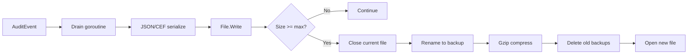

[← Back to Output Types](outputs.md)

# File Output — Detailed Reference

The file output writes one audit event per line to a local file. Files
rotate automatically when they reach a configured size. Rotated files
are compressed with gzip and retained up to a configured count and age.

- [Why File Output for Audit Logging?](#why-file-output-for-audit-logging)
- [Quick Start](#quick-start)
- [How It Works](#how-it-works)
- [Complete Configuration Reference](#complete-configuration-reference)
- [File Rotation](#file-rotation)
- [Permissions and Security](#permissions-and-security)
- [Metrics and Monitoring](#metrics-and-monitoring)
- [Production Configuration](#production-configuration)
- [Troubleshooting](#troubleshooting)
- [Related Documentation](#related-documentation)

## Why File Output for Audit Logging?

Local file output provides the simplest form of persistent, durable
audit logging:

- **Compliance retention** — store a complete, unfiltered audit trail
  for regulatory requirements (SOC 2, PCI DSS, HIPAA)
- **Offline analysis** — grep, jq, and standard Unix tools work
  directly on the audit file
- **No infrastructure dependencies** — no network, no external
  services, no single points of failure
- **Tamper evidence** — combine with [HMAC integrity](hmac-integrity.md)
  for tamper detection on the audit trail
- **Backup and archival** — rotated files can be shipped to S3, GCS, or
  tape for long-term retention

## Quick Start

```bash
go get github.com/axonops/go-audit/file
```

```yaml
# outputs.yaml
version: 1
app_name: "my-app"
host: "my-host"
outputs:
  audit_log:
    type: file
    file:
      path: "/var/log/audit/events.log"
```

```go
import _ "github.com/axonops/go-audit/file"  // registers "file" factory
```

The parent directory MUST exist — the library creates the file but not
the directory.

**[→ Progressive example](../examples/05-file-output/)**

## How It Works



1. `AuditEvent()` enqueues the event in the internal buffer
2. The drain goroutine serialises the event (JSON or CEF)
3. The serialised bytes are written to the active file
4. When the file reaches `max_size_mb`, rotation is triggered:
   - The current file is closed
   - It is renamed with a timestamp suffix (e.g.,
     `events.log-2026-04-05T12-00-00.000`)
   - If `compress: true` (default), the backup is gzip-compressed
     asynchronously
   - Backups exceeding `max_backups` count or `max_age_days` are deleted
   - A new active file is opened

## Complete Configuration Reference

| Field | Type | Default | Range | Description |
|-------|------|---------|-------|-------------|
| `path` | string | *(required)* | — | Filesystem path. Relative paths resolved to absolute at construction |
| `max_size_mb` | int | `100` | 1–10,240 (10 GB) | Rotate when the file reaches this size. Values <= 0 default to 100 |
| `max_backups` | int | `5` | 0–100 | Rotated backups to retain. 0 = keep all (no count limit). Values <= 0 default to 5 |
| `max_age_days` | int | `30` | 0–365 | Delete backups older than this. 0 = no age limit. Values <= 0 default to 30 |
| `permissions` | string | `"0600"` | Octal (0–0777) | File permissions. MUST be quoted in YAML |
| `compress` | bool | `true` | — | Gzip compress rotated backup files |

### Validation Rules

- `path` MUST NOT be empty
- Parent directory of `path` MUST exist at construction time
- **Symlinks are rejected** — the parent directory path is resolved at
  construction time and symlinks are rejected to prevent path traversal
- `permissions` MUST be a valid octal string. Values above `0777` are
  rejected
- Group or world-writable permissions (e.g., `0666`, `0777`) produce a
  `slog` warning
- `max_size_mb`, `max_backups`, `max_age_days` are rejected if above
  their upper bounds. Zero values default to the documented defaults

### Permissions Quoting

The `permissions` field MUST be quoted in YAML:

```yaml
# CORRECT — quoted string, parsed as octal
permissions: "0600"

# WRONG — unquoted, YAML parses 0600 as the integer 384
permissions: 0600
```

## File Rotation

### Size-Based Trigger

Rotation is triggered when the active file exceeds `max_size_mb`
megabytes (converted to bytes: `max_size_mb × 1,024 × 1,024`). The
size check happens after each write.

### Backup Naming

Rotated files are renamed with a timestamp suffix:

```
events.log                              ← active file
events.log-2026-04-05T12-00-00.000.gz  ← most recent backup (compressed)
events.log-2026-04-04T12-00-00.000.gz  ← older backup
```

### Gzip Compression

When `compress: true` (the default), rotated backup files are
compressed with gzip asynchronously. This reduces disk usage
significantly — JSON audit events typically compress by 80–90%.

### Backup Retention

Two retention mechanisms work together:

| Mechanism | Config | Behaviour |
|-----------|--------|-----------|
| **Count-based** | `max_backups` | Keep the N most recent backups; delete the rest |
| **Age-based** | `max_age_days` | Delete backups older than N days |

Both run after each rotation. A backup is deleted if EITHER condition
is met.

Setting `max_backups: 0` keeps all backups (no count limit). Setting
`max_age_days: 0` disables age-based deletion.

## Permissions and Security

### Symlink Rejection

The file output resolves the parent directory path and **rejects
symlinks**. This prevents path traversal attacks where a symlink could
redirect audit writes to an unintended location (e.g., `/etc/shadow`).

The symlink check occurs when the output is first constructed. If the
parent directory or any component of the path is a symlink, `New()`
returns an error.

### Default Permissions

The default permission `0600` (owner read/write) is the most secure
setting:

| Permission | Meaning | Security |
|-----------|---------|----------|
| `"0600"` | Owner read/write | **Recommended.** Only the process owner can read/write |
| `"0640"` | Owner read/write, group read | Group members can read the audit log |
| `"0644"` | Owner read/write, everyone read | All users can read — use only for non-sensitive logs |
| `"0666"` | Everyone read/write | **Dangerous.** Anyone can modify the audit trail |

The library emits a `slog.Warn` when group or world-writable
permissions are configured.

## Metrics and Monitoring

The file output provides an optional `Metrics` interface:

```go
type Metrics interface {
    RecordFileRotation(path string)
}
```

`RecordFileRotation` is called after each successful file rotation.
The `path` is the absolute filesystem path of the file that was
rotated.

Register your implementation before calling `outputconfig.Load`. This
replaces the default factory registered by the blank import. If you
don't need file-specific metrics, the blank import
`_ "github.com/axonops/go-audit/file"` is sufficient.

```go
audit.RegisterOutputFactory("file", file.NewFactory(myFileMetrics))
```

### What to Monitor

| Event | Meaning | Action |
|-------|---------|--------|
| `RecordFileRotation` frequency increasing | File filling faster (higher event volume) | Increase `max_size_mb` or add more storage |
| Disk space alerts | Backups accumulating | Reduce `max_backups` or `max_age_days` |
| Permission denied errors | Process user changed | Verify file ownership and permissions |

## Production Configuration

### Minimum Configuration

```yaml
outputs:
  audit_log:
    type: file
    file:
      path: "/var/log/audit/events.log"
```

This uses all defaults: 100 MB rotation, 5 backups, 30-day retention,
0600 permissions, gzip compression.

### High-Volume Configuration

```yaml
outputs:
  audit_log:
    type: file
    file:
      path: "/var/log/audit/events.log"
      max_size_mb: 500
      max_backups: 20
      max_age_days: 90
      permissions: "0600"
      compress: true
```

### Compliance Configuration

For regulatory retention, keep more backups and longer age:

```yaml
outputs:
  compliance:
    type: file
    file:
      path: "/var/log/audit/compliance.log"
      max_size_mb: 1000
      max_backups: 100
      max_age_days: 365
      permissions: "0600"
      compress: true
    hmac:
      algorithm: "sha256"
      salt: "${HMAC_SALT}"
```

The [HMAC integrity](hmac-integrity.md) option adds a tamper-detection
signature to each event, providing evidence of modification.

## Troubleshooting

| Problem | Cause | Fix |
|---------|-------|-----|
| `path must not be empty` | Missing `path` in config | Add the `path` field to the file block |
| `parent directory does not exist` | Directory not created | Create the directory before starting the application |
| `symlink rejected` | Parent path contains a symlink | Use a direct path without symlinks |
| `invalid permissions` | `permissions` value > 0777 | Use a valid octal string like `"0600"` |
| File not rotating | `max_size_mb` too large for event volume | Reduce `max_size_mb` or check disk space |
| Disk filling up | Too many backups or age limit too high | Reduce `max_backups` and `max_age_days` |
| `YAML error: 0600 is not a string` | `permissions` not quoted | Quote it: `permissions: "0600"` |

## Related Documentation

- [Output Types Overview](outputs.md) — summary of all five outputs
- [Output Configuration Reference](output-configuration.md) — YAML field tables
- [Progressive Example](../examples/05-file-output/) — working code with rotation
- [HMAC Integrity](hmac-integrity.md) — tamper detection for file output
- [Async Delivery](async-delivery.md) — buffer sizing and graceful shutdown
