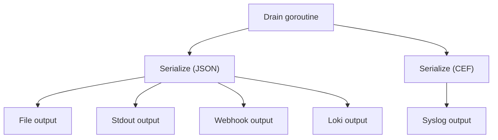

[&larr; Back to README](../README.md)

# Output Types and Fan-Out

- [What Are Outputs?](#what-are-outputs)
- [Available Outputs](#available-outputs)
- [File Output](#file-output)
- [Syslog Output](#syslog-output)
- [Webhook Output](#webhook-output)
- [Loki Output](#loki-output)
- [Stdout Output](#stdout-output)
- [Per-Output Features](#per-output-features)
- [Fan-Out Architecture](#fan-out-architecture)

## 🔍 What Are Outputs?

Outputs are where your audit events end up after validation and
serialisation. audit can send the same event to multiple outputs
at once — a local file for long-term retention, a syslog server for
your SIEM, and a webhook for real-time alerting, all simultaneously.

### Optional Interfaces

Output implementations may satisfy additional optional interfaces:

| Interface | Purpose |
|-----------|---------|
| `DestinationKeyer` | Duplicate destination detection at construction |
| `DeliveryReporter` | Output handles its own delivery metrics |
| `MetadataWriter` | Receives structured event metadata (event type, severity, category, timestamp) alongside pre-serialised bytes |

`MetadataWriter` is used by outputs that need structured access to
per-event fields — for example, Loki uses event_type and severity as
stream labels. Outputs that don't implement it receive plain `Write()`
calls with no overhead.

## ❓ Why Multiple Outputs?

Different teams need audit events in different places, in different
formats, with different levels of detail:

- **Security team** — needs events in [CEF format](cef-format.md) in their SIEM, filtered to security categories
- **Compliance** — needs a complete, unfiltered file with all fields for regulatory retention
- **Operations** — needs high-severity events pushed to a webhook for alerting
- **External partners** — needs events with [PII fields stripped](sensitivity-labels.md) before delivery

Each output can have its own formatter, [event routing](event-routing.md)
filter, and [sensitivity label exclusions](sensitivity-labels.md).

## 📋 Available Outputs

| Output | Module | Transport | Key Features |
|--------|--------|-----------|--------------|
| **File** | `audit/file` | Local filesystem | Size-based rotation, gzip compression, backup retention, configurable permissions |
| **Syslog** | `audit/syslog` | TCP, UDP, TCP+TLS | RFC 5424 format, mTLS client certs, automatic reconnection |
| **Webhook** | `audit/webhook` | HTTPS | Batched delivery, retry with backoff, SSRF protection, custom headers |
| **Loki** | `audit/loki` | HTTPS | Stream labels, gzip compression, multi-tenancy, retry with backoff, SSRF protection |
| **Stdout** | `audit` (core) | Standard output | Built into the core module — no additional dependency needed |

---

## 📁 File Output

Writes one audit event per line to a local file with automatic
size-based rotation, gzip compression, and backup retention.

Key features:

- **Size-based rotation** — automatic rollover at configurable file
  size (default: 100 MB, max: 10 GB)
- **Gzip compression** — rotated backups compressed automatically
  (80–90% reduction)
- **Backup retention** — configurable count (max: 100) and age (max:
  365 days)
- **Secure permissions** — default `0600` (owner only); symlinks
  rejected to prevent path traversal
- **No infrastructure dependencies** — local filesystem only

**[→ Full File Output Reference](file-output.md)** — complete
configuration, rotation mechanics, permissions, production examples,
and troubleshooting.

**[→ Progressive example](../examples/03-file-output/)**

Install: `go get github.com/axonops/audit/file`

---

## 📡 Syslog Output

Sends events as [RFC 5424](https://datatracker.ietf.org/doc/html/rfc5424)
syslog messages over TCP, UDP, or TCP+TLS. The connection is
established immediately when the output is created — the syslog server
must be reachable at startup. TCP and TLS connections are
re-established automatically on failure with exponential backoff.

Key features:

- **Standards-based** — RFC 5424 message format with octet-counting
  framing (RFC 5425)
- **Three transports** — TCP (default), UDP, or TCP+TLS with mTLS
- **Automatic reconnection** — bounded exponential backoff (100ms to
  30s with jitter)
- **SIEM pairing** — combine with the CEF formatter for native ArcSight,
  Splunk, and QRadar integration

**[→ Full Syslog Output Reference](syslog-output.md)** — complete
configuration, TLS, reconnection, facility values, production examples,
and troubleshooting.

**[→ Progressive example with embedded TCP receiver](../examples/07-syslog-output/)**

Install: `go get github.com/axonops/audit/syslog`

---

## 🌐 Webhook Output

Batches audit events as
[NDJSON](https://github.com/ndjson/ndjson-spec) (newline-delimited
JSON) and POSTs them to an HTTPS endpoint. Failed batches are retried
with exponential backoff. Private and loopback addresses are blocked
by default (SSRF protection).

Key features:

- **Batched delivery** — configurable batch size and flush interval
  reduce HTTP overhead
- **Retry with backoff** — 5xx and 429 responses trigger exponential
  backoff with jitter
- **SSRF protection** — private/loopback ranges blocked by default;
  redirects rejected
- **Custom headers** — authentication tokens, correlation IDs on every
  request
- **At-least-once delivery** — batches retried on transient failure

**[→ Full Webhook Output Reference](webhook-output.md)** — complete
configuration, authentication, TLS, NDJSON format, retry logic, SSRF
protection, production examples, and troubleshooting.

**[→ Progressive example with embedded HTTP receiver](../examples/08-webhook-output/)**

Install: `go get github.com/axonops/audit/webhook`

---

## Loki Output

Pushes audit events to [Grafana Loki](https://grafana.com/oss/loki/)
via the HTTP Push API with stream labels, gzip compression,
multi-tenancy, and exponential backoff retry.

**[→ Full Loki Output Reference](loki-output.md)** — complete
configuration, stream labels, authentication, TLS, LogQL queries,
production examples, performance tuning, and troubleshooting.

### Key Features

- **Stream labels** derived from event metadata (event_type, severity,
  category) make audit events queryable via LogQL without parsing
  every log line
- **Multi-tenancy** via `X-Scope-OrgID` keeps different applications
  or environments isolated in a shared Loki cluster
- **Grafana integration** provides dashboards, alerting, and LogQL
  exploration out of the box
- **Gzip compression** reduces push payload size by ~80%
- **SSRF protection** blocks private/loopback ranges by default
- **Exponential backoff retry** on 429/5xx with `Retry-After` support

**[→ Progressive example with real query output](../examples/14-loki-output/)**

Install: `go get github.com/axonops/audit/loki`

---

## 💻 Stdout Output

Writes events to standard output. Built into the core module — no
additional `go get` needed. Useful for local development, debugging,
and piping to other tools.

### YAML Configuration

```yaml
outputs:
  console:
    type: stdout
```

No additional configuration fields are needed.

**[→ Full Stdout Output Reference](stdout-output.md)** — container
deployment, piping patterns, limitations.

**[→ Progressive example](../examples/02-code-generation/)**

---

## 🔀 Per-Output Features

Every output supports these optional features:

| Feature | Where to Configure | Documentation |
|---------|-------------------|---------------|
| **Formatter** | `formatter:` block on each output | [JSON](json-format.md), [CEF](cef-format.md) |
| **Event routing** | `route:` block on each output | [Event Routing](event-routing.md) |
| **Sensitivity labels** | `exclude_labels:` on each output | [Sensitivity Labels](sensitivity-labels.md) |
| **Enable/disable** | `enabled: false` on each output | Toggle without removing config |

## 🏗️ Buffering and Delivery Model

Outputs fall into two categories based on how they receive events from
the core drain goroutine:

| Output | Internal Buffer | Batching | Delivery Model |
|--------|----------------|----------|----------------|
| **Stdout** | No | No | Synchronous — blocks drain goroutine until write to `os.Stdout` completes |
| **File** | No | No | Synchronous — blocks drain goroutine until file write completes (with OS-level file buffering) |
| **Syslog** | No | No | Synchronous — blocks drain goroutine until TCP/UDP write completes |
| **Webhook** | Yes (`buffer_size`, default 10,000) | Yes (`batch_size`, `flush_interval`) | Async — own goroutine, batched HTTP POST |
| **Loki** | Yes (`buffer_size`, default 10,000) | Yes (`batch_size`, `max_batch_bytes`, `flush_interval`) | Async — own goroutine, batched HTTP POST with gzip |

**Synchronous outputs** (file, syslog, stdout) write directly from the
core drain goroutine. If a synchronous output blocks (e.g., syslog
server unreachable, disk full), it delays delivery to **all** outputs
because the drain goroutine delivers sequentially. Monitor output
errors and consider using async outputs (webhook, Loki) for unreliable
destinations.

**Async outputs** (webhook, Loki) copy the event bytes into their own
internal buffer and return immediately. A background goroutine reads
from this buffer, accumulates events into batches, and delivers them
via HTTP. If the internal buffer fills, events are dropped.
`RecordLokiDrop()` or `RecordWebhookDrop()` fires on every drop, and
a rate-limited `slog.Warn` fires at most once per 10 seconds. Drops
in one async output's buffer do not affect other outputs.

See [Two-Level Buffering](async-delivery.md#two-level-buffering) for
the complete pipeline architecture, memory sizing, and tuning guidance.

## 📡 Fan-Out Architecture



The drain goroutine serialises each event once per unique format and
delivers to all outputs in sequence. An error returned by one output
does not prevent delivery to others — the drain loop continues.
However, a synchronous output that blocks (e.g., during syslog
reconnection) delays all subsequent outputs for that event. See
[Buffering and Delivery Model](#-buffering-and-delivery-model) above.

## 📚 Further Reading

- [Progressive Example: File Output](../examples/03-file-output/)
- [Progressive Example: Multi-Output](../examples/09-multi-output/)
- [Progressive Example: Capstone](../examples/17-capstone/) — four outputs with HMAC, CEF, Loki, and PII stripping
- [Output Configuration YAML](output-configuration.md) — full YAML reference
