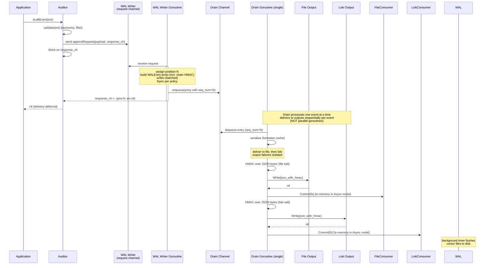
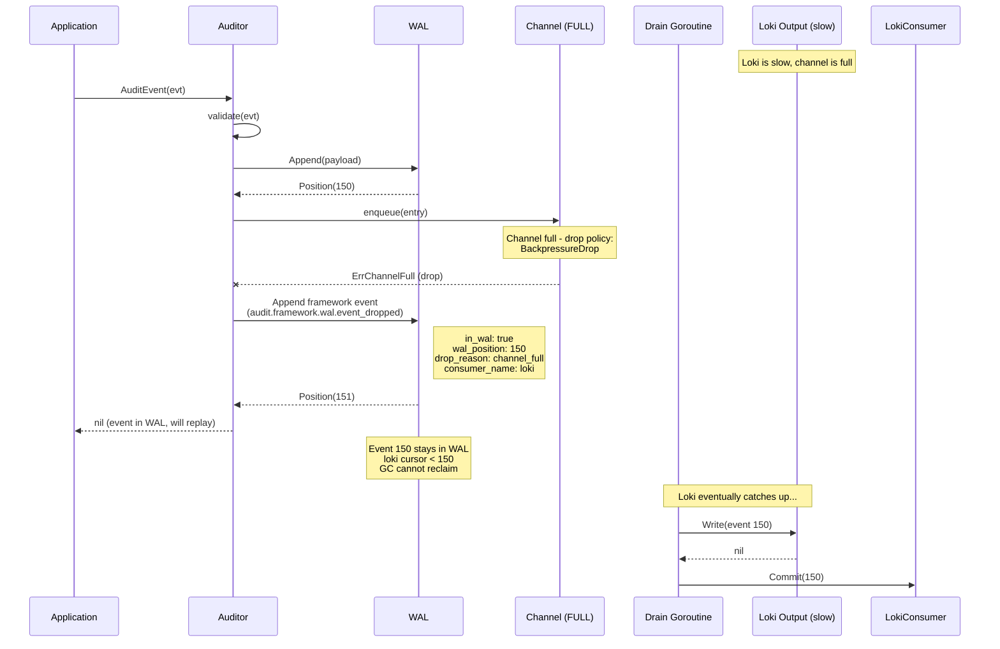
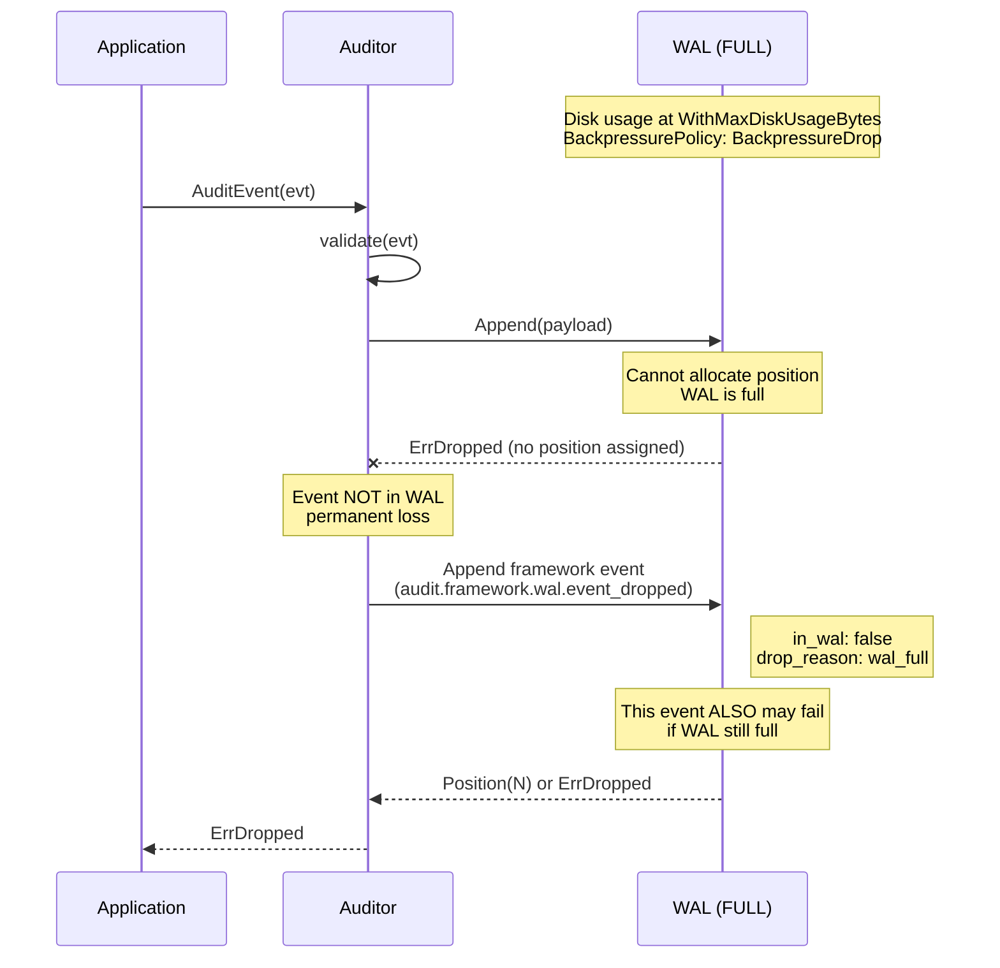
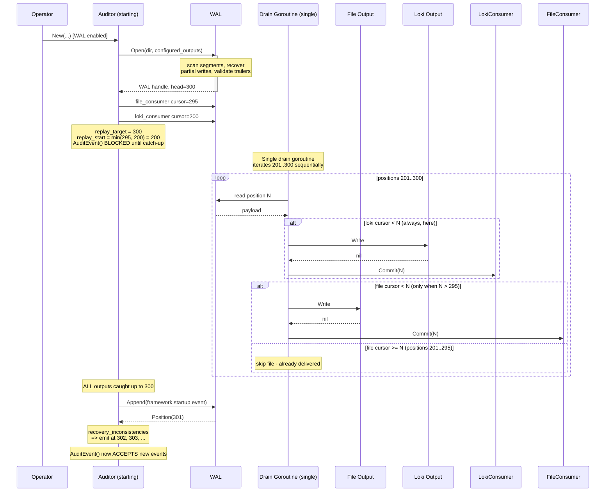
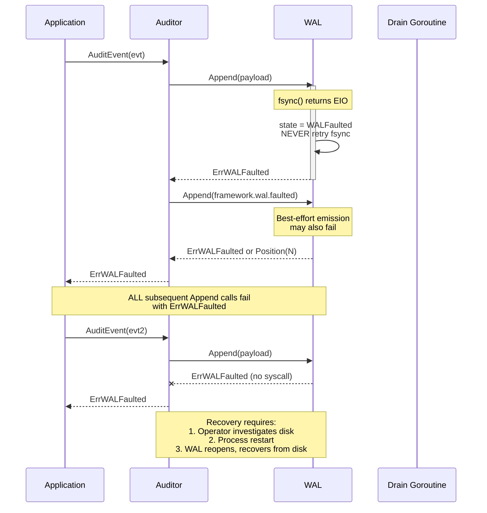
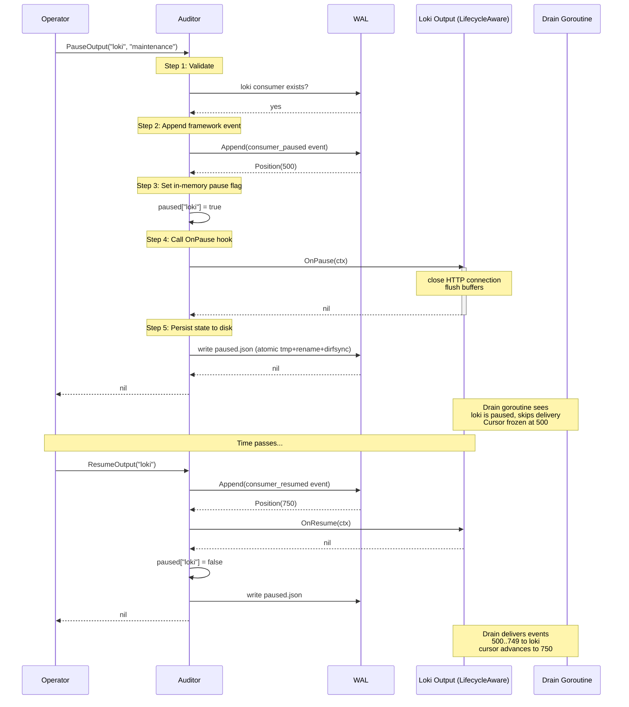
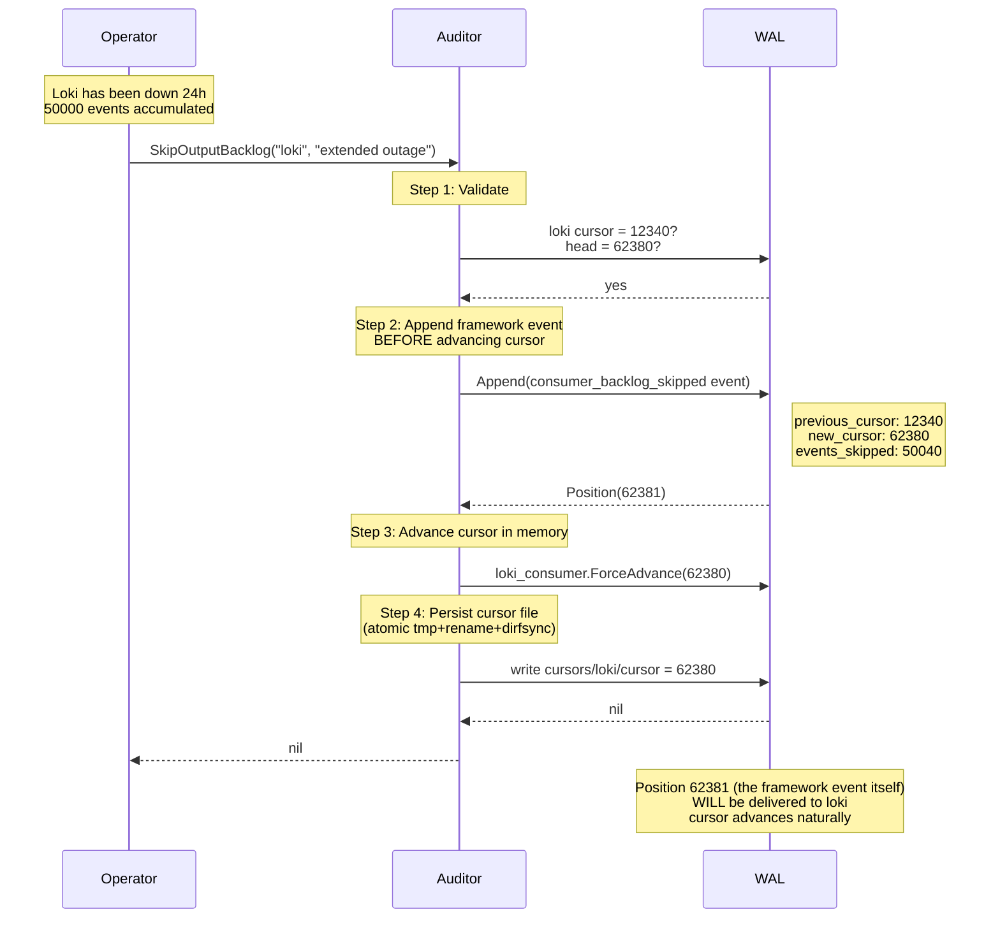
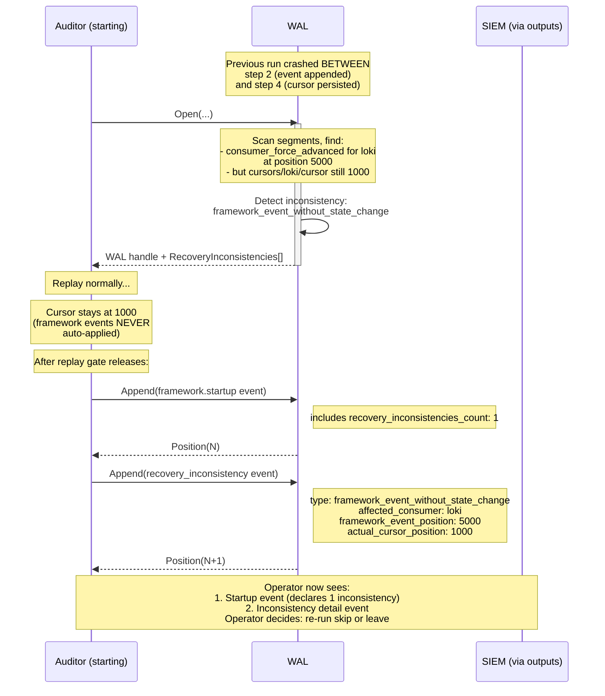
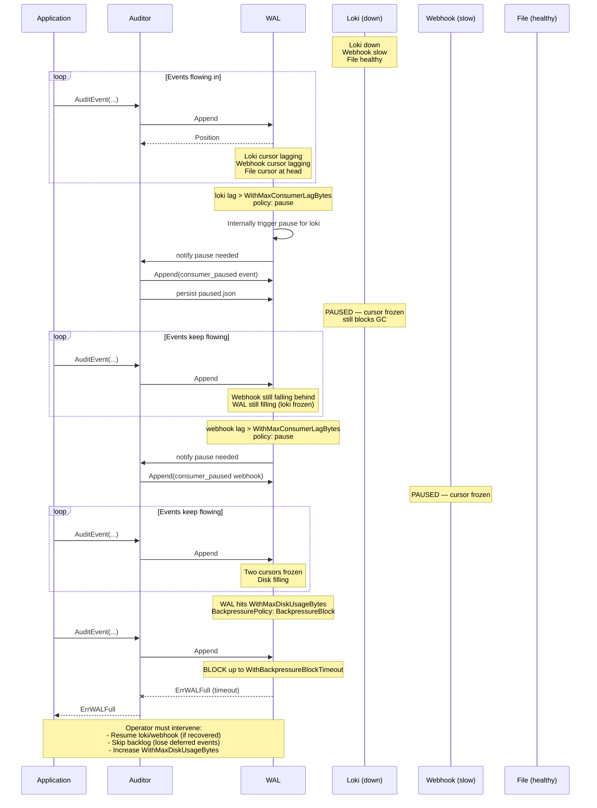

# Write-Ahead Log (WAL) — Design and Reference

> **Status:** Pre-implementation design specification. Tracked in a GitHub issue
> (linked from this file's commit history). Phase 0 (design-resolution
> blockers) are listed in the tracking issue and MUST be addressed before
> Phase 1 implementation begins.
>
> **Subsumes:** #460 (built-in startup/shutdown audit events).

## Summary

Add a write-ahead log (WAL) to the audit library that provides durable event storage before fan-out to outputs, monotonic sequence numbers as a natural consequence of append-only writes, per-output cursor tracking for replay after crash or output failure, segment-based retention with safe garbage collection, and programmatic control over output delivery for operators handling planned and unplanned downtime.

This work also implements the full set of built-in framework audit events covering library lifecycle (startup, shutdown), WAL integrity (corruption, faulted state, dropped events), and operator control plane operations (pause, resume, force advance, cursor reset, backlog skip, replay).

The WAL must be implemented as a self-contained internal module designed for future extraction into a standalone Go library. Module boundary must be clean: no audit-specific types in the WAL API, no leakage of WAL implementation details into the audit core. The same applies to the io_uring/writev abstraction from #511 — both are designed for post-v1 extraction.

This design has been informed by failure mode analysis of comparable systems: PostgreSQL fsyncgate (2018), UnisonDB (trailer canaries, 8-byte alignment), Kafka consumer offset semantics, ScyllaDB CharybdeFS testing, and RocksDB recovery patterns.

## Existing Architecture (Background)

The current audit library uses a single-drain-goroutine architecture. From `audit.go`:

> Architecture: async buffer -> single drain goroutine -> serialise -> fan-out
>
> AuditEvent() validates the event against the registered taxonomy, checks the global filter, then enqueues the event to a buffered channel. A single drain goroutine reads from the channel, serialises the event to JSON (or the configured format), and writes to all enabled outputs.

Event flow through the existing fan-out engine (`fanout.go`):

```
AuditEvent() → validate → global filter → enqueue
   → drainLoop → for each output:
      → per-output route filter (matchesRoute)
      → serialise once per unique formatter
      → per-output HMAC (if hmacConfig != nil)
      → deliver to output
```

Key existing properties confirmed from the source:

- **Single drain goroutine** owns serialisation, HMAC, and delivery
- **Per-output configuration**: each output has its own `EventRoute`, `Formatter`, `excludedLabels`, `hmacConfig`, and `hmacState` (pre-constructed hash for drain-loop reuse)
- **Formatter sharing**: "Serialisation is cached per Formatter pointer: if three outputs share the same formatter, the event is serialised once and the same `[]byte` is delivered to all three"
- **Per-output HMAC**: HMAC is computed in the drain loop, AFTER serialisation, on the formatted bytes that go on the wire to that specific output. HMAC state is single-goroutine (drain) and reused across events
- **stdout is a regular Output**: `output.go` documents "Built-in implementations are provided by the file, syslog, webhook, loki, and stdout packages." It implements the standard `Output` interface like every other output. It is NOT a special pre-fan-out path.
- **Output failure isolation**: "Output failures are isolated — one output returning an error does not block delivery to others"
- **Synchronous mode** exists via `WithSynchronousDelivery` (used for tests/CLIs); guards `processEntry` calls with `syncMu` because per-output state (formatOpts, HMAC) is only safe under single-goroutine access
- **Buffer ownership contract**: outputs MUST NOT retain the data slice past the `Write` call — the library reuses the underlying array

These existing properties shape the WAL design constraints below.

## Motivation

Without a WAL, the audit library has three failure modes when an output is slow or down:
- Block the caller (couples application throughput to slowest output)
- Drop events (violates audit's core promise)
- Buffer in memory (loses everything on crash, no real durability)

A WAL provides:
- **Durability** — events persisted before any output is attempted
- **Decoupling** — caller returns once WAL append succeeds, regardless of output state
- **Replay** — outputs recover from where they left off after crash or transient failure
- **Backpressure** — when the WAL fills, principled policy applies rather than silent loss
- **Sequence numbers** — monotonic positions assigned at append time, providing canonical ordering and gap detection
- **HMAC integrity** — sequence numbers in the canonical event payload make tampering and deletion detectable when HMAC is enabled
- **Operator control** — programmatic pause/resume/skip/replay for handling downtime

The WAL is **opt-in**. Operators in environments without appropriate persistent storage (ephemeral containers, restricted filesystems) continue to use the existing channel-based architecture without WAL.

## Architecture: Two Modes

The audit core supports two delivery architectures, selected by configuration:

### Mode A — WAL Disabled (existing architecture, unchanged)

```
AuditEvent(evt)
    │
    ├─→ validate (taxonomy, filter)
    │
    └─→ enqueue to ch (buffered channel)
                │
                └─→ drainLoop (single goroutine):
                       for each output:
                         → route filter (matchesRoute)
                         → serialise (with formatter cache)
                         → per-output HMAC (if enabled)
                         → output.Write(data)
                         (output failures isolated)
```

Best-effort delivery, no durability, lower overhead. Existing buffering, existing per-output backpressure (drop limiter, etc.), no WAL state. If the process crashes, in-flight events buffered in the channel are lost.

### Mode B — WAL Enabled

```
AuditEvent(evt)
    │
    ├─→ validate (taxonomy, filter)
    │
    ├─→ WAL.Append(canonical_payload) → returns Position
    │   (DURABILITY GUARANTEE — caller blocks until durable per fsync policy)
    │
    └─→ enqueue to ch (existing buffered channel, unchanged)
                │
                └─→ drainLoop (existing single goroutine):
                       for each output:
                         → route filter (matchesRoute)
                         → serialise (formatter cache; sequence_number IN canonical fields)
                         → per-output HMAC over serialised bytes (if enabled)
                         → output.Write(data)
                         → on success: consumer.Commit(position)
                         (output failures isolated; cursor only advances on success)
```

The WAL is layered IN FRONT of the existing fan-out:

1. WAL append happens first — durability guarantee
2. The existing channel-based fan-out is unchanged in shape — same buffering, same drain goroutine, same output isolation
3. **One change**: when an output's `Write` returns nil, the drain goroutine calls `consumer.Commit(position)` for that output's cursor
4. **Outputs deliver from the existing in-memory channel** during normal operation, NOT by polling the WAL
5. **The WAL is read only at startup** for replay from each output's cursor position

### Replay on Startup — Strict Gate

When the audit core starts up with WAL enabled, it MUST complete replay BEFORE accepting new `AuditEvent()` calls. Because the existing audit core uses a **single drain goroutine** that delivers each event to all outputs in fan-out, replay is also single-threaded through the same goroutine.

The replay procedure:

1. Open the WAL (recovers from any partial writes; collects `RecoveryInconsistencies` from segment scan)
2. Determine the current head position at startup time — call this `replay_target`
3. For each configured output, read its cursor position from `cursors/<name>/cursor`
4. Compute `replay_start = min(all cursors)` — the lowest cursor position across all outputs
5. The drain goroutine iterates positions from `replay_start + 1` through `replay_target`:
   - Read event at position N from WAL
   - For each output where cursor < N: deliver to that output (same fan-out path as live events)
   - For each output where cursor ≥ N: skip — that output already delivered N before the crash
   - On output Write success for position N: cursor advances to N for that output
6. **Wait until every output's cursor has advanced to `replay_target`** — i.e., every replay event has been delivered AND committed to disk
7. Only then does `AuditEvent()` open for new events
8. Emit `audit.framework.startup` event (which itself flows through WAL → fan-out)
9. Emit any queued `recovery_inconsistency` events with sequence numbers immediately following the startup event

**Critical correctness property**: replay is sequential through the single drain goroutine, NOT parallel per output. Per-output skipping happens via cursor comparison: an output that was 5 events ahead of another doesn't get re-delivered the events it already saw. This is the same mechanism that handles "different outputs at different cursor positions" during normal operation.

**The gate is "all outputs caught up to replay_target," not "replay events queued."** This avoids the race where output A finishes its replay quickly, live events for A start, but output B's replay is still pending — which would break per-output ordering invariants.

For heavily-lagged outputs, this means startup may take significant time. This is correct behaviour for an audit library: the library must not accept new events until it has caught up on its delivery obligations from before the restart. Operators wanting faster startup must explicitly skip backlog via the control plane API before restart, or accept the wait.

**Replay gate liveness — output failure during replay**

If an output's `Write()` returns errors continuously during replay (e.g., loki is permanently down, syslog connection refused), its cursor never advances and the gate never releases. Without bounded behaviour, the audit library would be unable to start.

The library handles this via `WithReplayTimeout` (default: 0, meaning wait forever):

- **`WithReplayTimeout = 0` (default)**: gate is unconditional. Auditor blocks startup until every output has caught up. A permanently-failing output blocks startup indefinitely. Operators must intervene externally — either fix the output, or use a separate mechanism (manual `paused.json` edit before startup, or `SkipOutputBacklog` invoked via a sidecar/admin tool that opens the WAL with the audit-core API in skip-only mode) to unblock.
- **`WithReplayTimeout > 0`**: gate releases after the timeout regardless of catch-up state. The audit core proceeds to accept new events. Outputs still behind their `replay_target` are auto-paused with `reason: "replay_timeout"` (so their cursors freeze, their backlog stays in WAL, and operators see them as paused via SIEM and metrics). The startup framework event includes a `replay_timeout_paused` field listing which consumers were auto-paused.

**Operational guidance**:

- Production deployments using stable outputs (file, syslog) typically run with `WithReplayTimeout = 0` — the gate's "wait forever" property is the right call when you trust your outputs.
- Production deployments using flaky external outputs (webhooks, hosted log aggregators) may want a finite timeout (e.g., 5 minutes). The trade-off is explicit: faster startup vs. potential operator surprise (SIEM seeing auto-paused outputs without operator action).
- The `consumer_paused` framework event with `trigger: "replay_timeout"` makes the auto-pause visible in the audit trail itself, so operators can correlate startup with which outputs were skipped.

A separate "replay-skip" admin tool — opening the WAL via the audit-core API with `SkipOutputBacklog` — is the recommended way to unblock a stuck startup without changing config. Documentation should include a worked example.

### Position Assignment and Channel Ordering — Correctness Requirement

A naive implementation of `AuditEvent()` in Mode B would be:

```go
// NAIVE - INCORRECT under concurrency
func (a *Auditor) AuditEvent(evt Event) error {
    pos, err := a.wal.Append(canonical_payload)  // assigns position
    entry.sequence_number = pos
    a.ch <- entry                                  // enqueue to drain
    return nil
}
```

This is **incorrect** under concurrent calls. Consider:

- Goroutine A calls AuditEvent → WAL.Append returns position 100 → A is preempted before stamping/enqueueing
- Goroutine B calls AuditEvent → WAL.Append returns position 101 → B stamps and enqueues 101
- A resumes, stamps and enqueues 100
- The drain goroutine receives 101 first, then 100

The result: WAL position order is 100 → 101, but channel and delivery order is 101 → 100. This breaks `PropTotalOrderPerConsumer` — outputs receive events out of WAL order. SIEMs detecting "sequence_number out of order" will fire spuriously.

**Required architecture**: position assignment and channel enqueue MUST happen in the same goroutine in the same critical section. The natural shape is the queue+writer pattern (also needed for batched `writev`):

```go
// CORRECT
type appendRequest struct {
    payload    []byte
    entry      *auditEntry
    response   chan appendResponse
}

// Caller goroutine:
func (a *Auditor) AuditEvent(evt Event) error {
    payload := serializeCanonical(evt)
    req := &appendRequest{payload: payload, entry: entry, response: make(chan appendResponse, 1)}
    a.wal.requests <- req
    resp := <-req.response
    return resp.err
}

// WAL writer goroutine (single):
//   for req := range a.requests {
//       pos := nextPosition()
//       writeRecord(pos, req.payload)  // batched writev with peers
//       fsync (per policy)
//       req.entry.sequence_number = pos
//       a.drainCh <- req.entry           // enqueue in position order
//       req.response <- appendResponse{pos: pos, err: nil}
//   }
```

Properties this gives:

- **Position monotonicity matches channel order**: the writer goroutine assigns position N, then enqueues entry N, before assigning N+1. Channel order = position order, always.
- **Drain order = WAL order**: the drain goroutine reads from `drainCh` in FIFO order, which matches position order, which matches WAL persistence order.
- **`PropTotalOrderPerConsumer` is preserved**: every output sees events in position order (subject to per-output cursor for replay/skip).

**Implementation cost**: every `AuditEvent()` call has the overhead of two channel operations (request + response). Benchmarks should confirm this overhead is in the noise relative to fsync cost. If it isn't, batched response signalling can be added (one fsync = one signal to all waiting callers in the batch).

**Interaction with batched fsync**: in `FsyncInterval` mode, the writer goroutine collects multiple requests, writes them to the segment with `writev`, fsyncs once, then signals all callers and enqueues all entries to the drain channel in order. This preserves both the ordering invariant and amortises fsync cost.

### Two Serialisations Per Event — Explicit Model

In Mode B, every event is serialised TWICE:

1. **Canonical WAL payload** — produced once at `AuditEvent()` time (in the caller goroutine OR the WAL writer goroutine). This is the proto3 `WALEntry` message stored in binary form on disk in the WAL segment. The WALEntry's `payload` field is a `map<string, bytes>` holding all event fields: eventType, framework fields (host, app_name, pid, wal_instance_id, sequence_number, etc.), event fields, severity, timestamp, plus the `_hmac_salt_version_at_append:<output_name>` entries described in the HMAC section. Stable format, version-controlled by `metadata.json` `format_version` plus proto field numbering. See "Canonical WAL Payload Proto Schema" below for the complete WALEntry definition.

2. **Per-output formatted payload** — produced in the drain goroutine for each output that has a unique formatter. Subject to formatter caching: outputs sharing a `Formatter` pointer get the same bytes (this is the existing optimisation in `fanout.go`). May omit excluded labels per output's sensitivity exclusions. Receives per-output HMAC append.

These are independent serialisations of the same event. The canonical payload is the durable record; the per-output payload is what goes on the wire.

**An implementor MUST NOT try to reuse one for the other.** The drain goroutine produces formatted bytes that may be CEF (different structure), may have per-output HMAC appended (additional bytes), may have sensitivity exclusions (subset of fields). None of these are valid for the WAL canonical store. Conversely, the WAL canonical WALEntry proto carries the chain-HMAC fields (`prev_hmac`, `hmac`) but has no per-output HMAC and no per-output sensitivity exclusions, so it isn't valid for any output that requires those.

**Sequence number stamping**: the canonical payload INCLUDES the sequence number. This means either (a) the canonical payload is built with a placeholder, the WAL writer stamps the position into it before writing, or (b) the canonical payload is built AFTER position assignment, with the position already known.

Option (b) is simpler and is what the request/response architecture above produces: the WAL writer goroutine receives the auditEntry, assigns position, builds map<string, bytes> from Fields (UTF-8/LE encoding), proto.Marshals into WALEntry with sequence_number and wal_instance_id set, writes binary proto bytes to segment.

### Standard Out Handling

`stdout` is one of the built-in `Output` implementations alongside file, syslog, webhook, and loki. It implements the standard `Output` interface, has its own `outputEntry` in the auditor's entries slice, and is delivered to via the same fan-out path as every other output.

In Mode B (WAL enabled), stdout participates fully in the WAL flow:

- WAL append happens BEFORE stdout receives the event (durability before display)
- stdout has its own cursor file: `cursors/stdout/cursor`
- stdout has its own `wal_overflow_policy` (see Configuration)
- stdout can be paused/resumed via the control plane API
- During replay, stdout receives replayed events through its channel like any other output

This is the correct behaviour: a process may crash, restart, and on restart the events it was about to print to stdout will be reprinted as part of replay. The user of stdout sees a complete record of audited events, with possibly some duplicates after a crash (at-least-once semantics applied to console output).

**Implication for operators using stdout for human-readable monitoring:**

- After a crash and restart, stdout will replay events from its cursor. If `WithCursorCommitMode` is `CursorCommitAsync` (default), there can be up to `WithCursorCheckpointInterval` of duplicate output on stdout after restart. Operators viewing stdout in real-time may see duplicate lines.
- If duplicate lines on stdout are operationally undesirable, configure `CursorCommitBatchSync` for tighter bounds.
- stdout is typically configured with `wal_overflow_policy: force_advance` because falling behind on console output is rarely useful — historical console output that scrolled past is not valuable. **Operators choose the policy explicitly per output**; the WAL doesn't impose a default different from any other output.

**No special pre-WAL stdout path.** The temptation to add a "console echo before WAL" path was considered and rejected:

- It would create a second delivery model (sync console + async everything else)
- It would mean stdout receives events that the WAL never appended (durability violation: one output sees an event nobody else does, and which never went through the audit trail)
- It would make stdout an exception that operators must reason about specially
- The existing single-flow model is simpler and correct

If operators want immediate console visibility at the cost of durability, they should configure stdout in Mode A (WAL disabled) or accept the tiny WAL append latency in Mode B. With `FsyncInterval` (default 100ms), the latency is negligible for human observation.

### Drop Policy Semantics in Mode B

In Mode A, `BackpressureDrop` means "if the channel is full, lose the event."

In Mode B, the event is in the WAL. A channel-full condition with Drop policy means "don't queue more in memory, but DO leave it in the WAL for catch-up." The cursor does NOT advance for dropped events. When the output eventually catches up (channel drains, or process restarts and replays), those events are delivered.

This is correct: the WAL exists to make sure events get delivered. A transient channel-full state is not a reason to permanently lose events when durable storage is available.

This is a behavioural change from Mode A and operators must be aware:
- Mode A: Drop = permanent loss
- Mode B: Drop = deferred delivery (delivered when output catches up)

The `audit.framework.wal.event_dropped` event distinguishes these via the `in_wal` field (see Built-in Audit Events section).

## Layout

```
/var/lib/audit/wal/
  segments/
    000000000000.wal        (sealed)
    000000000001.wal        (sealed)
    000000000002.wal        (active)
  cursors/
    file/
      cursor                (8 bytes, big-endian uint64)
    syslog/
      cursor
    webhook/
      cursor
    loki/
      cursor
    stdout/
      cursor
  metadata.json             (format version, WAL instance ID, clean shutdown marker)
  paused.json               (operator-controlled pause state)
```

Segment file naming: 12-digit zero-padded sequence number with `.wal` extension. Lexicographic ordering matches numerical ordering.

### Cursor Subdirectory Per Consumer

**Each consumer has its own subdirectory.** This is a deliberate design choice for fsync isolation.

If all cursor files lived directly in `cursors/`, then `fsync(cursors_dir_fd)` after a rename of one cursor file would also flush directory metadata for any other in-progress operations on that directory — coupling unrelated consumers' durability events. With one consumer per subdirectory:

- `fsync(cursors/loki_dir_fd)` after renaming `cursors/loki/cursor.tmp` only synchronises loki's directory metadata
- File output's cursor commit is unaffected
- Each consumer's cursor lifecycle is fully isolated

The trade-off is more inodes (one extra directory per consumer) and slightly more setup work on Open. Both are negligible. The fsync isolation is the right call for an audit library where cursor durability semantics must be precise.

**On consumer removal**: the orphaned cursor cleanup procedure (see below) removes the entire subdirectory `cursors/<old_consumer_name>/` including the cursor file inside, then fsyncs the parent `cursors/` directory.

## Sequence Numbers and Event IDs

The WAL `Position` (uint64) is the sequence number. Monotonic, never wraps, never resets within a WAL instance lifetime. At 1M events/sec, uint64 lasts 584,000 years.

### WAL Instance ID

A WAL instance ID is generated at WAL initialisation and persisted in `metadata.json`. This identifier distinguishes between successive WAL lifetimes on the same host with the same application name — for example, after WAL directory deletion or filesystem rebuild.

**Default format**: UUIDv7 (IETF RFC 9562) — 36 characters with timestamp ordering.
**Optional format**: ULID — 26 characters with timestamp ordering.

The format is chosen at initialisation via `WithWALInstanceIDFormat` and is immutable for the WAL's lifetime. Changing the option after creation has no effect; the existing ID format is preserved.

**Implementation note**: UUIDv7 generation requires a monotonic counter within the same millisecond to guarantee uniqueness when generating multiple IDs rapidly. Use `google/uuid` ≥ 1.6 or equivalent library that handles monotonicity. Pin in `go.mod`.

### Event ID Composition

Event IDs combine existing identity (the auditor's `appName` and `host` fields, set via `WithAppName` and `WithHost`) with WAL instance and sequence:

```
<host>:<app_name>:<wal_instance_id>:<sequence_number>
```

For CloudEvents formatter:
- `id`: `<wal_instance_id>:<sequence_number>` — unique within source
- `source`: `urn:axonops:audit:<host>:<app_name>:<wal_instance_id>`

For CEF/JSON formatters: the full composition appears as a structured field (e.g., `event.id`).

### Why WAL Instance ID Matters

Without it, wiping the WAL directory and restarting produces a new sequence starting at 0. The receiver sees events with `web-01:myservice:1`, `web-01:myservice:2`, ... that collide with the original IDs from before the wipe. Deduplication breaks. Forensic correlation breaks. An attacker who can wipe the WAL can replay IDs.

With the WAL instance ID, the post-wipe events have a different ID component:
- Pre-wipe: `web-01:myservice:01957d8a-...:42`
- Post-wipe: `web-01:myservice:01958c2f-...:42`

SIEMs detect "WAL instance ID for host:app changed" as either an alert (suspicious) or operational signal (planned rebuild).

### WAL Instance ID as a Framework Field on Every Event

The WAL instance ID is treated as a **framework field** attached to every emitted audit event, alongside the existing framework fields (`host`, `app_name`, `pid`, `timezone`, etc.). This is parallel to how the existing audit core propagates `appName` and `host` from `WithAppName` / `WithHost` into every event.

**Field name on the wire**: `wal_instance_id` (snake_case to match other framework fields).

**Population**: When the WAL is enabled (Mode B), the audit core reads the instance ID from `WAL.InstanceID()` once at startup (it is immutable for the WAL's lifetime) and sets it on every event the same way `host` and `app_name` are set. When the WAL is disabled (Mode A), the field is absent from events — no value is invented and no placeholder is emitted.

**Where it appears**:

- **Canonical event payload stored in the WAL** — `wal_instance_id` is a top-level field on the `WALEntry` proto3 message (field 2), alongside `sequence_number` (field 1); other framework fields live inside the `payload` map<string, bytes> (field 3) using the codec convention documented in the proto schema section.
- **Every formatter output** — JSON, CEF, CloudEvents formatters all include the field. CEF maps it to a structured extension (e.g., `cs1Label=wal_instance_id cs1=...`). CloudEvents already uses it in the `source` URN as documented above; in addition it is exposed as a top-level extension attribute (`waliid` or similar — chosen at implementation time per CloudEvents extension naming guidance).
- **Every output** — file, syslog, webhook, loki, stdout. Every output that receives an event in Mode B sees the `wal_instance_id` field. No output is exempt.
- **Framework events** — startup, shutdown, corrupted_record, event_dropped, faulted, all consumer_* events, recovery_inconsistency. Framework events have always had framework fields; `wal_instance_id` is no different. (Note: framework events that already include a `wal:` block with `instance_id` continue to do so for structured access; `wal_instance_id` at the top level is the framework-field treatment that mirrors `host`, `app_name`, etc.)
- **HMAC coverage** — because `wal_instance_id` is in the canonical payload before formatting, it ends up in the formatted bytes that go on the wire, and is therefore covered by HMAC on every output that has HMAC enabled. Tampering with `wal_instance_id` invalidates the HMAC. This is the same property `sequence_number` has.

**Implementation hook**: The audit core has an existing mechanism for propagating framework fields to outputs and formatters via `FrameworkContext` and `FrameworkFieldReceiver` (see `output.go`). The WAL instance ID joins this mechanism. `FrameworkContext` gains a `WALInstanceID string` field. Outputs / formatters that already implement `FrameworkFieldReceiver` get the value through the existing call. New formatter signatures may need a small extension — the existing `propagateFrameworkFields()` flow is the natural place to add this.

**Why as a framework field rather than only inside the event ID**: The composite event ID (`<host>:<app_name>:<wal_instance_id>:<sequence_number>`) embeds the instance ID in a compound string. That is sufficient for record-level identity but inconvenient for SIEM queries — a rule writer who wants "show me everything from instance X" needs to parse the composite ID to filter. With `wal_instance_id` as a top-level field, SIEM queries become trivial: `wal_instance_id == "01957d8a-..."`. This is consistent with how operators already query by `host` or `app_name` — first-class field, not a substring of another field.

**Behaviour around WAL recreation**: When the WAL directory is wiped and recreated, the new instance ID propagates to every subsequent event automatically. The audit core's framework field set is updated on `New()` (or equivalent reinitialisation); there is no "framework field rotation" mid-process because the WAL instance ID does not change mid-process. If the operator rebuilds the WAL while the process is running (which would require closing the auditor and creating a new one), the new auditor's framework fields reflect the new instance ID from the start.

**Field absence in Mode A**: When the WAL is disabled, events do NOT carry a `wal_instance_id` field. Operators looking at the SIEM should expect `wal_instance_id` to be present on events from WAL-enabled instances and absent from WAL-disabled instances. This is informative — its absence indicates the corresponding instance has no durable WAL backing and lacks the integrity guarantees that come with sequence numbers and the instance ID.

**Acceptance criteria additions** (also reflected in the Acceptance Criteria section below):
- [ ] `wal_instance_id` propagated as a framework field via the same mechanism as `host`/`app_name`
- [ ] Field present in every event in Mode B (user events AND framework events)
- [ ] Field absent in Mode A
- [ ] Field included in HMAC coverage when HMAC is enabled (verified by test)
- [ ] All formatters (JSON, CEF, CloudEvents) emit the field
- [ ] All outputs receive the field

## HMAC Integration

This section is critical because HMAC has subtle interactions with the WAL.

### Existing HMAC Architecture (from `hmac.go` and `fanout.go`)

HMAC is **per-output and optional**:

- Configured under `outputs.<name>.hmac` in YAML
- Each output has its own `hmacConfig` (`*HMACConfig`) — nil means no HMAC for this output
- Each output has its own `hmacState` (`*hmacState`) — pre-constructed hash for drain-loop reuse, single-goroutine
- HMAC is computed **after** serialisation, **on the formatted bytes** that go on the wire to that specific output
- "The HMAC is computed over the final serialised payload (after field stripping and event_category append)"
- Salt has version + value, with the version emitted alongside the digest for rotation
- Algorithms: NIST-approved (HMAC-SHA-256/384/512, HMAC-SHA3-256/384/512)
- Salt minimum length: 16 bytes (NIST SP 800-224)

**Different outputs produce different HMAC digests** because they may use different formatters (JSON vs CEF), different sensitivity exclusions, and have separate salts.

### How the WAL Affects HMAC

The WAL stores the **canonical `WALEntry` proto3 message**: `sequence_number`, `wal_instance_id`, the generic `payload` map<string, bytes> carrying the audit core's logical event fields (eventType, framework fields, event fields, severity, timestamp), the chain HMAC fields (`prev_hmac`, `hmac`), and `hmac_key_version`. Per-output HMAC computation is unchanged: still per-output, still in the drain goroutine, still over the formatted bytes destined for that specific output. The WAL chain HMAC (the `hmac` field on the proto record) is a separate, independent integrity layer documented in the WAL Chain HMAC subsection above.

What the WAL adds: **the sequence number must appear in the canonical event payload before formatting**, so it is included in every output's serialised representation, and therefore included in every output's HMAC over those bytes.

The flow is:

1. `AuditEvent(evt)` validates and produces an `auditEntry`; sends an appendRequest carrying the audit core's logical Fields (no position yet) to the WAL writer goroutine
2. The WAL writer goroutine assigns position N, builds the `WALEntry` proto with `sequence_number = N`, populates the `payload` map<string, bytes> from the request's logical Fields (per the codec convention), computes the chain HMAC if enabled, sets `WALEntry.hmac` and `WALEntry.hmac_key_version`, then proto-marshals and writes to the segment
3. WAL writer goroutine signals the response channel; sequence number is now known to the caller
4. Entry enqueued to drain channel with sequence_number set
5. Drain goroutine processes entry:
   - Adds `sequence_number` and `wal_instance_id` to the fields map (or these are read from the entry directly by the formatter)
   - Formatter serialises (sequence_number is in the output as a regular field)
   - HMAC (if configured for this output) computes over the serialised bytes — includes sequence_number naturally because it's in the bytes
6. `output.Write(formatted_bytes_with_hmac)`
7. On success: `consumer.Commit(position)`

**Two independent HMAC layers** — read this carefully. The WAL has its own HMAC concern (chain integrity, at-rest tamper detection) AND the per-output HMAC concern documented above is unchanged.

1. **Per-output HMAC** (existing): computed in the drain goroutine over the formatted bytes for each output, using that output's salt. Different outputs have different per-output HMACs. The sequence_number being in the formatted payload means each per-output HMAC naturally covers it.
2. **WAL chain HMAC** (new with proto switch): the WALEntry proto carries `prev_hmac` (HMAC of the previous entry — chain anchor) and `hmac` (`HMAC(key, proto_bytes_excl_hmac + prev_hmac)`). The WAL writer goroutine computes this at append time using a single WAL-level HMAC key (configured separately from per-output salts; see Configuration). The chain HMAC is stored in the proto on disk; it is NOT delivered to outputs. It exists solely to detect tampering, deletion, or reordering of records at rest in segment files. Recovery validates the chain on segment scan; a broken chain triggers a `recovery_inconsistency` framework event with type `chain_break`.

The two layers are independent. Disabling per-output HMAC has no effect on the WAL chain HMAC. Disabling the WAL chain HMAC (via `WithWALHMACDisabled`) has no effect on per-output HMACs.

### HMAC With Replay

When events replay through the fan-out machinery during startup:

- The replay event already has its sequence number (read from WAL)
- The drain goroutine processes it identically to a live event
- Each output computes HMAC over the formatted bytes (same algorithm, same salt as configured)
- Provided the per-output salt has not been rotated between original delivery and replay, the same sequence number produces the same HMAC, so replay produces byte-identical output. Salt rotation across a crash produces semantically equivalent but byte-different output (the verifier resolves this by reading the per-output salt version from the canonical payload's `_hmac_salt_version_at_append:<output_name>` map entry — see SEC-B3 resolution above).

This means: a verifier reading the audit trail cannot distinguish replayed events from originally-delivered events. Both have valid HMACs over the same payload. This is correct: the verifier's job is to validate integrity of received bytes, not to reconstruct delivery history.

### HMAC Salt Rotation Across Crash

If the operator rotates the HMAC salt between process runs:

- Pre-crash events were HMACed with old salt
- Post-restart, the new salt is configured
- Replay events produced after restart use the new salt
- The same event might be HMACed with old salt (delivered pre-crash) AND new salt (delivered as replay)

This is acceptable. The verifier holds historical salts (Salt.Version identifies which) and validates accordingly. The library does not preserve "which salt was active when this position was first appended" — the operator is responsible for tracking salt versions.

If this is operationally important, operators should perform salt rotation only at known-clean points (graceful shutdown, then config change, then start). The audit library does not orchestrate salt-rotation safety.

### Per-Record Salt Version in Canonical Payload (SEC-B3 resolution)

To eliminate the verifier's "which salt was active at original delivery" ambiguity introduced by salt rotation across a crash, the canonical WALEntry payload records the salt version active at append time for every HMAC-enabled output.

This is implemented as a set of map<string, bytes> entries inside the WALEntry `payload` field — one entry per HMAC-enabled output:

- **Key format**: `_hmac_salt_version_at_append:<output_name>` (literal underscore prefix, colon separator)
- **Value**: UTF-8-encoded salt version string for that output's then-active salt
- **Population**: at WAL append time, the WAL writer goroutine reads each HMAC-enabled output's `HMACConfig.Salt.Version` and writes one map entry per output

Properties:

- **Generic at the WAL layer**: the WAL has no audit-specific knowledge — it serialises whatever map<string, bytes> entries the audit core hands it. The `_hmac_salt_version_at_append:*` keys are conventions enforced by the audit core, not the WAL package.
- **Replay correctness**: a verifier reading the WAL canonical record can identify which salt version was active at original delivery by inspecting the `_hmac_salt_version_at_append:<output_name>` value. A SIEM that received the original-delivery HMAC under salt v1 AND later receives a replay-delivery HMAC under salt v2 sees both records' canonical payloads naming the salt version that produced the wire bytes.
- **Independent of WAL chain HMAC**: the chain HMAC (WALEntry.prev_hmac, .hmac) is the WAL-layer at-rest tamper-detection primitive — it answers "has anything been inserted, modified, or deleted on disk?" Salt-version recording answers a different question — "which per-output salt was active when this record was originally produced?" Both are independent integrity primitives, both in v1 scope.
- **Property test**: `PropSaltVersionRecordedAtAppend` — for every appended record with HMAC enabled on N outputs, the canonical payload contains exactly N `_hmac_salt_version_at_append:<output_name>` entries with values matching the corresponding `HMACConfig.Salt.Version` at the moment of append.

### WAL Chain HMAC (At-Rest Tamper Detection)

The WAL chain HMAC fields (`WALEntry.prev_hmac` and `WALEntry.hmac`) provide at-rest tamper detection independent of per-output HMAC. This was originally listed as out-of-scope for v1 and is moved in-scope by the proto switch. Resolves the security review's SEC-M2 finding ("HMAC chaining out-of-scope leaves v1 with no defence against record deletion at rest").

#### Canonical HMAC Input — library-defined, NOT raw proto bytes

**Resolves SEC-B1 (proto marshalling determinism).** Computing HMAC over `proto.Marshal(WALEntry)` is unsound because proto3 marshalling is non-deterministic by default and `proto.MarshalOptions{Deterministic: true}` is documented as "stable within a single binary version" — NOT stable across library upgrades or across `map<string, bytes>` field ordering changes. Any chain HMAC defined over re-marshalled proto bytes will silently break for every record after a `google.golang.org/protobuf` upgrade.

The chain HMAC is therefore computed over a **library-defined canonical encoding** of WALEntry's HMAC-covered fields, independent of any proto library:

```
canonical_chain_input(WALEntry) :=
    uint64_BE(sequence_number)                                  // 8 bytes
 || varint_len(wal_instance_id) || wal_instance_id_utf8        // length-prefixed
 || canonical_map(payload)                                      // see below
 || varint_len(prev_hmac) || prev_hmac                          // length-prefixed (empty for chain anchor)

canonical_map(m map<string,bytes>) :=
    uint32_BE(len(m))                                           // entry count
 || for each (k, v) in entries sorted lex by key bytes:
        varint_len(k) || k || varint_len(v) || v

hmac_N = HMAC(K_i, canonical_chain_input_N)
```

Where `varint_len` is unsigned LEB128 (proto-style varint) and `K_i` is the per-instance HMAC key (see "Per-instance key derivation" below).

This encoding is fully deterministic, library-independent, platform-independent, and round-trips trivially (`canonical_chain_input` is a function of WALEntry's logical content, not its on-the-wire encoding). The proto schema's `WALEntry.hmac` field is **never** in the input — it is computed from this canonical encoding and assigned to the field for storage.

#### Per-instance key derivation — Resolves SEC-M1 (cross-instance splice)

The configured `WithWALHMACKey` is the operator-supplied master key. It is NOT used directly. Instead, every WAL instance derives a per-instance key:

```
K_i = HKDF-Expand(
    PRK = HKDF-Extract(salt = nil, IKM = WithWALHMACKey),
    info = "axon.audit.wal-chain-hmac.v1" || wal_instance_id_utf8,
    L = key_length(WithWALHMACAlgorithm),
)
```

`HKDF-Extract`/`Expand` per RFC 5869, using the same hash function as `WithWALHMACAlgorithm`. The `info` argument binds the derived key to the WAL instance ID, so an attacker who splices segments from instance A into instance B's directory cannot produce a chain that validates against B's `K_i` (the derivation domain differs).

The master `WithWALHMACKey` MUST be ≥ 32 bytes. The derived `K_i` length matches the HMAC algorithm's natural output (32 bytes for HMAC-SHA-256, 48 for SHA-384, 64 for SHA-512).

#### Anchor commitment — Resolves SEC-M2 (head truncation)

`metadata.json` records the chain anchor so that head truncation is detectable:

```json
{
  "format_version": 1,
  "wal_instance_id": "01957d8a-...",
  "wal_chain": {
    "algorithm": "HMAC-SHA-256",
    "key_version": "v1",
    "first_appended_hmac": "<base64 hmac of position 0's record>",
    "earliest_anchor": {
      "position": 0,
      "expected_hmac": "<base64 — must equal the record at this position>"
    }
  }
}
```

- On first append (position 0), the WAL writer computes the chain HMAC normally (`prev_hmac = empty`), persists the resulting `hmac` value into `metadata.json` as `first_appended_hmac` AND `earliest_anchor.expected_hmac`, then writes the segment record.
- On every GC pass that drops the earliest segment, before unlinking, the writer reads the new earliest segment's first record (position M), and updates `earliest_anchor` to `{position: M, expected_hmac: <that record's hmac>}` atomically (tmp + rename + dirfsync, same pattern as cursor files).
- On `WAL.Open`, recovery loads `metadata.json` first. The earliest segment's first record at `earliest_anchor.position` MUST exist (or be partial-write-corrupted) AND its computed `hmac` MUST equal `earliest_anchor.expected_hmac`. On mismatch (or missing record): emit `recovery_inconsistency` with new type `chain_truncated_at_head` carrying both positions; the WAL transitions to chain-broken state for the entire WAL.

This adds one fsync per GC cycle (which already does fsyncs); the cost is negligible compared to segment compression.

#### Algorithm and key-version persistence — Resolves SEC-M3 and M4

`metadata.json` records `wal_chain.algorithm` and `wal_chain.key_version`. On `WAL.Open`:

- If `WithWALHMACKey == nil` AND `metadata.json` records a non-empty `wal_chain.algorithm`: this is a configuration regression (operator removed the key). Open returns `ErrChainHMACKeyMissing`. Operator must either restore the key OR explicitly clear `wal_chain` from `metadata.json` AND accept that all existing chain HMACs become unverifiable.
- If `WithWALHMACAlgorithm` differs from the persisted algorithm: Open returns `ErrChainHMACAlgorithmMismatch`. Operator must rebuild the WAL to change the algorithm. There is no in-place migration.
- `WithWALHMACKeyVersion` (new option, REQUIRED when key is set, 1–32 chars matching `^[a-zA-Z0-9._-]+$`): the operator-supplied identifier of the current key. Persisted in `metadata.json` AND included as a new optional WALEntry proto field 6 (`bytes hmac_key_version`) on every record so that a future operator with an old + new key set can validate old records under the old version and new records under the new.
- **Key rotation** (in-place, without WAL rebuild) is supported via the multi-version path:
  1. Operator wires the new key with a new version (e.g., `v2`) AND keeps the old key registered as a verification-only key (`WithWALHMACKeyHistory: map[string][]byte`).
  2. New appends use the new key. The WALEntry's `hmac_key_version` is `v2`. `metadata.json.wal_chain.key_version` is updated to `v2`.
  3. Recovery / iteration validates each record under the version named in its `hmac_key_version` field. Verification-only keys live in process memory only; they are never written into `metadata.json` (only the active version is).
- The minimum key length is 32 bytes (per `WithWALHMACKey`'s validation); the key history map's values are validated identically.

#### Computed by, validated by, default behaviour

**Computed by**: the WAL writer goroutine, at append time, after all other WALEntry fields are populated. The writer computes `canonical_chain_input` from the WALEntry's logical content, computes `hmac = HMAC(K_i, canonical_chain_input)`, sets `WALEntry.hmac` and `WALEntry.hmac_key_version` (the latter to the active key version), then proto-marshals the full record (including the now-set `hmac` field) for storage.

**Validated by**: the recovery scanner on `WAL.Open` and the iterator on every `Next()`. The verifier reads the on-disk record, parses the proto, reconstructs `canonical_chain_input` from the parsed fields (logical content, NOT wire bytes), looks up the appropriate verification key by the record's `hmac_key_version`, and recomputes the HMAC. Comparison uses `crypto/hmac.Equal()` for constant-time. Mismatch on the recomputed `hmac` OR mismatch between the record's `prev_hmac` and the previous record's `hmac` is a chain break.

**Default chain-break behaviour — Resolves SEC-M5**: the default is `ChainBreakQuarantine` (NOT continue, NOT halt):

- `WithChainBreakOnRecovery = ChainBreakHalt`: Open returns `ErrChainBroken`; no records delivered until operator intervention. Recommended for forensics-heavy environments.
- `WithChainBreakOnRecovery = ChainBreakQuarantine` (DEFAULT): chain-broken records are skipped during replay (cursor advances past them as if they were corrupted), `recovery_inconsistency` framework event emitted with type `chain_break`, but the underlying record content is NOT delivered to outputs. The audit trail records the integrity failure; the suspicious data does not flow downstream.
- `WithChainBreakOnRecovery = ChainBreakContinue`: chain-broken records are delivered like any other record; the framework event still fires. Opt-in for operators in degraded recovery mode.

For an audit library promoting at-rest tamper detection as a v1 feature, `Quarantine` is the only correct default — `Continue` ships records of unknown provenance to outputs, `Halt` makes a single tampering attempt deny service to the whole audit trail. `Quarantine` preserves availability while honouring the integrity contract.

The iterator surfaces chain-broken records via `Record.Corruption.GapReason = "chain_break"`; the audit core's drain loop checks `WithChainBreakOnRecovery` to decide between emit-and-skip (Quarantine), abort (Halt), or emit-and-deliver (Continue).

#### Disabling the chain

- `WithWALHMACKey = nil` (default): chain HMAC fields in WALEntry are written as empty bytes; `metadata.json.wal_chain` is absent or null; recovery skips chain validation; no `chain_break` or `chain_truncated_at_head` events fire. This is the no-tamper-detection mode — operators relying on filesystem-level integrity (e.g., dm-verity, ZFS) may legitimately choose this.
- `WithWALHMACDisabled = true`: explicit opt-out even when a key is otherwise wired in via the secrets layer; primarily for benchmarking the without-chain-HMAC overhead.

#### Performance impact

HMAC-SHA-256 over a typical ~500-byte canonical-chain-input is ~400 ns on amd64 (single core). The WAL writer goroutine performs this once per record before writev. For batched appends, the chain HMAC must be computed sequentially within the batch (each record's `prev_hmac` is the previous record's `hmac`), so chain HMAC effectively serialises the per-record portion of batch processing. Acceptance criterion: `BenchmarkAppend` with chain HMAC enabled adds ≤ 500 ns/op vs disabled. HKDF key derivation is a one-shot cost at WAL.Open (≤ 10 µs) and is amortised across the WAL's lifetime.

#### HMAC outputs are non-secret (info-disclosure rationale)

`expected_prev_hmac` and `actual_prev_hmac` are persisted in full bytes inside the `recovery_inconsistency` framework event payload (and truncated to first/last 8 bytes in diagnostic log lines for log-volume management). HMAC outputs are public commitment values — knowing them does not help an attacker reverse the key (that would break the HMAC primitive itself). Including them in the audit trail poses no key-recovery risk and is necessary for forensic post-mortem analysis. The truncation in slog output is purely about log line length; the framework event is the authoritative record.

#### Security properties (and what chain HMAC does NOT provide)

- **Detects**: record modification (changes hmac), record insertion (insertion's hmac doesn't match successor's prev_hmac), record deletion mid-stream (successor's prev_hmac doesn't match new predecessor's hmac), record reordering (any swap breaks the chain), **head truncation** (anchor commitment in metadata.json no longer matches the earliest record), **cross-instance segment splice** (per-instance key derivation produces a different K_i for instance B, so segments from instance A fail validation).
- **Does NOT detect**: complete WAL replacement when the attacker has BOTH (a) the master `WithWALHMACKey` AND (b) the ability to write a matching `metadata.json` with a corresponding `wal_instance_id` and a freshly-computed `earliest_anchor`. This is the "fully privileged attacker" scenario; defence is OS-level file permissions plus operator awareness of unexpected `wal_instance_id` changes via SIEM correlation.
- **Does NOT detect**: chain forgery if the attacker knows the master `WithWALHMACKey` AND the target `wal_instance_id`. Operators MUST protect the key the same way they protect per-output HMAC salts — load via the `secrets/` provider system, never embed in source code or unencrypted config files.

**Property tests**:

- `PropChainHMACContiguous` — for any sequence of appends, every WALEntry's `prev_hmac` equals the previous WALEntry's `hmac`.
- `PropChainBreakDetectedOnTamper` — randomly mutate a single byte in a sealed segment; verify recovery detects exactly the chain_break for the mutated record's position.
- `PropChainBreakDetectedOnDeletion` — splice out a single record from a sealed segment; verify recovery detects the chain_break.
- `PropChainHMACAbsentWhenKeyDisabled` — when `WithWALHMACKey = nil`, all WALEntry.hmac and prev_hmac fields are empty bytes; recovery does not emit chain_break events.

### HMAC With Framework Events

Framework events (startup, shutdown, corruption, control plane operations) flow through the SAME path as user events:

- Generated by the audit core
- Appended to WAL (durability)
- Fanned out via drain goroutine
- Per-output formatting + HMAC

Framework events therefore receive HMACs from outputs that have HMAC configured. Operators verifying audit trails can confirm framework events were produced by the legitimate audit instance.

If a particular output does NOT have HMAC configured, framework events delivered to that output do not have HMACs — same behaviour as user events. The operator's choice to enable or disable HMAC per output applies uniformly.

### What the WAL Stores vs What Goes On the Wire

| Layer | Bytes |
|-------|-------|
| WAL segment record | Protobuf WALEntry (proto3) with generic map<string, bytes> payload. No HMAC. No per-output formatting. Binary on disk — not human-readable without wal-inspect. |
| Output wire format | Formatted bytes (JSON/CEF/etc.) including sequence_number + wal_instance_id as regular fields, possibly followed by HMAC digest + salt version. |

The internal format used in WAL segments must be **stable across library versions** (same as the segment header format_version). Bumping format_version requires explicit migration. Protobuf (proto3) with a generic map<string, bytes> payload is the canonical internal format. Binary, ~70% smaller than JSON, not human-readable on disk. Stable across library versions via proto field numbering.

### Canonical WAL Payload Proto Schema

```proto
syntax = "proto3";
package wal;
option go_package = "github.com/axonops/wal/proto;walpb";

// WALEntry is the record stored in every WAL segment.
// Domain-agnostic: no audit-specific fields. The WAL knows
// nothing about audit events, taxonomy, or formatters.
message WALEntry {
  uint64            sequence_number  = 1;
  string            wal_instance_id  = 2;
  map<string,bytes> payload          = 3; // key=field name, value=UTF-8 or LE binary
  bytes             prev_hmac        = 4; // HMAC of previous entry (chain anchor; empty for first record)
  bytes             hmac             = 5; // HMAC(K_i, canonical_chain_input(this entry))
  string            hmac_key_version = 6; // operator-supplied key version (^[a-zA-Z0-9._-]{1,32}$); empty when chain HMAC disabled
}
```

Strongly typed per-event messages (UserLogin, PaymentEvent etc.) were considered and rejected. They would embed audit taxonomy into the WAL proto schema, violating the module boundary required for standalone library extraction. Generic map<string, bytes> means the WAL writer goroutine serialises the audit core's Fields map directly. Each value encodes strings as UTF-8, int64 as little-endian 8 bytes — documented as a codec convention alongside the proto schema, not in the WAL itself. Replay deserialises map<string, bytes> back to Fields map using the same convention. No schema coupling, no proto schema evolution concerns on the WAL side.

### Canonical Payload Stability Contract

The canonical WALEntry proto bytes stored in WAL segments are read by future versions of the library during replay (e.g., a WAL written by v1.2 is replayed by v1.5 after an upgrade).

**format_version bump required only for WALEntry proto field number changes or field removal. Adding new optional fields to WALEntry is backward-compatible and does NOT require a format_version bump.**

**Backward-compatible (no `format_version` bump required)**:

- **Adding new optional fields** to WALEntry with new proto field numbers. Older library versions writing the WAL omit the field; newer versions reading the WAL handle absence gracefully (treat as proto3 default — zero-value).
- **Adding new keys** to the `payload` map<string, bytes>. The map is itself untyped from proto's perspective; new keys are just additional map entries.
- **Adding new event types** to the audit taxonomy (the WAL stores `event_type` as a string entry inside the `payload` map; it is opaque to the WAL).

**Backward-incompatible (`format_version` bump required)**:

- **Removing or renumbering existing WALEntry fields**. Proto field numbers are the wire identity; once assigned, they MUST be reserved (never reused) per proto3 best practice.
- **Changing the wire type of an existing field** (e.g., changing `sequence_number` from uint64 to string).
- **Changing the codec convention for `payload` map<string, bytes> values** (e.g., changing int64 encoding from little-endian to big-endian, or changing string encoding from UTF-8).
- **Changing CRC algorithm or trailer canary** for the segment record format itself (this is a different layer than the WALEntry proto, but follows the same rule).

**Forward-compatibility constraint (older library reading WAL written by newer library)**:

Proto3 silently ignores unknown fields by default — older library versions reading WALEntry bytes written by newer versions with additional field numbers will skip those fields. The implementation should add a unit test verifying this behaviour holds for all supported proto-Go versions (`google.golang.org/protobuf` >= 1.30).

**Operator implications**:

- During a rolling upgrade across library versions within the same major/minor where the contract is preserved, replay works seamlessly in both directions.
- An upgrade that bumps `format_version` requires operator action: graceful shutdown of the old version (drains WAL, writes clean-shutdown marker), explicit format migration via a dedicated tool, then start of the new version. The new version refuses to open a WAL with unrecognised `format_version` rather than risk silent semantic mismatch.
- The README must include a "WAL format compatibility" section documenting the version each `format_version` corresponds to and the migration path between them.

**v1 commitment**: `format_version: 1` is the initial format. Any field added during v1.x of the library is backward-compatible. The `format_version` will not be bumped during the v1 series unless an unforeseen incompatibility forces it, in which case the migration tool ships in the same release.

## Sequence Diagrams

These diagrams illustrate the key flows in Mode B. All use Mermaid syntax.

### Diagram 1: Normal AuditEvent in Mode B (happy path)

The `AuditEvent` flow uses the queue+writer architecture: position assignment and drain channel enqueue happen in the same goroutine (the WAL writer), preserving channel order = position order under concurrency. The drain goroutine then iterates outputs **sequentially** (not in parallel) — the existing audit core uses a single drain goroutine.



**Per-output position tracking in the drain goroutine**: the drain goroutine reads `entry.sequence_number` (set by the WAL writer goroutine when assigning position) and passes it to `consumer.Commit()` on each successful `output.Write()`. The drain goroutine does NOT call `WAL.State()` or any other WAL method to get the position — the position is a field on the entry, set once at append time, immutable thereafter.

### Diagram 2: Channel-full Drop in Mode B (deferred delivery)



### Diagram 3: WAL-full Drop (permanent loss)



### Diagram 4: Replay on Startup



The drain goroutine is single-threaded; replay is sequential. Per-output skip happens via cursor comparison: positions 201–295 are delivered to loki only (file already saw them); 296–300 delivered to both. This is the same fan-out filtering that happens during normal operation.

### Diagram 5: Faulted State Transition (fsync EIO)



### Diagram 6: Pause / Resume Flow



### Diagram 7: Force Advance (Destructive)



### Diagram 8: Recovery Inconsistency Detection



### Diagram 9: WAL Overflow with Pause Policy (Failure Cascade)




## Position Allocation — Never Reclaim

**Positions are assigned exactly once and never reused.** Even when a write fails or the process crashes mid-write, the position number is consumed permanently. Every position number was assigned exactly once and either has a valid record or has a documented corruption event.

| Case | Detection | Behaviour |
|------|-----------|-----------|
| Process crashes mid-write at tail | Trailer canary missing OR header CRC fails on startup | Position consumed permanently. Next Append uses N+1. `corrupted_record` emitted with `gap_reason: "partial_write"`. |
| Mid-segment record corruption | CRC fails during read/replay | Position consumed permanently. Cursor advances past it. `corrupted_record` emitted with `gap_reason: "corruption"`. |
| Header straddles sector boundary | Should be impossible with 8-byte alignment, but reported if observed | `gap_reason: "torn_header"`. |

## Orphaned Cursor Cleanup — Automatic

On WAL startup, the audit core passes the list of currently-configured output names. The WAL:

1. Cursor subdirectories matching configured outputs: keep, use as starting position
2. Cursor subdirectories NOT matching any configured output: **remove subdirectory and contents** (`unlink cursors/<name>/cursor`, `rmdir cursors/<name>/`, fsync `cursors/`), log info message, list in startup event
3. Configured outputs without cursor subdirectory: create `cursors/<name>/` (mode 0700) and create cursor file at position 0 (replay everything still in WAL)

Operators never manually clean up cursor directories. Removing an output from config automatically removes its cursor subdirectory on next startup. Names of removed cursors appear in the startup event for visibility.

## Durability Requirements

The following requirements are mandatory and address known failure modes from comparable systems.

### Trailer Canary on Every Record

Every record ends with an 8-byte trailer canary. **The exact byte pattern is `0x41584F4E57414C00` (ASCII "AXONWAL\0").** Validated BEFORE the length field is dereferenced for memory allocation.

Without the trailer, a corrupt length field causes the recovery scanner to seek past EOF or attempt unbounded allocation. UnisonDB documented this as a real failure mode.

### Header CRC Coverage

CRC32C input is `position || length || payload`, not just payload. A bit flip in the length field with payload-only CRC is undetectable until allocation succeeds (or fails with OOM).

### 8-Byte Record Alignment

Every record padded to 8-byte boundary. Headers (16 bytes) and trailers (8 bytes) never straddle a 512-byte sector boundary. On torn writes, a corrupt header is "completely absent" rather than "partially present garbage."

### Directory fsync at Structural Boundaries

`fsync(dir_fd)` mandatory at:
1. After creating a new segment file (during rotation)
2. After unlinking a segment file (during GC)
3. After renaming a cursor file (`cursors/<name>/cursor.tmp` → `cursors/<name>/cursor`) — fsync of `cursors/<name>/` only (subdirectory isolation)
4. After creating or removing a consumer subdirectory under `cursors/` — fsync of `cursors/`
5. After renaming the paused.json state file — fsync of WAL root directory
6. After updating metadata.json — fsync of WAL root directory

PostgreSQL learned in 2015 that `fdatasync()` on a file does not persist the directory entry. On ext4/XFS with `data=ordered`, a newly-created or renamed file can vanish on power failure without a directory fsync. This is non-negotiable for an audit library.

### Fsync Error Handling — No Retry on EIO

When `fsync()` returns `EIO` (or any unrecoverable I/O error):

1. WAL transitions to `WALFaulted` state
2. All subsequent `Append()` and `AppendContext()` calls return `ErrWALFaulted`
3. The error is **not** retried (Linux clears EIO on next fsync, masking data loss — the PostgreSQL "fsyncgate" bug)
4. `audit.framework.wal.faulted` event emitted (best-effort — outputs may also be affected)
5. The WAL must be closed and the process restarted to recover

`WALFaulted` is permanent for the current WAL handle. Recovery requires:
1. Operator investigates the underlying disk/filesystem issue
2. Process restart performs full WAL recovery
3. Records that were not durably persisted before EIO are treated as partial writes (positions consumed, corruption events emitted)

### Segment GC Reference Counting

Before unlinking a segment, GC verifies no active iterators hold it open via per-segment reference counting. Each iterator increments the segment's refcount on Open and decrements on Close. GC checks refcount == 0 before unlink. If non-zero, GC defers deletion to the next cycle.

This prevents the race where:
1. GC determines segment S is below all consumer cursors and safe to delete
2. A consumer opens an iterator on S (refcount 0 → 1)
3. GC unlinks S — on Linux the inode is held alive by the open fd, so the iterator can finish reading, BUT
4. Another consumer attempting to open a new iterator on S after unlink gets ENOENT

Reference counting closes this race: the unlink in step 3 is deferred until the iterator from step 2 closes.

Implementation may use either explicit reference counting or per-segment `sync.RWMutex` (read-locked by iterators, write-locked by GC). Reference counting is simpler and matches the access pattern.

## Configuration

### Core WAL Configuration

| Setting | Default | Range | Notes |
|---------|---------|-------|-------|
| `WithSegmentSizeBytes` | 1 GiB | 1 MiB - 16 GiB | Kafka default |
| `WithMaxSegmentRecords` | 10,000,000 | 1,000+ | Hard cap independent of byte size |
| `WithFsyncPolicy` | `FsyncInterval` | enum | Best balance of durability and throughput |
| `WithFsyncInterval` | 100ms | 1ms - 10s | Matches Postgres `commit_delay`, Kafka `flush.ms` |
| `WithFsyncBatchSize` | 1000 | 1+ | Triggers fsync if interval not yet reached |
| `WithMaxBatchBytes` | 1 MiB | 64 KiB - 16 MiB | Caps writev batch size; prevents head-of-line blocking |
| `WithCursorCommitMode` | `CursorCommitAsync` | enum | Async (Kafka auto-commit) vs BatchSync |
| `WithCursorCheckpointInterval` | 1s | 100ms - 60s | For Async mode |
| `WithCursorCheckpointEvents` | 1000 | 1+ | For Async mode — bounds replay duplicates |
| `WithGCInterval` | 30s | 1s - 1h | Frequent enough to reclaim, infrequent enough to be cheap |
| `WithWriteBufferSize` | 1 MiB | 4 KiB - 16 MiB | Standard buffered write |
| `WithReadBufferSize` | 1 MiB | 4 KiB - 16 MiB | Standard buffered read |
| `WithMaxDiskUsageBytes` | 0 (unlimited) | 0 or 100 MiB+ | Operator decision |
| `WithBackpressurePolicy` | `BackpressureBlock` | enum | Audit must not silently drop |
| `WithBackpressureBlockTimeout` | 30s | 1s - 1h | Use AppendContext for shorter deadlines |
| `WithMaxConsumerLagBytes` | 0 (no limit) | 0 or 100 MiB+ | Per-consumer lag threshold |
| `WithMaxConsumerLagEvents` | 0 (no limit) | 0 or 1+ | Per-consumer lag threshold |
| `WithFileMode` | 0600 | any | Owner read/write only |
| `WithDirMode` | 0700 | any | Owner only |
| `WithMaxRecordSizeBytes` | 16 MiB | 1 KiB - 256 MiB | Sanity check, prevents runaway memory |
| `WithFastPath` | auto | enum | Auto-detect Linux 5.6+ for io_uring |
| `WithWALInstanceIDFormat` | `WALInstanceIDFormatUUIDv7` | enum | UUIDv7 (default) or ULID |
| `WithCloseTimeout` | 30s | 1s - 5m | Close() timeout for in-progress operations |
| `WithRecoveryForwardScanLimit` | 10 | 1 - 100 | Max positions to scan forward when looking for `_failed` event during recovery (suppression rule) |
| `WithReplayTimeout` | 0 (unlimited) | 0 or 1s+ | Max time to wait for all outputs to catch up during replay; 0 = wait forever |
| `WithWALHMACKey` | nil (disabled) | nil or `[]byte` ≥ 32 bytes | Key for WAL chain HMAC (WALEntry.prev_hmac, .hmac); nil disables chain HMAC entirely |
| `WithWALHMACAlgorithm` | `HMACSHA256` | enum | Chain HMAC algorithm; only effective when `WithWALHMACKey` is set |
| `WithWALHMACDisabled` | false | bool | Explicit opt-out for the chain HMAC even if a key is otherwise wired in via the secrets layer; primarily for benchmarking the without-chain-HMAC overhead |

**Validation**: `Open()` validates `WithMaxRecordSizeBytes < WithSegmentSizeBytes`. A record larger than a segment is a configuration error.

**Chain HMAC key sourcing**: when `WithWALHMACKey` is non-nil and ≥ 32 bytes, the WAL chain HMAC is enabled. The key SHOULD be loaded via the existing `secrets/` provider system (Vault/OpenBao/file/env) rather than passed as a literal byte slice in code. Operators wanting at-rest tamper detection MUST configure this; without a key, the chain HMAC fields in WALEntry are written as empty bytes and chain validation is skipped on recovery.

### Fsync Policy

```go
type FsyncPolicy int

const (
    // FsyncAlways performs fsync after every Append.
    // Strongest durability, no data loss on crash.
    // Slowest — bound by disk fsync latency.
    FsyncAlways FsyncPolicy = iota

    // FsyncInterval fsyncs periodically (every WithFsyncInterval OR
    // WithFsyncBatchSize events, whichever comes first).
    // Default. Matches Postgres, MySQL, Kafka behaviour.
    FsyncInterval
)
```

### Removed Options

**`FsyncNever` is intentionally NOT supported.** It was considered and rejected because:
- Allowing the OS to flush eventually creates a class of failure where records can be persisted out of order, producing a segment with gaps that don't fail CRC
- For an audit library this is unacceptable — silent data loss with no detection mechanism
- The performance gap to FsyncInterval at 100ms is mostly noise on modern SSDs because OS writeback cache already coalesces

If a future use case demands it, it can be added with explicit warnings. Do not add it without revisiting these reasons.

### Cursor Commit Mode

```go
type CursorCommitMode int

const (
    // CursorCommitAsync: cursor commits update in-memory only.
    // Background goroutine flushes to disk every WithCursorCheckpointInterval
    // OR WithCursorCheckpointEvents, whichever first.
    // Default. Kafka auto-commit semantics.
    // At-least-once with replay window bounded by checkpoint interval.
    CursorCommitAsync CursorCommitMode = iota

    // CursorCommitBatchSync: Commit() blocks until cursor is durable on disk.
    // Application controls batching by calling Commit() once per N events.
    // At-least-once with replay window bounded by application's batch size.
    CursorCommitBatchSync
)
```

| Mode | Per-Event Cost | Replay Window on Crash | Use Case |
|------|----------------|------------------------|----------|
| Async (default) | ~50ns | Up to 1 second | High throughput, deduplicating receiver |
| BatchSync (batch=100) | ~10-20µs | Up to 100 events | Tunable balance |
| BatchSync (batch=1) | ~1-2ms | Up to 1 event | Strongest at-least-once |

Mode is chosen at WAL open and applies to all consumers. Per-consumer override is not supported in v1.

**Drain goroutine stall in BatchSync mode**: in BatchSync, `consumer.Commit(pos)` blocks until the cursor file is durably persisted to disk. Because the existing audit core uses a single drain goroutine that processes the fan-out for all outputs serially, a slow disk on a cursor write stalls the drain goroutine — which means delivery to ALL outputs behind that point is delayed.

Concrete example: drain processes event N. It delivers to file (Write returns nil, calls `file_consumer.Commit(N)` — blocks on fsync of `cursors/file/cursor` for 50ms because disk is busy). During that 50ms, the drain goroutine is blocked, so loki, syslog, webhook do NOT receive event N until file's commit completes. Total wall-clock time for event N to reach all outputs is dominated by the slowest cursor commit.

This is the cost of stronger durability guarantees. Operators choosing BatchSync should:

- Provision fast disks for the WAL directory (NVMe SSD recommended)
- Choose batch size carefully — batch=100 amortises 50ms over 100 events (0.5ms per event amortised)
- Monitor `wal_fsync_duration_seconds` histogram for cursor file fsyncs; tail latency directly impacts delivery latency
- Consider whether per-output durability is genuinely required, or whether Async (default) with checkpointing is adequate

This trade-off is fundamental to the single-drain-goroutine architecture and applies across both modes — BatchSync just makes the cost visible per-event rather than amortised across the checkpoint interval.

### Backpressure Policy

```go
type BackpressurePolicy int

const (
    BackpressureBlock BackpressurePolicy = iota   // block until disk space frees (default)
    BackpressureError                              // return ErrWALFull
    BackpressureDrop                               // returns ErrDropped
)
```

Even in `BackpressureDrop` mode, `Append()` returns `ErrDropped` rather than nil. Silent drops are unacceptable for an audit library — the audit core uses this signal to emit `audit.framework.wal.event_dropped`.

`BackpressureBlock` has a timeout (default 30s). After timeout, returns `ErrWALFull`. For HTTP handlers and other deadline-aware callers, use `AppendContext()` instead.

### Per-Output WAL Overflow Policy

When a single consumer's lag causes the WAL to approach `WithMaxDiskUsageBytes`, per-output policy determines behaviour:

```yaml
outputs:
  loki:
    type: loki
    endpoint: http://loki:3100
    wal_overflow_policy: pause   # block | pause | force_advance
  stdout:
    type: stdout
    wal_overflow_policy: force_advance   # historical console output not valuable
```

- **`block`**: New `Append()` calls block (or return `ErrWALFull`). Audit becomes unavailable. Forces immediate operator attention.
- **`pause`**: Lagging consumer is paused (cursor frozen, output goroutine stops). Other outputs continue. Operator must resume.
- **`force_advance`**: Lagging consumer's cursor advances to current head. Events between old and new position are skipped for that consumer (only). Destructive. Emits critical framework event.

**Default policy: TBD — explicit decision required when implementation begins.** Audit semantics argue for block (don't lose events). Operational practicality argues for pause (don't break the application). This is a deliberate non-decision — it must be discussed at implementation time with full context.

### Failure Cascades — Documented Behaviour

When `wal_overflow_policy: pause` is in use and multiple outputs experience transient failures, they may pause in sequence as each crosses its lag threshold. The WAL still fills if the producer keeps producing.

The cascade sequence:
1. Output A falls behind, hits lag threshold, gets paused
2. WAL keeps filling because the producer continues
3. Output B falls behind (different reason or just relative speed), hits its threshold, gets paused
4. ... repeated for all lagging outputs
5. Eventually `WithMaxDiskUsageBytes` is hit
6. `BackpressureBlock` triggers on the producer side, halting all new event ingestion
7. Operator intervention required — either resume/skip enough paused outputs to free disk, or increase disk limit

This cascade is the correct failure mode for an audit library — better to halt new events than to silently drop them. Operators must understand this:

- **Paused consumers do NOT advance GC.** Their cursor is frozen, segments are retained.
- The audit library may become unavailable if producers face block timeouts.
- Recovery is operator-driven: resume, skip backlog, or increase disk limits.

Monitor `wal_consumer_paused` count and `wal_disk_usage_bytes` to detect cascade conditions before producer block timeout. SIEM alerts should fire well before this scenario.

## Error Scenario Walkthroughs

This section enumerates each error class with: what triggers it, what the caller observes, what happens in the WAL, what framework events are emitted, and what operators see.

### E1: WAL Append Succeeds, Channel Full, Drop Policy

**Trigger**: An output is slow; channel buffer fills. `BackpressurePolicy` for the channel is `BackpressureDrop` (the existing audit core's drop limiter).

**Sequence**:
1. `AuditEvent()` validates event
2. `WAL.Append(payload)` succeeds — returns Position N
3. `enqueue(entry)` — channel full, drop limiter rejects
4. Audit core synthesises framework event: `audit.framework.wal.event_dropped` with `in_wal: true`, `wal_position: N`, `consumer_name: <which output>`, `drop_reason: channel_full`
5. Framework event itself is appended to WAL (Position N+1) and enqueued

**Caller observes**: `AuditEvent()` returns nil. The library considers the operation a success because the event is in durable WAL.

**WAL state**: Event N is in WAL with valid record. Cursor for the affected output is < N. GC will retain the segment until cursor advances.

**Operator visibility**:
- `wal_event_dropped_total{reason="channel_full",consumer="loki"}` metric incremented
- `audit.framework.wal.event_dropped` event delivered to all outputs (except possibly the affected one)
- `wal_consumer_lag_events{consumer="loki"}` reflects the lag
- SIEM rule: `event_dropped` with `in_wal: true` is informational (deferred delivery), not loss

**Recovery**: When the output catches up (channel drains), drain goroutine delivers event N. Cursor advances naturally. No operator action required.

### E2: WAL Append Fails (WAL Full, Drop Policy)

**Trigger**: WAL disk usage at `WithMaxDiskUsageBytes`. `BackpressurePolicy` for the WAL is `BackpressureDrop`.

**Sequence**:
1. `AuditEvent()` validates event
2. `WAL.Append(payload)` returns `ErrDropped` — no position assigned, event not in WAL
3. Audit core synthesises framework event: `audit.framework.wal.event_dropped` with `in_wal: false`, `drop_reason: wal_full`
4. Framework event WAL append may also fail (still full); best-effort

**Caller observes**: `AuditEvent()` returns `ErrDropped`.

**WAL state**: No record for this event. Permanent loss.

**Operator visibility**:
- `wal_append_total{status="dropped"}` incremented
- `wal_event_dropped_total{reason="wal_full"}` incremented
- `audit.framework.wal.event_dropped` event delivered (if WAL append for the framework event succeeded)
- SIEM rule: `event_dropped` with `in_wal: false` is **critical** — events permanently lost

**Recovery**: Operator must address the underlying lagging consumer (resume or skip backlog) to free WAL space. Lost events cannot be recovered.

### E3: WAL Append Fails (WAL Full, Block Policy + Timeout)

**Trigger**: WAL full, `BackpressureBlock`, `WithBackpressureBlockTimeout` exceeded.

**Sequence**:
1. `AuditEvent()` validates event
2. `WAL.Append(payload)` blocks waiting for space
3. Timeout (default 30s) elapses without space
4. `WAL.Append` returns `ErrWALFull`
5. Audit core synthesises framework event: same as E2 (also might fail to append)

**Caller observes**: `AuditEvent()` returns `ErrWALFull` after up to 30 seconds.

**Caller-side concern**: HTTP handlers blocking 30s exhaust goroutine pools. Solution: use `AuditEventContext(ctx, ...)` which honours caller's deadline (returns `context.DeadlineExceeded` earlier).

**Recovery**: Same as E2.

### E4: AppendContext Deadline Fires

**Trigger**: Caller passes a context with deadline shorter than WAL append latency under load.

**Sequence variants**:

**E4a: Deadline fires before WAL append starts.**
1. `AuditEventContext(ctx, evt)` checks ctx — already expired
2. Returns `ctx.Err()` immediately
3. Drop metric recorded
4. Diagnostic log emitted

Caller observes: `context.DeadlineExceeded` or `context.Canceled`. Event NOT in WAL.

**E4b: Deadline fires while waiting for WAL space.**
1. Append is blocked waiting for space (BackpressureBlock)
2. Context fires
3. Append unblocks, returns `ctx.Err()`
4. Event NOT in WAL.

Caller observes: `context.DeadlineExceeded`. Event NOT in WAL.

**E4c: Deadline fires AFTER WAL append succeeds but before response delivery.**
1. `WAL.Append(payload)` succeeds — returns Position N internally
2. Context fires before the goroutine returns to caller
3. The goroutine can either:
   - Return ctx.Err() (event IS in WAL but caller sees error)
   - Return success (event in WAL, caller sees success)
4. **The library returns ctx.Err() in this case** — this is the at-least-once trade-off applied to producer side

Caller observes: `context.DeadlineExceeded`. **Event IS in WAL** even though caller saw error.

**Operator visibility**: This is documented behaviour. SIEM may receive the event normally; caller's audit log records "deadline exceeded but unknown if recorded." Documentation MUST clearly state that AppendContext deadline errors do NOT mean the event was not recorded.

**Recovery**: Caller should NOT retry AppendContext on deadline error if there is any possibility the event was recorded — duplicate would result. If verification is critical, caller can use `WAL.State()` to check head position before retrying.

### E5: fsync Returns EIO (fsyncgate)

**Trigger**: Disk hardware error or filesystem-level failure during fsync.

**Sequence**:
1. `WAL.Append(payload)` writes record to OS buffer
2. fsync syscall returns EIO
3. WAL transitions to `WALFaulted` state immediately — no retry
4. WAL.Append returns `ErrWALFaulted`
5. Audit core attempts to emit `audit.framework.wal.faulted` framework event — also likely fails with `ErrWALFaulted`
6. ALL subsequent `WAL.Append` calls return `ErrWALFaulted` with no syscall

**Caller observes**: `ErrWALFaulted` on this and all future calls until process restart.

**WAL state**: Faulted. All in-flight events post-EIO are NOT durable. Pre-EIO events that were durably persisted remain in segments.

**Operator visibility**:
- `wal_faulted` gauge = 1
- `wal_fsync_total{status="error"}` incremented
- `audit.framework.wal.faulted` event delivered to outputs (if delivery channel still functional in-memory)
- Critical SIEM alert

**Recovery**: 
1. Operator investigates disk/filesystem health
2. Process must be restarted (faulted state is per-WAL-handle, not per-process)
3. On restart, WAL recovery validates segments. Records partially written before EIO are detected as `partial_write` corruptions.
4. Replay continues normally for outputs from their cursor positions.

### E6: Output.Write Returns Error (Transient)

**Trigger**: Loki returns 503, syslog connection drops, file write hits transient I/O error.

**Sequence**:
1. Drain goroutine processes event N for output X
2. Format → HMAC → `output.Write(bytes)`
3. Output returns error (not nil)
4. Drain goroutine logs warning, increments error metric
5. **Cursor for output X is NOT advanced** (cursor only advances on Write success)
6. Drain goroutine continues to next output / next event

**On the next iteration of the drain loop:**
- Event N is no longer in the channel (it was dequeued)
- But cursor X is < N, so on next process restart event N would be replayed to X

**During the same process run:** event N is **lost from output X's perspective** unless WAL replay is triggered (it isn't, in normal operation).

This is a problem the existing audit core already has. **The WAL does not change this behaviour during normal operation.** What changes:
- On crash + restart, replay from cursor X catches up — event N (and any others beyond cursor X) get re-delivered
- The cursor pinning on disk-write-success means the WAL knows what was actually delivered

**To recover during a single process run** (without restart), the operator can use `ResetOutputCursor` to manually replay from a specific position.

**Operator visibility**:
- `wal_output_write_errors_total{output="loki"}` incremented
- Output's own error metrics (e.g., `loki_send_errors_total`)
- Lag grows for that output

### E7: Crash During Control Plane Operation

**Trigger**: Process killed (SIGKILL, OOM, power loss) between framework event append and state file persistence during a control plane operation.

**Sequence (pre-crash)**:
1. Operator calls `SkipOutputBacklog("loki", "outage")`
2. Validate → succeeds
3. Append framework event → Position 5000 → durable in WAL
4. **CRASH HERE — before cursor file written**

**On restart**:
1. WAL.Open scans segments
2. Detects: framework event for `consumer_backlog_skipped` at position 5000 declares cursor target 62380, but `cursors/loki/cursor` is still 12340
3. Recovery does NOT auto-advance the cursor
4. WAL records this as a `RecoveryInconsistency` of type `framework_event_without_state_change`
5. Replay proceeds normally with cursor still at 12340
6. After replay gate releases, audit core emits:
   - `audit.framework.startup` event (declares 1 inconsistency in payload)
   - `audit.framework.wal.recovery_inconsistency` event with full details

**Operator visibility**:
- Startup event in SIEM with `recovery_inconsistencies_count: 1`
- Detail event with consumer name, framework event position, expected vs actual cursor
- `wal_recovery_inconsistencies_total` incremented

**Recovery**: Operator investigates and either:
- Re-runs `SkipOutputBacklog` (generates new framework event, completes the operation)
- Decides the skip was wrong and lets the cursor stay where it was

The library does NOT auto-resolve. This is by design.

### E8: Corrupt metadata.json

**Trigger**: Disk corruption, partial write to metadata.json, manual file edit gone wrong.

**Sequence**:
1. WAL.Open reads metadata.json
2. JSON parse fails OR required fields missing
3. WAL logs warning, defaults to:
   - `previous_shutdown: unknown`
   - `wal_instance_id`: NEW instance ID generated (treats this as fresh WAL identity)
   - `clean_shutdown`: false
4. WAL proceeds with full recovery scan of all segments
5. Startup event includes `previous_shutdown: unknown` and the new instance_id

**Operator visibility**:
- Startup event in SIEM shows new instance_id (different from any historical)
- `previous_shutdown: unknown`

**Recovery**: Operator investigates filesystem health. The audit trail continues but with a new instance lifeline.

### E9: Corrupt paused.json

**Trigger**: Disk corruption, partial write.

**Sequence**:
1. WAL.Open reads paused.json
2. Parse fails OR required fields missing
3. WAL logs warning, treats all consumers as unpaused
4. Recovery emits `audit.framework.wal.recovery_inconsistency` of type `state_file_corrupted`

**Operator visibility**:
- Inconsistency event in SIEM
- Any previously-paused consumers are now unpaused — they will start delivering events again

**Recovery**: Operator must verify intended pause state and re-pause if needed.

### E10: Replay Detects Corrupted Record

**Trigger**: A record in a segment fails CRC validation during replay.

**Sequence**:
1. Replay reads position N from segment
2. CRC over `position || length || payload` does not match stored CRC
3. Iterator yields this position with `IsCorrupted() == true`
4. Audit core treats this as: emit `audit.framework.wal.corrupted_record` framework event with `gap_reason: corruption`, advance cursor past N
5. Replay continues with N+1

**Operator visibility**:
- `corrupted_record` event in SIEM with full details (segment file, offset, CRC values)
- `wal_corrupted_records_total{reason="corruption"}` incremented
- Critical SIEM alert (corruption is anomalous)

**Recovery**: Operator investigates filesystem health. The lost event is gone. Replay continues for remaining events.

### E11: Replay Detects Partial Write

**Trigger**: Process crashed mid-write previously; segment has partial record at tail.

**Sequence**:
1. Replay reads partial record header
2. Trailer canary at expected offset is missing or wrong
3. Iterator yields this position with `IsCorrupted() == true`
4. Audit core treats this as: emit `audit.framework.wal.corrupted_record` with `gap_reason: partial_write`, advance cursor past N
5. Replay stops at this position (no more valid records in this segment)

**Operator visibility**:
- `corrupted_record` event with `gap_reason: partial_write`
- SIEM rule: suppress alerts on this — it's expected after unclean shutdown

**Recovery**: Automatic. No action required.

### E12: OnPause Hook Returns Error

**Trigger**: Operator calls `PauseOutput("loki")`. Loki output implements `LifecycleAwareOutput`. `OnPause(ctx)` returns error (e.g., couldn't flush HTTP buffer cleanly).

**Sequence**:
1. Validate: succeeds
2. Append framework event (`consumer_paused`) at position N
3. Set in-memory pause flag
4. Call `OnPause(ctx)` — returns error
5. Persist `paused.json` (pause is durable regardless of hook failure)
6. Append framework event `consumer_pause_hook_failed` at position N+1 with error details
7. Return nil to caller (pause itself succeeded)

**Caller observes**: nil from `PauseOutput` (pause did happen)

**Operator visibility**:
- `consumer_paused` event in SIEM
- `consumer_pause_hook_failed` event in SIEM with error message
- Operator can investigate hook failure cause

**Why pause persists despite hook failure**: The hook failure indicates an unclean transition (e.g., buffered events lost). Reverting the pause would mean Loki keeps receiving events while the operator was clearly trying to stop that. Better to honour the pause and surface the hook failure.

### E13: OnResume Hook Returns Error

**Trigger**: Operator calls `ResumeOutput("loki")`. Loki's `OnResume(ctx)` returns error (e.g., still cannot connect).

**Sequence**:
1. Validate: succeeds
2. Append framework event `consumer_resumed` at position N? 
3. Call `OnResume(ctx)` — returns error
4. **Do NOT clear pause flag**. Consumer stays paused.
5. Append framework event `consumer_resume_failed` at position N+1 with error details
6. Return error to caller

Wait — there's a sequencing issue. If we appended `consumer_resumed` first but then the resume failed, the audit trail says "resumed" but consumer is still paused. That's wrong.

**Corrected sequence**:
1. Validate: succeeds
2. Call `OnResume(ctx)` FIRST — returns error
3. Do NOT clear pause flag
4. Append framework event `consumer_resume_failed` at position N
5. Return error to caller

**OR alternative correct sequence** (which preserves the operation-ordering invariant from elsewhere in the spec):
1. Validate: succeeds
2. Append framework event `consumer_resumed` at position N (BEFORE attempting)
3. Call `OnResume(ctx)` — returns error
4. Append framework event `consumer_resume_failed` at position N+1
5. Do NOT clear pause flag (consumer stays paused)
6. Do NOT update paused.json
7. Return error to caller

The two events together (`consumer_resumed` followed by `consumer_resume_failed` with no state change) are the audit trail. The operator sees "resume was attempted but failed."

**Decision: use the second sequence**, with the explicit pattern "framework events describe ATTEMPTS, state file describes ACTUAL STATE." The recovery_inconsistency machinery already handles the case where a framework event is in the WAL but state didn't change — but here we don't WANT recovery_inconsistency because this is the intended outcome. So we suppress recovery_inconsistency when the corresponding "_failed" event also exists.

Recovery rule: an inconsistency between framework event and state file is suppressed if a subsequent framework event explicitly indicates failure of the original operation.

**Caller observes**: error from `ResumeOutput` containing the OnResume error.

**Operator visibility**:
- Both `consumer_resumed` and `consumer_resume_failed` events in SIEM with same consumer name, sequential positions
- `wal_consumer_paused{consumer="loki"}` gauge still 1
- `paused.json` still lists loki

**Recovery**: Operator investigates hook failure (e.g., Loki still down) and re-runs `ResumeOutput` when ready.

### E14: WAL.Open with Mismatched Configured Outputs

**Trigger**: Operator changes config — removes output "loki", adds output "elasticsearch". Restarts.

**Sequence**:
1. WAL.Open passed `configuredOutputs: ["file", "syslog", "stdout", "elasticsearch"]`
2. Disk has cursor subdirectories: `file/`, `syslog/`, `stdout/`, `loki/`
3. Loki is in subdirectories but not in configuredOutputs → orphaned
4. Elasticsearch is in configuredOutputs but no subdirectory → new
5. WAL deletes `cursors/loki/` (rmdir contents, fsync parent)
6. WAL creates `cursors/elasticsearch/cursor` with position 0
7. Records `OrphanedCursorsRemoved: ["loki"]` in startup state
8. Startup event includes the orphaned list

**Operator visibility**: Startup event lists `orphaned_cursors_removed: ["loki"]`. Operator confirms intentional.

**Recovery**: Automatic. No action required.

### E15: Concurrent AuditEvent During Pause

**Trigger**: Operator calls `PauseOutput("loki")` while events are flowing.

**Sequence**:
1. Many in-flight events: validated, appended to WAL, in channel
2. Operator triggers PauseOutput
3. Audit core appends `consumer_paused` framework event to WAL
4. Drain goroutine, on next loki delivery attempt, checks pause flag
5. Pause flag is set → loki is skipped
6. Cursor for loki frozen at whatever position drain was at when pause took effect
7. Events that were in channel but not yet processed for loki: now skipped
8. They remain in WAL — when loki resumes, they'll be delivered as catch-up

**Caller observes**: `PauseOutput` returns nil. No callers see errors.

**Operator visibility**:
- `consumer_paused` event in SIEM
- `wal_consumer_paused{consumer="loki"} = 1`
- `wal_consumer_lag_events{consumer="loki"}` starts growing


## API Design

### Core WAL API

```go
package wal

type WAL struct { /* unexported */ }
type Position uint64

// Open creates or opens a WAL. configuredOutputs lists current output names —
// cursor subdirectories for outputs not in this list will be removed on startup.
// State files (cursors, paused.json) are restored from disk.
func Open(dir string, configuredOutputs []string, opts ...Option) (*WAL, error)

// Close performs a graceful shutdown:
// - Waits for any in-progress Append/AppendContext to complete
// - Waits for any in-progress BatchSync Commit to complete
// - Flushes all consumer cursors to disk
// - Writes the clean shutdown marker to metadata.json
// Bound by WithCloseTimeout. Returns ErrCloseTimeout on exceeded.
func (w *WAL) Close() error

// CloseContext is Close with explicit deadline.
func (w *WAL) CloseContext(ctx context.Context) error

// Append writes a record and returns its assigned position.
// Subject to WithBackpressureBlockTimeout. Use AppendContext for explicit deadlines.
func (w *WAL) Append(data []byte) (Position, error)

// AppendContext writes a record with an explicit deadline.
// Returns ctx.Err() if deadline fires before record is durably written.
//
// IMPORTANT: if context fires AFTER WAL append succeeds but BEFORE response
// returns, the event IS in the WAL even though the caller saw an error.
// This is at-least-once applied to the producer side. Callers MUST NOT assume
// the event was not recorded — it may have been. To verify, use State() to
// check the current head position.
func (w *WAL) AppendContext(ctx context.Context, data []byte) (Position, error)

// State returns a snapshot of WAL state.
func (w *WAL) State() State

// Lag returns the number of records between the current head and the named
// consumer's cursor.
func (w *WAL) Lag(consumerName string) (uint64, error)

// IsFaulted returns true if the WAL has entered faulted state.
func (w *WAL) IsFaulted() bool

// InstanceID returns the WAL instance ID (UUIDv7 or ULID).
func (w *WAL) InstanceID() string
```

### State Types

```go
type State struct {
    Status                  StateStatus      // New, Existing, Recovered, Disabled, Faulted
    InstanceID              string
    InstanceIDFormat        string           // "uuidv7" | "ulid"
    StartingPosition        Position
    EarliestPosition        Position
    SegmentsCount           int
    DiskUsageBytes          int64
    PreviousShutdown        ShutdownStatus   // Clean, Crash, Unknown
    OrphanedCursorsRemoved  []string
    Consumers               []ConsumerState
    CorruptedPositions      []CorruptedRecord
    PausedConsumers         []string
    RecoveryInconsistencies []RecoveryInconsistency
}

type ConsumerState struct {
    Name           string
    CursorPosition Position
    Lag            uint64
    Paused         bool
    LastDelivery   time.Time
}

type CorruptedRecord struct {
    Position       Position
    SegmentFile    string
    SegmentOffset  int64
    ExpectedCRC    uint32
    ActualCRC      uint32
    GapReason      string  // "partial_write" | "corruption" | "torn_header" | "chain_break"
}

type RecoveryInconsistency struct {
    Type             string  // "framework_event_without_state_change" | "state_change_without_framework_event" | "state_file_corrupted" | "chain_break"
    Description      string
    DetectedAt       time.Time
    AffectedConsumer string
}
```

### Consumer API

```go
func (w *WAL) Consumer(name string) (*Consumer, error)

type Consumer struct { /* unexported */ }

// Iterate returns a non-blocking iterator. Iterator.Next() returns false at the tail.
// Used during startup replay.
func (c *Consumer) Iterate() Iterator

func (c *Consumer) Cursor() Position

// Commit updates cursor (semantics depend on WithCursorCommitMode).
// In Async mode: in-memory only, returns immediately.
// In BatchSync mode: blocks until cursor is durable on disk.
func (c *Consumer) Commit(pos Position) error

// FlushCursor forces synchronous disk write of current cursor position.
// Used before shutdown or for explicit consistency points.
func (c *Consumer) FlushCursor() error

func (c *Consumer) Close() error  // implicit FlushCursor on close

// IsPaused returns the paused state.
func (c *Consumer) IsPaused() bool

// SetPaused sets paused state and persists to paused.json atomically.
// Pause is honoured by the audit core when starting/running output goroutines.
func (c *Consumer) SetPaused(paused bool, reason string) error

// ForceAdvance moves the cursor forward, skipping events. Destructive.
//
// Idempotency:
// - If pos > current cursor: advance, persist, emit framework event
// - If pos == current cursor: no-op, no framework event, returns nil
// - If pos < current cursor: ErrInvalidPosition (use ResetOutputCursor for backward moves)
// - If pos > current head: ErrInvalidPosition
func (c *Consumer) ForceAdvance(pos Position) error
```

### Iterator

```go
type Iterator interface {
    Next() bool                            // non-blocking; false at tail
    Position() Position
    Data() []byte
    IsCorrupted() bool                     // true if this position is corrupted
    CorruptionInfo() CorruptedRecord       // valid when IsCorrupted() is true
    Err() error
    Close() error
}
```

When `IsCorrupted()` returns true, the audit core consumes that position by emitting `audit.framework.wal.corrupted_record`, then advances the cursor past it via `Commit()`.

### Concurrency Contract

- **`WAL.Append`/`AppendContext`**: safe for concurrent calls from multiple goroutines.
- **`Consumer.Commit`**: NOT safe for concurrent calls on the same consumer. Each consumer should be driven by a single goroutine (matches the existing single-drain-goroutine architecture).
- **`Consumer.Iterate`**: only one active iterator per consumer at a time. Calling Iterate while a previous iterator is open closes the previous one.
- **`WAL.State`**: safe for concurrent calls; returns a snapshot.
- **`Consumer.SetPaused` / `ForceAdvance`**: safe for concurrent calls; serialised internally.
- **`WAL.Close` interaction with in-progress operations**:
  - Waits for in-progress `Append`/`AppendContext` to complete or timeout
  - Waits for in-progress BatchSync `Commit` to complete or timeout
  - After Close timeout, returns `ErrCloseTimeout`; in-progress operations may return errors
  - After successful Close, all subsequent calls return `ErrClosed`

**`CloseContext` and `WithCloseTimeout` composition**: when both are specified, the effective deadline is `min(ctx.Deadline(), now + WithCloseTimeout)`. Whichever fires first wins. `Close()` (no context) uses `context.Background()`, so only `WithCloseTimeout` applies.

**Interaction with in-progress BatchSync `Commit()`**: a `BatchSync` cursor commit is blocked inside `fsync()` on the cursor file. If the close timeout fires while `Commit()` is still inside the syscall, behaviour is:

1. The close goroutine signals the writer/commit goroutines via internal context cancellation.
2. The blocked `Commit()` call returns `context.Canceled` (or `context.DeadlineExceeded`) to the caller (the drain goroutine that invoked it). The fsync syscall itself cannot be interrupted from userspace — Go runtime waits for it to return — but the goroutine immediately handles the cancellation when it does.
3. The cursor file may be in an inconsistent intermediate state (tmp file written but not yet renamed, or rename done but parent directory not fsynced). The next process startup treats this as crash recovery: cursor is at last durable value, replay covers the gap.
4. `Close()` returns `ErrCloseTimeout`. The audit core surfaces this to the calling shutdown sequence; operators see it in the application log as an Error-level slog line.
5. `clean_shutdown` is NOT set in `metadata.json` — startup will report `previous_shutdown: "crash"` (correct, because shutdown didn't complete).

This means a permanently-blocked disk fsync during shutdown will not hang the process forever — `Close()` will return after at most `WithCloseTimeout`. The cost is a "crash" recovery on next startup. This is the right trade-off: an inability to fsync during shutdown is itself a sign of disk trouble that the operator needs to investigate, and the audit trail's `previous_shutdown: "crash"` makes that situation visible.

### Audit Core Public API — Existing + WAL Additions

The existing audit core API (from `audit.go`) is preserved unchanged:

```go
// Existing — UNCHANGED in Mode A and Mode B
func (a *Auditor) AuditEvent(evt Event) error
func (a *Auditor) AuditEventContext(ctx context.Context, evt Event) error
```

**`AuditEvent`** is a wrapper around `AuditEventContext(context.Background(), evt)` (existing behaviour).

**`AuditEventContext`** is the context-aware variant. Its existing contract (from `audit.go`):

> The context is checked at well-defined cancellation points — at the top of the validate / enqueue / sync-deliver path and between fan-out outputs in synchronous-delivery mode — but is NOT threaded into individual `Output.Write` calls; once an event is enqueued for the drain goroutine, it is no longer cancellable.

In Mode B, `AuditEventContext` extends this contract: the context IS threaded into the WAL append step via `WAL.AppendContext(ctx, payload)`. The chain is:

1. ctx checked at top of `AuditEventContext` (existing)
2. Validate (existing)
3. Filter check (existing)
4. **In Mode B**: build canonical payload → `WAL.AppendContext(ctx, payload)` — context honoured during WAL backpressure / fsync wait
5. Stamp position on entry
6. Enqueue to drain channel — context checked again before enqueue (existing)
7. Return to caller

**At-least-once trade-off**: as documented in the WAL section, if the context fires AFTER `WAL.AppendContext` succeeds but BEFORE the response is returned to the caller, the event IS in the WAL even though the caller observes `ctx.Err()`. This propagates the WAL-level at-least-once-on-producer semantics to the Audit core API.

**Diagnostic logging on context cancellation** (existing behaviour from `audit.go`): the library emits a `slog.Warn` line `"audit: event dropped due to context cancellation"` with `event_type` and `cause` fields. In Mode B, this is supplemented with a separate diagnostic log line if the cancellation occurred during WAL append vs after.

### Audit Core Control Plane API

The audit core exposes operator-facing methods that wrap WAL primitives with framework event emission and validation:

```go
// Pause delivery to the named output. Cursor frozen; events accumulate in WAL.
// Persists across restart via paused.json.
//
// Idempotency: if already paused, returns nil with no second framework event.
//
// If output implements LifecycleAwareOutput, OnPause(ctx) is called.
// If OnPause returns error: pause flag is still set (state file written),
// but emit `audit.framework.wal.consumer_pause_hook_failed` event with details.
// Pause persists across restart even if hook failed — operator can investigate.
func (a *Auditor) PauseOutput(name string, reason string) error

// Resume delivery to a previously-paused output.
//
// Idempotency: if not paused, returns nil with no framework event.
//
// If output implements LifecycleAwareOutput, OnResume(ctx) is called.
// If OnResume returns error: consumer STAYS paused (flag NOT cleared,
// paused.json NOT updated). Emits both `consumer_resumed` (attempt) and
// `consumer_resume_failed` (outcome) framework events. Returns error to caller.
func (a *Auditor) ResumeOutput(name string) error

func (a *Auditor) IsOutputPaused(name string) (bool, error)
func (a *Auditor) OutputState(name string) (OutputState, error)

// Reset cursor to a specific position. May replay or skip depending on direction.
// Emits consumer_cursor_reset (warning) or consumer_force_advanced (critical).
func (a *Auditor) ResetOutputCursor(name string, pos uint64, reason string) error

// Skip backlog — advance cursor to current head. Always destructive.
// Emits consumer_backlog_skipped (critical).
func (a *Auditor) SkipOutputBacklog(name string, reason string) error

// Replay from earliest available position. Causes large duplicate replay.
// Emits consumer_replay_started (warning).
//
// Internal sequencing (because Consumer.Iterate has the "one active iterator"
// rule and live delivery is happening concurrently):
//
//   1. Set in-memory pause flag for the consumer (immediately stops live
//      drain-goroutine deliveries to this output)
//   2. Emit consumer_replay_started framework event to WAL
//   3. Wait for any in-progress delivery to this output to complete
//      (drain goroutine's per-output Write must return before we proceed)
//   4. Reset the consumer's cursor to wal.EarliestPosition
//   5. Persist cursor file (atomic tmp+rename+dirfsync)
//   6. Persist paused.json — but this consumer is NOT in the paused set;
//      the pause was internal-only for the duration of the operation
//   7. Clear in-memory pause flag
//   8. Drain goroutine resumes delivering to this consumer; iteration
//      starts at the new cursor (= EarliestPosition) and proceeds
//      through all events in the WAL
//
// During steps 1-7 the consumer is effectively paused. Other consumers
// continue receiving live events normally (single drain goroutine continues
// processing for them; only this consumer's deliveries are skipped).
//
// If the audit core were to fail between steps 4 and 5, recovery would
// detect: framework event consumer_replay_started present, cursor still
// at old position. This is captured by recovery_inconsistency with type
// framework_event_without_state_change, NOT auto-applied. Operator decides.
func (a *Auditor) ReplayOutputFromEarliest(name string, reason string) error
```

### LifecycleAwareOutput

Output implementations can optionally implement this to react to pause/resume:

```go
type LifecycleAwareOutput interface {
    Output
    OnPause(ctx context.Context) error    // flush, close connections
    OnResume(ctx context.Context) error   // reconnect, prepare
}
```

Failure semantics:
- `OnPause` failure: pause still takes effect (state persisted). `consumer_pause_hook_failed` framework event emitted.
- `OnResume` failure: consumer stays paused (state NOT updated). Both `consumer_resumed` (attempt) and `consumer_resume_failed` (outcome) emitted.

### State File: paused.json

Located in the WAL root directory. Permissions 0600. Atomic writes via tmp+rename+dirfsync.

```json
{
  "format_version": 1,
  "paused_outputs": [
    {
      "name": "loki",
      "paused_at": "2026-04-29T14:23:00Z",
      "reason": "operator_request"
    }
  ]
}
```

Reason values: `operator_request`, `wal_overflow_policy_pause`, `lifecycle_hook_failure`. Extensible.

If `paused.json` is corrupt or unreadable on startup: log warning, treat all outputs as unpaused, emit `recovery_inconsistency` event with type `state_file_corrupted` so the operator is aware.

## Built-in Audit Events (Subsumes #460)

All framework events are **mandatory and cannot be disabled**. There is no configuration to silence them. Disabling framework events would defeat the purpose of an audit library.

This issue includes the full set of framework events; #460 (startup/shutdown only) is subsumed.

Framework events flow through the SAME path as user events: WAL append → channel → drain goroutine → per-output formatting → per-output HMAC → output.Write. They receive sequence numbers and are HMAC'd by every output that has HMAC enabled.

### Lifecycle Events

#### `audit.framework.startup`

Emitted AFTER the replay gate has released. Severity: info.

```json
{
  "type": "audit.framework.startup",
  "severity": "info",
  "timestamp": "2026-04-29T10:30:00.123456Z",
  "framework": {
    "library_version": "1.0.0",
    "go_version": "1.26.0",
    "os": "linux",
    "arch": "amd64",
    "host": "web-01.prod.example.com",
    "pid": 12345,
    "app_name": "myservice",
    "uid": 1001,
    "gid": 1001
  },
  "wal": {
    "enabled": true,
    "state": "existing",
    "instance_id": "01957d8a-7b3c-7000-8a4e-f3e5b2c1d000",
    "instance_id_format": "uuidv7",
    "directory": "/var/lib/audit/wal",
    "starting_position": 12345,
    "earliest_position": 8000,
    "segments_count": 4,
    "disk_usage_bytes": 268435456,
    "consumers": [
      {"name": "file", "cursor_position": 12345, "lag": 0, "paused": false},
      {"name": "syslog", "cursor_position": 12345, "lag": 0, "paused": false},
      {"name": "stdout", "cursor_position": 12345, "lag": 0, "paused": false},
      {"name": "loki", "cursor_position": 11500, "lag": 845, "paused": true}
    ],
    "previous_shutdown": "clean",
    "orphaned_cursors_removed": [],
    "recovery_inconsistencies_count": 0
  }
}
```

If `recovery_inconsistencies_count > 0`, individual `recovery_inconsistency` events are emitted AFTER the startup event with sequence numbers immediately following.

State values: `new`, `existing`, `recovered`, `disabled`.
Previous shutdown values: `clean`, `crash`, `unknown`.

#### `audit.framework.shutdown`

Emitted on graceful shutdown, AFTER all user events and BEFORE WAL closes. The audit core calls `FlushCursor` for all consumers prior to emission so cursor positions in the event are accurate.

After this event is durably written, the WAL writes its clean shutdown marker and closes.

```json
{
  "type": "audit.framework.shutdown",
  "severity": "info",
  "wal": {
    "instance_id": "01957d8a-7b3c-7000-8a4e-f3e5b2c1d000",
    "final_position": 62000,
    "events_processed_during_uptime": 49655,
    "uptime_seconds": 4530,
    "consumers": [
      {"name": "file", "cursor_position": 62000, "lag": 0},
      {"name": "loki", "cursor_position": 62000, "lag": 0}
    ]
  }
}
```

### Integrity Events

#### `audit.framework.wal.corrupted_record`

Severity: critical.

```json
{
  "type": "audit.framework.wal.corrupted_record",
  "severity": "critical",
  "wal": {
    "instance_id": "01957d8a-7b3c-7000-8a4e-f3e5b2c1d000",
    "corrupted_position": 12345,
    "segment_file": "000000000003.wal",
    "segment_offset": 1048576,
    "expected_crc": "0x12345678",
    "actual_crc": "0xabcdef01",
    "detected_during": "startup_recovery",
    "gap_reason": "partial_write",
    "segment_mtime": "2026-04-28T15:22:00Z"
  }
}
```

`gap_reason`:
- `partial_write` — process crash mid-write, position consumed but record incomplete. **Expected** on unclean shutdown.
- `corruption` — completed record was later corrupted. **Anomalous**.
- `torn_header` — header straddling sector boundary (should be impossible with 8-byte alignment).

SIEM rule writers: alert strongly on `corruption` and `torn_header`. Suppress alerts on `partial_write`.

#### `audit.framework.wal.event_dropped`

Severity: warning. **The `in_wal` field distinguishes two fundamentally different scenarios.**

When the channel is full (Mode B) and the event is in the WAL but couldn't be queued for delivery:

```json
{
  "type": "audit.framework.wal.event_dropped",
  "severity": "warning",
  "wal": {
    "in_wal": true,
    "wal_position": 12345,
    "drop_reason": "channel_full",
    "consumer_name": "loki"
  }
}
```

When the WAL itself is full and the append was rejected (BackpressureDrop on Append):

```json
{
  "type": "audit.framework.wal.event_dropped",
  "severity": "warning",
  "wal": {
    "in_wal": false,
    "drop_reason": "wal_full"
  }
}
```

Operational meaning:
- `in_wal: true` — event is durably stored, will be replayed when the consumer catches up. Deferred delivery.
- `in_wal: false` — event is permanently lost. Never recorded.

SIEM rules should distinguish:
- `in_wal: true` events are operationally significant but expected during transient downstream failures
- `in_wal: false` events are critical — events were never recorded

#### `audit.framework.wal.faulted`

Severity: critical. Emitted when WAL transitions to faulted state due to unrecoverable I/O error. Best-effort emission — outputs may also be affected.

### Control Plane Events

All operator-initiated control plane operations emit framework events. Events flow through the same WAL append + fan-out path as any other event — they get sequence numbers, HMAC, and are delivered to all configured outputs (including the one being controlled).

#### `audit.framework.wal.consumer_paused`

Severity: warning.

```json
{
  "type": "audit.framework.wal.consumer_paused",
  "severity": "warning",
  "wal": {
    "consumer_name": "loki",
    "cursor_position": 12340,
    "current_head_position": 12380,
    "lag_at_pause": 40,
    "previously_paused": false,
    "reason": "operator_request",
    "trigger": "operator_api"
  }
}
```

`trigger` values: `operator_api`, `wal_overflow_policy`, `lifecycle_hook_failure`.

#### `audit.framework.wal.consumer_resumed`

Severity: warning. Includes pause duration and event count accumulated during pause.

#### `audit.framework.wal.consumer_pause_hook_failed`

Severity: warning. Emitted when `OnPause(ctx)` returns an error. Pause still took effect (state persisted), but the lifecycle hook failed.

```json
{
  "type": "audit.framework.wal.consumer_pause_hook_failed",
  "severity": "warning",
  "wal": {
    "consumer_name": "loki",
    "error": "<error message, no sensitive content>",
    "pause_persisted": true
  }
}
```

#### `audit.framework.wal.consumer_resume_failed`

Severity: warning. Emitted when `OnResume(ctx)` returns an error. Consumer stays paused.

Emitted as a SECOND event immediately after `consumer_resumed` (which records the attempt). Recovery treats the pair as "attempted but failed" — does NOT emit `recovery_inconsistency`.

```json
{
  "type": "audit.framework.wal.consumer_resume_failed",
  "severity": "warning",
  "wal": {
    "consumer_name": "loki",
    "error": "<error message>",
    "still_paused": true
  }
}
```

#### `audit.framework.wal.consumer_force_advanced`

Severity: critical. Emitted when cursor advance skips events.

```json
{
  "type": "audit.framework.wal.consumer_force_advanced",
  "severity": "critical",
  "wal": {
    "consumer_name": "loki",
    "previous_cursor_position": 12340,
    "new_cursor_position": 62380,
    "events_skipped": 50040,
    "first_skipped_position": 12341,
    "last_skipped_position": 62380,
    "reason": "operator_request",
    "trigger": "operator_api"
  }
}
```

#### `audit.framework.wal.consumer_cursor_reset`

Severity: warning. Cursor moved (may replay or skip depending on direction).

#### `audit.framework.wal.consumer_backlog_skipped`

Severity: critical. Backlog explicitly skipped to head. Same shape as `consumer_force_advanced`.

#### `audit.framework.wal.consumer_replay_started`

Severity: warning. Replay-from-earliest initiated.

#### `audit.framework.wal.recovery_inconsistency`

Severity: critical. Emitted on startup if recovery detects inconsistency between framework events and state files.

```json
{
  "type": "audit.framework.wal.recovery_inconsistency",
  "severity": "critical",
  "wal": {
    "inconsistency_type": "framework_event_without_state_change",
    "description": "consumer_force_advanced event for 'loki' at position 62381 but cursor file still at 12340",
    "affected_consumer": "loki",
    "framework_event_position": 62381,
    "actual_cursor_position": 12340
  }
}
```

`inconsistency_type` values:
- `framework_event_without_state_change` — Operation framework event present in WAL but state file unchanged. Operation did not take effect.
- `state_change_without_framework_event` — State file shows change but no preceding framework event. Should be impossible if procedure followed.
- `state_file_corrupted` — paused.json or other state file failed to parse; defaults applied.
- `chain_break` — WAL chain HMAC validation failed for one or more records. Payload includes `segment_file`, `first_broken_position`, `expected_prev_hmac` (full value), `actual_prev_hmac` (full value). Indicates record modification, insertion, deletion, or reordering at rest. The diagnostic log line emits truncated HMAC bytes; the framework event carries full bytes for forensic analysis.

Multiple inconsistencies on a single startup are emitted as separate events, each with its own sequence number, all immediately following the startup event.

## Control Plane Operation Ordering

Control plane operations modify both the WAL state (cursor files, paused.json) and emit framework events describing the change. Ordering of these two writes determines crash recovery behaviour.

### Required Order

For all control plane operations:

1. **Validate** — check consumer exists, position is valid, etc. Return early on error.
2. **Append framework event to WAL** — describes what is about to happen, captures BEFORE state. Returns position.
3. **Perform the operation in memory** — update flags, in-memory cursor, etc.
4. **Persist state to disk atomically** — write tmp file, rename, fsync directory.
5. **Return success to caller**.

### Crash Recovery Semantics

If process crashes during a control plane operation, recovery on next startup detects inconsistencies:

- **Crash between step 2 and step 4**: Framework event in WAL, state file unchanged. Recovery: state file is source of truth. **Operation did NOT take effect.** `recovery_inconsistency` event emitted with type `framework_event_without_state_change`. Operator must manually re-run if still desired.

- **Crash between step 4 and step 5**: Framework event in WAL, state file updated. Recovery: operation took effect. No inconsistency. The caller didn't see success but the operation completed (at-least-once on the control plane).

- **State file written without preceding framework event**: Should be impossible if order is followed. If detected, recovery emits `recovery_inconsistency` with type `state_change_without_framework_event`.

### Hook Failure Pattern — Forward-Scan Suppression Rule

When the recovery scanner detects a framework event for an attempted operation but the corresponding state file change is missing, it normally emits a `recovery_inconsistency` event. However, this would generate false positives for operations that legitimately failed — the framework event reflects the attempt, the state didn't change because the operation was correctly rejected, and a subsequent `_failed` framework event documents the failure.

**Suppression rule** (generalised):

> When recovery scanning encounters a framework event of type `consumer_paused`, `consumer_resumed`, `consumer_force_advanced`, `consumer_cursor_reset`, `consumer_backlog_skipped`, or `consumer_replay_started` at position N, and the corresponding state change is absent on disk, scan forward in the WAL for up to `WithRecoveryForwardScanLimit` positions (default: 10). If a `_failed` framework event for the same operation type and same consumer is found, suppress the `recovery_inconsistency` for this attempt. The audit trail records the attempt and the failure; no inconsistency is raised.

The forward-scan limit prevents unbounded scanning. 10 is generous: in practice the failure event is at position N+1.

**Operations and their failure-event pairs**:

| Attempt event | Suppression failure event |
|---------------|---------------------------|
| `consumer_resumed` | `consumer_resume_failed` |
| (others) | (none defined in v1 — only resume can fail in a hook; pause persists despite hook failure, force_advance/reset/skip/replay don't have hooks) |

For v1, only the resume pair exists. The rule is generalised so future hook failures (e.g., a future `consumer_pause_hook_blocking_failure` if pause hooks become blocking) can be added without re-architecting the recovery scanner.

**`consumer_pause_hook_failed` is NOT a suppression event** — pause persists despite hook failure (state file IS written). The pause itself succeeded; the hook failed independently. There is no inconsistency to suppress.

### Operator Recovery Runbook

When `recovery_inconsistency` events are observed at startup:

**For `framework_event_without_state_change` on a destructive operation (`consumer_force_advanced`, `consumer_backlog_skipped`)**:

1. Investigate the framework event to understand what was attempted
2. Review WAL state to confirm operation did not take effect
3. Decide whether the operation should still happen
4. If yes: manually invoke the operation via the audit core API. Generates a new framework event.
5. If no: no action needed — the inconsistency is logged in the audit trail

**For `framework_event_without_state_change` on a pause operation**:

1. Check if a `consumer_pause_hook_failed` event follows in the audit trail
2. If yes: the pause did succeed (paused.json was written) but hook failed. The recovery_inconsistency may be a false positive; verify paused.json contents.
3. If no: pause was attempted but did not persist. Re-run if still desired.

**For `state_change_without_framework_event`**:

1. This indicates state file corruption or external modification
2. Verify state file contents are sensible
3. Check filesystem integrity
4. Consider whether the state file should be reset

**For `state_file_corrupted`**:

1. Investigate filesystem health
2. Verify intended pause/resume state matches `paused.json` (now defaulted to all unpaused)
3. Re-pause any outputs that were intentionally paused before the crash

The library does NOT auto-resolve inconsistencies. Operator judgment is required.


## File Format

### Segment Header (32 bytes)

```
Bytes  | Field
-------|------------------------------------------
0-3    | Magic number: 0x57414C00 ("WAL\0")
4-5    | Format version: 0x0001
6-7    | Reserved (must be 0)
8-15   | First position in segment (uint64, big-endian)
16-23  | Segment creation timestamp (int64 nanoseconds, big-endian)
24-31  | Reserved (must be 0)
```

### Record Format

Records padded to 8-byte alignment. Padding bytes are 0x00, NOT covered by CRC.

```
Bytes        | Field
-------------|------------------------------------------
0-7          | Position (uint64, big-endian)
8-11         | Payload length N (uint32, big-endian)
12-15        | CRC32C of (position || length || payload), big-endian
16 to 15+N   | Payload bytes (WALEntry proto3-encoded)
16+N to ?    | Padding to 8-byte boundary (0x00)
?+0 to ?+7   | Trailer canary: 0x41584F4E57414C00 ("AXONWAL\0")
```

Payload is the canonical event marshalled as a proto3 `WALEntry` message, including all fields: sequence_number (proto field 1), wal_instance_id (field 2), payload (field 3 — the map<string, bytes> carrying eventType, framework fields, event fields, severity, timestamp, and per-output salt-version entries), prev_hmac (field 4 — chain anchor), and hmac (field 5 — chain HMAC). See "Canonical WAL Payload Proto Schema" in the architecture section for the complete schema and the codec convention for map values.

### Recovery Procedure

For a record at offset O within a segment:

1. Read 16 bytes for header
2. Validate position == previous_position + 1 (accounting for known corrupted positions)
3. Read length field
4. **Reject if length > WithMaxRecordSizeBytes** (prevents wild allocation)
5. Compute aligned record size: `16 + length + padding + 8`
6. **Verify trailer canary `0x41584F4E57414C00` at expected offset BEFORE allocating payload buffer**
7. If trailer canary missing or wrong: partial write detected. Mark position as consumed-corrupted with `gap_reason: partial_write`. Stop processing this segment.
8. If trailer canary correct, allocate, read payload, compute CRC over (position || length || payload), compare to stored CRC.
9. If CRC mismatch: corruption (not partial write). Emit `corrupted_record` with `gap_reason: corruption`.
10. **Chain HMAC validation** (only when chain HMAC is enabled — `WithWALHMACKey != nil` AND NOT `WithWALHMACDisabled`):
    a. Parse the WALEntry proto. Reconstruct `canonical_chain_input` from the parsed logical fields (sequence_number, wal_instance_id, payload map, prev_hmac) per the canonical encoding defined in the WAL Chain HMAC subsection.
    b. Look up the verification key for `WALEntry.hmac_key_version`: the active key from `WithWALHMACKey` if version matches `metadata.json.wal_chain.key_version`, otherwise consult `WithWALHMACKeyHistory`. If the version is unknown to the running process, emit `recovery_inconsistency` with `inconsistency_type: chain_break` (sub-reason: `unknown_key_version`) and proceed per `WithChainBreakOnRecovery`.
    c. Recompute HMAC = HMAC(K_i, canonical_chain_input) where K_i = HKDF-Expand(extracted-PRK, "axon.audit.wal-chain-hmac.v1" || wal_instance_id, key_length(algorithm)).
    d. Compare recomputed HMAC to `WALEntry.hmac` using `crypto/hmac.Equal()` (constant-time).
    e. Compare `WALEntry.prev_hmac` to the previous record's `WALEntry.hmac` (or to empty bytes if this is the chain anchor at `metadata.json.wal_chain.earliest_anchor.position`) using `crypto/hmac.Equal()`.
    f. On any mismatch: emit `recovery_inconsistency` with `inconsistency_type: chain_break`, mark the position with `gap_reason: chain_break`. Subsequent processing of this position depends on `WithChainBreakOnRecovery`: `Halt` → return ErrChainBroken from Open; `Quarantine` (default) → cursor advances past the position, record content NOT delivered to outputs; `Continue` → record content delivered with the framework event.
11. **Anchor verification on first segment scan**: before processing the first record of the earliest segment, verify that record's position equals `metadata.json.wal_chain.earliest_anchor.position` AND its computed `hmac` equals `metadata.json.wal_chain.earliest_anchor.expected_hmac`. On mismatch (or if the anchor record is missing): emit `recovery_inconsistency` with `inconsistency_type: chain_truncated_at_head`. Process subsequent records per `WithChainBreakOnRecovery`.
12. Advance to next 8-byte-aligned offset.

### Cursor File (8 bytes)

Located at `cursors/<consumer_name>/cursor`.

```
Bytes  | Field
-------|------------------------------------------
0-7    | Position (uint64, big-endian)
```

### metadata.json

```json
{
  "format_version": 1,
  "wal_instance_id": "01957d8a-7b3c-7000-8a4e-f3e5b2c1d000",
  "wal_instance_id_format": "uuidv7",
  "created_at": "2026-04-29T10:30:00Z",
  "clean_shutdown": false
}
```

`clean_shutdown` is set to `true` on graceful Close, set back to `false` immediately on Open.

On corrupt or missing `metadata.json`: WAL defaults to `previous_shutdown: unknown`, generates new instance_id, logs warning, proceeds with full recovery scan. WAL never refuses to open due to missing/corrupt metadata.

On unrecognised `format_version`: WAL refuses to open, returns `ErrUnsupportedFormatVersion`. Migration is explicit operator action via dedicated tooling.

## Security

- File mode 0600, directory mode 0700 (owner only by default)
- No group access by default
- Path traversal protection: absolute path required, no `..`, no symlinks (validated via `os.Lstat`)
- Consumer name validation: alphanumeric + `_-`, no path separators, max 64 chars (this is consistent with the existing `audit.ValidateOutputName` constraint of `[a-zA-Z0-9_-]` and 128 chars; WAL applies a stricter 64-char limit because consumer names also become directory names on disk)
- CRC32C on every record header + payload
- No record contents in error messages
- Resource limits via `WithMaxDiskUsageBytes` and `WithMaxRecordSizeBytes`
- Trailer canary validation before allocation (protects against length-bomb attacks)
- HMAC salt values never logged (existing `HMACSalt.String()` redaction preserved)

## io_uring / writev Fast Path

Issue #511 found io_uring did not help the file output. The WAL access pattern is different — many concurrent goroutines into one segment file, natural batching at the writer goroutine.

### Implementation Strategy

1. **Always** use the batched-write architecture (queue + writer goroutine + `writev`). This beats per-event writes regardless of io_uring availability.
2. **Optionally** use io_uring on Linux 5.6+ to chain `writev` + `fsync` into a single submission.
3. **Cap batch size** at `WithMaxBatchBytes` (default 1 MiB) to prevent head-of-line blocking — a 16 MiB record is written solo.
4. **Benchmark** both code paths during implementation. **If io_uring shows < 10% improvement, drop the io_uring code path entirely.**

The io_uring abstraction from #511 is consumed here, not reimplemented. The WAL is the second consumer of that abstraction.

## Operational Tooling

### Prometheus Metrics

```
wal_append_total{status="ok|ok_context_fired|error|dropped|faulted"}
wal_append_bytes_total
wal_append_duration_seconds (histogram)
wal_fsync_total{status="ok|error"}
wal_fsync_duration_seconds (histogram)
wal_corrupted_records_total{reason="partial_write|corruption|torn_header"}
wal_segments_count
wal_disk_usage_bytes
wal_gc_segments_deleted_total
wal_gc_duration_seconds (histogram)
wal_consumer_cursor_position{consumer="..."}
wal_consumer_lag_events{consumer="..."}
wal_consumer_lag_bytes{consumer="..."}
wal_consumer_paused{consumer="..."}
wal_consumer_last_delivery_timestamp{consumer="..."}
wal_event_dropped_total{reason="channel_full|wal_full",consumer="..."}
wal_backpressure_events_total{policy="block|error|drop"}
wal_position_current
wal_position_earliest
wal_faulted (gauge: 0 or 1)
wal_control_plane_operations_total{operation="...",result="ok|error"}
wal_recovery_inconsistencies_total{type="..."}
wal_output_write_errors_total{output="..."}
wal_replay_duration_seconds (histogram, observed once per startup)
wal_replay_timeout_paused_total (counter, increments per consumer auto-paused at startup due to WithReplayTimeout)
```

**`wal_append_total{status="ok_context_fired"}`** is a distinct status from `ok` and `error`. It captures the at-least-once-on-producer race documented in E4c: the WAL append succeeded (event IS in WAL with assigned position) but the caller's context fired before the response was returned, so the caller observed `ctx.Err()`. The event is durable, but the caller doesn't know that. Operators monitoring this counter can spot:
- A persistent gap between `ok` events seen by callers and actual head position movement (this status accounts for the gap)
- A high rate of this status indicating callers are setting deadlines that are too tight relative to fsync latency tail
- Correlation with `wal_fsync_duration_seconds` P99 — if fsync tail latency is high, this counter rises in tandem


### SIEM Integration Recommendations

Suggested alert rules:
- Alert if `previous_shutdown: "crash"` in startup event
- Alert if `wal_consumer_lag_events` > threshold for any consumer
- Alert on `wal_consumer_paused == 1`
- Alert on `corrupted_record` events with `gap_reason != "partial_write"`
- Alert on `wal_faulted == 1` (immediate attention)
- Alert on `consumer_force_advanced` or `consumer_backlog_skipped` events
- Alert on `recovery_inconsistency` events
- Alert if WAL `instance_id` changes for same `host+app_name` (may indicate WAL recreation)
- Alert on `event_dropped` events with `in_wal: false` (permanent loss)
- Treat `event_dropped` events with `in_wal: true` as deferred delivery (informational, not loss)
- Suppress alerts on `corrupted_record` with `gap_reason == "partial_write"` (expected after unclean shutdown)

**Important note for AppendContext callers**: A caller observing `context.DeadlineExceeded` from `AppendContext` MUST NOT assume the event was not recorded. The context may have fired between WAL append success and response delivery. Receivers may see the event with a sequence number normally. Callers wanting to verify can use `WAL.State()` to check the current head position before retrying.

### `wal-inspect` CLI Tool (Post-v1)

Tracked as separate post-v1 issue. Capabilities:
- Print WAL state without opening through the library
- List positions, detect gaps, list corrupted positions
- Dump specific position payload (hex)
- Per-consumer cursor positions and lag
- Verify all CRCs without delivering to outputs
- Pretty-print framework events from segments

## Diagnostic Logging (slog)

The audit library uses Go's standard `log/slog` for diagnostic logging. This is **distinct from audit events** — slog logs go to the operator's application log (typically stdout, stderr, journald, or a log aggregator) and are intended for live debugging, troubleshooting, and operational monitoring of the audit library itself. Audit events go through the WAL and outputs as configured.

The existing audit core already uses `slog` extensively (see `audit.go`: `a.logger.Load().Info("audit: auditor created", ...)`). Outputs receive the logger via the `DiagnosticLoggerReceiver` interface and use it for their own diagnostic output. The WAL participates in the same logger plumbing.

### Logger Propagation

The WAL receives the logger from the audit core:

- `WAL.Open(...)` accepts a `WithLogger(*slog.Logger)` option
- Internally, the WAL wraps the logger with a component attribute: `logger = logger.With("component", "wal")` so all WAL-originated log lines carry `component=wal` and operators can filter
- Sub-components add further attributes: `logger = logger.With("subcomponent", "writer")` for the writer goroutine, `"subcomponent": "gc"` for GC, `"subcomponent": "recovery"` for startup recovery, etc.
- When the audit core's logger is swapped via `Auditor.SetLogger()` (existing behaviour), the WAL's logger is also updated atomically

### Log Levels — When to Use What

The library follows standard slog level conventions:

- **`Debug`** — high-volume, typically off in production. Internal state transitions useful only for library-author debugging.
- **`Info`** — operational events the operator wants to see in normal operation: startup, shutdown, segment rotation, GC summary, replay completion. Volume should be low (a few lines per minute at most under normal load).
- **`Warn`** — something unexpected happened but the library is handling it. Operator attention recommended but not required: corrupted record on read, channel-full drop in Mode B, output Write returned error, OnPause hook failed.
- **`Error`** — something went wrong that the library cannot self-recover from in the current handle: WAL faulted, fsync EIO, Open failed, control plane operation failed.

The WAL never panics (panics are bugs). Recovery from severe states (faulted) requires process restart; this is logged at Error level, not panic.

### Required Log Lines — Exhaustive

This section enumerates the log lines the WAL MUST emit for each significant event. Field names use snake_case to match slog conventions and the existing audit core style.

#### Startup and Open

| Level | Message | Fields | When |
|-------|---------|--------|------|
| Info | `wal: opening` | `dir`, `format_version` | Beginning of `WAL.Open()` |
| Info | `wal: scanning segments` | `dir`, `segment_count` | After segment listing |
| Debug | `wal: validating segment` | `segment_file`, `segment_offset`, `position_range` | Per segment during recovery |
| Warn | `wal: corrupted record detected during recovery` | `position`, `segment_file`, `segment_offset`, `gap_reason` (`partial_write` / `corruption` / `torn_header`), `expected_crc`, `actual_crc` | Each corruption found |
| Info | `wal: recovery complete` | `segments_count`, `head_position`, `earliest_position`, `corrupted_positions_count`, `previous_shutdown` (`clean`/`crash`/`unknown`), `duration_ms` | After recovery scan |
| Warn | `wal: metadata.json corrupt or missing — using defaults` | `path`, `error` | metadata recovery fallback |
| Warn | `wal: paused.json corrupt or missing — treating all consumers as unpaused` | `path`, `error` | paused.json recovery fallback |
| Info | `wal: orphaned cursor removed` | `consumer_name`, `cursor_subdirectory_path` | Per orphaned consumer cleaned up |
| Info | `wal: cursor created for new consumer` | `consumer_name`, `starting_position` | Per new consumer added on startup |
| Info | `wal: opened` | `instance_id`, `instance_id_format`, `head_position`, `consumer_count`, `paused_consumer_count`, `state` (`new`/`existing`/`recovered`) | After Open completes successfully |
| Error | `wal: open failed` | `dir`, `error` | Open returns error |

#### Replay (Mode B)

| Level | Message | Fields | When |
|-------|---------|--------|------|
| Info | `wal: replay starting` | `replay_start`, `replay_target`, `consumer_count`, `lagging_consumers` (list with cursor positions) | Just before replay begins |
| Debug | `wal: replay delivering position` | `position`, `target_consumers` (list) | Per position during replay (high volume — debug only) |
| Info | `wal: replay progress` | `current_position`, `replay_target`, `percent_complete`, `events_delivered`, `elapsed_ms` | Periodic during long replay (every 10000 events or 5 seconds) |
| Warn | `wal: replay encountered corrupted record` | `position`, `gap_reason` | Each corruption encountered during replay |
| Info | `wal: replay complete — gate releasing` | `replay_target`, `events_delivered`, `corrupted_skipped`, `duration_ms` | Just before AuditEvent() opens for new events |
| Info | `wal: replay gate released — accepting new events` | `head_position` | Immediately after gate release |
| Warn | `wal: replay AuditEvent() blocked` | `caller_pc`, `wait_duration_ms` | Periodic warning if AuditEvent() is blocked > 10 seconds during replay (helps diagnose stuck startups) |

#### Normal Operation — Append

| Level | Message | Fields | When |
|-------|---------|--------|------|
| Debug | `wal: appending record` | `position`, `length`, `caller_goroutine` | Per Append (debug only — extreme volume) |
| Warn | `wal: append blocked due to backpressure` | `policy`, `wait_ms`, `disk_usage_bytes`, `disk_usage_pct`, `max_disk_usage_bytes` | When backpressure starts blocking (once per blocking episode, not continuously) |
| Info | `wal: append unblocked` | `wait_duration_ms`, `disk_usage_bytes` | When backpressure clears (recovery from blocked state) |
| Error | `wal: append failed — backpressure timeout` | `policy`, `timeout_seconds`, `disk_usage_bytes`, `max_disk_usage_bytes` | When BackpressureBlock timeout fires; per occurrence (rate-limited to once per second) |
| Warn | `wal: append dropped (BackpressureDrop)` | `reason` (`channel_full` / `wal_full`), `consumer_name` (if channel_full) | Per drop |
| Debug | `wal: append succeeded but caller context fired before response` | `position`, `event_durable: true` | Per occurrence of the at-least-once-on-producer race (E4c). Debug because operators have the metric counter; this log line is for diagnostic deep-dives only. |
| Error | `wal: append rejected — WAL faulted` | `instance_id` | Per Append after fault (log limited via dropLimiter analogue to avoid spam) |

#### fsync

| Level | Message | Fields | When |
|-------|---------|--------|------|
| Debug | `wal: fsync triggered` | `policy`, `batch_size`, `batch_bytes`, `last_position` | Per fsync (debug — high volume in FsyncAlways) |
| Warn | `wal: fsync slow` | `duration_ms`, `policy` | When fsync exceeds 100ms (operator wants to know) |
| Error | `wal: fsync failed — entering faulted state` | `error`, `errno`, `last_position`, `instance_id` | EIO or other fsync failure — exactly once per fault transition |
| Error | `wal: faulted — refusing append` | `last_good_position` | Subsequent Append calls (rate limited; emit once per second per WAL handle) |

#### Segment Rotation and GC

| Level | Message | Fields | When |
|-------|---------|--------|------|
| Info | `wal: rotating segment` | `current_segment`, `new_segment`, `current_size_bytes`, `current_record_count`, `trigger` (`size`/`record_count`/`shutdown`) | Per rotation |
| Info | `wal: segment created` | `segment_file`, `first_position`, `mode` (octal) | After new segment file is created |
| Debug | `wal: GC scan starting` | `min_cursor_position`, `segment_count` | Per GC interval |
| Info | `wal: GC deleted segment` | `segment_file`, `record_count`, `size_bytes`, `min_cursor_at_decision` | Per segment deleted |
| Debug | `wal: GC deferred segment delete (refcount > 0)` | `segment_file`, `refcount` | When GC defers due to open iterator |
| Info | `wal: GC summary` | `segments_deleted`, `bytes_freed`, `duration_ms`, `min_cursor`, `head_position` | At end of each GC cycle |
| Warn | `wal: GC blocked by lagging consumer` | `consumer_name`, `cursor_position`, `head_position`, `lag_events`, `lag_bytes` | When the same consumer blocks GC for more than `WithGCInterval * 10` (~5 minutes default) |

#### Cursor Management

| Level | Message | Fields | When |
|-------|---------|--------|------|
| Debug | `wal: cursor commit (in-memory)` | `consumer_name`, `position` | Per Commit() in Async mode (high volume — debug only) |
| Debug | `wal: cursor checkpoint (disk)` | `consumer_name`, `old_position`, `new_position`, `bytes_advanced` | Per checkpoint disk write |
| Warn | `wal: cursor checkpoint failed` | `consumer_name`, `error` | Per checkpoint write failure |
| Warn | `wal: cursor file corrupt — resetting to position 0` | `consumer_name`, `expected_size`, `actual_size`, `path` | When cursor file is unreadable on Open |
| Warn | `wal: cursor file ahead of WAL tail — resetting to head` | `consumer_name`, `cursor_position`, `wal_head_position` | When cursor > head on Open |
| Info | `wal: consumer lag exceeded threshold` | `consumer_name`, `lag_events`, `lag_bytes`, `threshold_events`, `threshold_bytes` | When lag crosses the configured limit (once per crossing, not continuously) |

#### Control Plane Operations

| Level | Message | Fields | When |
|-------|---------|--------|------|
| Info | `wal: pause requested` | `consumer_name`, `reason`, `caller` | Beginning of PauseOutput |
| Info | `wal: pause completed` | `consumer_name`, `cursor_position`, `framework_event_position` | After successful pause |
| Warn | `wal: OnPause hook failed` | `consumer_name`, `error`, `pause_persisted` | Per hook failure (pause still persists) |
| Info | `wal: resume requested` | `consumer_name`, `caller` | Beginning of ResumeOutput |
| Info | `wal: resume completed` | `consumer_name`, `cursor_position`, `events_delivered_during_pause`, `pause_duration_seconds` | After successful resume |
| Warn | `wal: OnResume hook failed — consumer remains paused` | `consumer_name`, `error` | Per hook failure |
| Warn | `wal: force advance requested — destructive operation` | `consumer_name`, `from_position`, `to_position`, `events_to_skip`, `reason`, `caller` | Beginning of ForceAdvance / SkipBacklog |
| Info | `wal: force advance completed` | `consumer_name`, `from_position`, `to_position`, `events_skipped`, `framework_event_position` | After successful force advance |
| Warn | `wal: cursor reset requested — destructive if backward` | `consumer_name`, `from_position`, `to_position`, `direction` (`forward`/`backward`), `reason`, `caller` | Beginning of ResetOutputCursor |
| Info | `wal: cursor reset completed` | `consumer_name`, `from_position`, `to_position` | After successful reset |
| Warn | `wal: replay from earliest requested` | `consumer_name`, `current_position`, `target_position`, `events_to_replay`, `reason`, `caller` | Beginning of ReplayOutputFromEarliest |

#### Recovery Inconsistencies

| Level | Message | Fields | When |
|-------|---------|--------|------|
| Warn | `wal: recovery inconsistency detected` | `inconsistency_type`, `affected_consumer`, `framework_event_position`, `actual_cursor_position`, `description` | Per inconsistency detected during Open |
| Debug | `wal: recovery inconsistency suppressed (failure pair found)` | `attempt_event_position`, `failure_event_position`, `consumer_name`, `operation_type` | When forward-scan rule suppresses an inconsistency |
| Info | `wal: recovery inconsistencies summary` | `total`, `by_type` (map) | After recovery scan completes |

#### Shutdown

| Level | Message | Fields | When |
|-------|---------|--------|------|
| Info | `wal: close requested` | `timeout_ms` | Beginning of Close |
| Info | `wal: flushing cursors` | `consumer_count` | Just before final cursor flushes |
| Debug | `wal: cursor flushed` | `consumer_name`, `final_position` | Per consumer flush during shutdown |
| Info | `wal: writing clean shutdown marker` | `instance_id`, `final_position` | Just before metadata.json final write |
| Info | `wal: closed cleanly` | `uptime_seconds`, `total_appends`, `total_bytes_written`, `final_position` | Successful Close completion |
| Warn | `wal: close timeout — forcing shutdown` | `timeout_ms`, `pending_appends`, `pending_commits` | When CloseTimeout fires before drain completes |
| Error | `wal: close failed` | `error` | Per Close error |

### Audit Core — Additional Log Lines for Mode B

The existing audit core already logs key events (`audit.go`: "audit: auditor created", drop warnings). Mode B adds:

| Level | Message | Fields | When |
|-------|---------|--------|------|
| Info | `audit: WAL enabled` | `wal_dir`, `wal_instance_id`, `cursor_commit_mode`, `fsync_policy` | At auditor construction in Mode B |
| Info | `audit: WAL disabled — using existing channel-based delivery` | (none) | At auditor construction in Mode A |
| Info | `audit: replay starting` | `replay_target`, `lagging_consumers` (list) | Beginning of replay (forwards from WAL log line) |
| Info | `audit: replay complete — accepting events` | `events_delivered`, `duration_ms` | After replay gate releases |
| Warn | `audit: control plane operation` | `operation`, `consumer_name`, `caller`, `reason` | Per control plane API call |
| Warn | `audit: event dropped — channel full (Mode B)` | `wal_position`, `consumer_name`, `event_type` | Per channel-full drop in Mode B (different from existing channel-full drop in Mode A — distinguish via WAL position field presence) |

### Rate Limiting and Spam Prevention

Some log lines could fire at extreme volume during certain failure modes. The library applies rate limiting consistent with the existing `dropLimiter` pattern (`droplimit.go`):

- `wal: append rejected — WAL faulted` — once per second per WAL handle (otherwise every Append after fault would log)
- `wal: corrupted record detected during recovery` — first 100 per recovery scan, then summarised
- `wal: cursor checkpoint failed` — first 10 per consumer per minute
- `wal: GC blocked by lagging consumer` — once per consumer per `WithGCInterval * 10`
- `wal: append blocked due to backpressure` — once when blocking starts, once when unblocked (not continuously while blocked)

The rate limiter MUST emit a "log lines suppressed" summary periodically: `wal: log lines suppressed` with `reason`, `count`, `period_seconds`. This ensures operators know suppression is happening.

### Sensitive Data — What Must Never Be Logged

The library MUST NOT include the following in log lines, regardless of level:

- Event payload contents (the actual user audit event data)
- HMAC salt values (already redacted by `HMACSalt.String()` and `HMACSalt.GoString()` per `hmac.go`)
- HMAC computed digests (these are not secret per se, but logging them serves no operational purpose and bloats logs)
- Cursor file contents byte-for-byte (the position number is fine; raw bytes are not)
- Segment file payload bytes (CRC values, position numbers, lengths are fine; payload bytes are not)
- File paths beyond the WAL root directory unless explicitly part of the WAL configuration (no leaking of `/etc/passwd` or similar in error contexts)
- Errors from outputs that could contain payload data — the audit core already wraps these to strip payloads; the WAL must NOT re-expose them

This is consistent with the existing audit core's security posture (`SECURITY.md` and the buffer ownership contract in `output.go` which prevents data leaks).

### Logger Configuration Recommendations for Operators

The README must include guidance:

- **Production**: configure slog at `Info` level. Provides operational visibility without volume.
- **Debugging WAL issues**: switch to `Debug` level, ideally only for the `component=wal` slice if the slog handler supports per-component filtering. Beware: Debug volume is high during normal operation.
- **Recommended handler**: structured JSON output (e.g., `slog.NewJSONHandler`) so log aggregators can index fields. The library uses snake_case fields and stable message strings to support log queries.
- **Field cardinality**: position numbers, event counts, byte counts are high-cardinality but bounded. Consumer names are operator-controlled and bounded. Operators using log aggregation should expect these as queryable fields.
- **Retention**: WAL diagnostic logs are operationally useful for ~7 days. Longer retention is fine but provides diminishing returns; the audit events themselves are the long-term record.

### Tests for Logging

Adding to the test catalogue:

| Test | Verification |
|------|--------------|
| `TestLogging_StartupSequence` | Open, replay, gate release each emit expected log lines at expected levels |
| `TestLogging_ShutdownSequence` | Close emits flush, marker, closed-cleanly lines |
| `TestLogging_CorruptedRecord_Once` | Each corrupted record emits one Warn line with all required fields |
| `TestLogging_FaultedState_RateLimited` | After fault, subsequent Appends do not log every attempt — bounded to once per second |
| `TestLogging_NoPayloadLeakage` | Inject events with sentinel payload bytes; verify no log line at any level contains those bytes |
| `TestLogging_NoHMACSaltLeakage` | Configure HMAC; verify no log line contains salt bytes |
| `TestLogging_LoggerSwapPropagates` | After SetLogger, subsequent WAL log lines use the new logger |
| `TestLogging_ComponentAttributePresent` | Every WAL log line carries `component=wal` |
| `TestLogging_SuppressionSummary` | When rate-limited, periodic suppression-summary line is emitted |
| `TestLogging_ControlPlaneOperationsLogged` | Pause, resume, force_advance, etc. each produce expected log entries |
| `TestLogging_RecoveryInconsistencyLogged` | Detected inconsistencies produce log lines AND framework events (separate channels for the same information) |

### Acceptance Criteria — Logging

- [ ] WAL emits log lines at the levels and with the fields specified in the table above
- [ ] All WAL log lines include `component=wal` attribute
- [ ] Sub-component attributes (`writer`, `gc`, `recovery`, `cursor`, `control`) used appropriately
- [ ] Rate limiting applied to faulted-state, corruption, and checkpoint-failure log lines with documented limits
- [ ] Suppression summary emitted when limits engage
- [ ] No event payload bytes ever appear in log lines
- [ ] No HMAC salt bytes ever appear in log lines
- [ ] Logger propagation: `WithLogger`, `Auditor.SetLogger` swap, atomic update consistent with existing audit core behaviour
- [ ] Mode A vs Mode B distinguished in startup log lines
- [ ] All control plane operations produce both a `requested` and a `completed`/`failed` log line at appropriate level

## Testing

### Test Catalogue Overview

The test catalogue is organised by failure class. Crash/injection and corruption tests are highest-value. Use **CharybdeFS** (ScyllaDB's fault-injection FUSE filesystem) for filesystem fault injection scenarios.

### Crash and Recovery Tests (kill -9 Suite)

Run with `SIGKILL` at precise injection points using a fault-injection wrapper.

| Test | Injection Point | Expected |
|------|----------------|----------|
| `TestCrash_MidHeaderWrite` | After 4 of 16 header bytes | Recovery truncates partial record; position consumed; `corrupted_record` with `gap_reason: "partial_write"` |
| `TestCrash_AfterHeaderBeforePayload` | After full header, before payload | Same as above |
| `TestCrash_MidPayloadWrite` | After 50% of payload | Trailer canary missing; partial write detected |
| `TestCrash_AfterPayloadBeforeTrailer` | Payload written, trailer not | Trailer canary missing; partial write detected |
| `TestCrash_AfterPayloadBeforeFsync` | Full record + trailer, before fsync | Either fully there (CRC + trailer valid) or fully missing |
| `TestCrash_MidFsync` | During fsync syscall | Fsync atomic; record committed or not |
| `TestCrash_MidCursorCheckpoint` | After tmp write, before rename | Cursor at pre-checkpoint position; replay duplicates bounded |
| `TestCrash_AfterCursorRenameBeforeDirFsync` | After rename, before dir fsync | On ext4: rename may revert; verify directory fsync prevents this |
| `TestCrash_DuringConsumerSubdirCreate` | After mkdir, before fsync of cursors/ | Subdirectory may not exist on recovery; fresh subdirectory created |
| `TestCrash_MidSegmentRotation` | After segment file created, before dir fsync | Segment may not exist on recovery; recovery from previous segment |
| `TestCrash_DuringGC_OpenIterator` | GC about to delete segment; iterator open on it | Refcount prevents deletion; iterator finishes; later GC cycle deletes |
| `TestCrash_MidMetadataWrite` | During metadata.json rewrite | Recovery reads partial JSON; defaults to unknown shutdown |
| `TestCrash_MidPausedJsonWrite` | During paused.json rewrite | Recovery reads partial JSON; treats all outputs as unpaused; emit recovery_inconsistency |
| `TestCrash_WithMultipleConsumers` | Crash mid-append, consumers at different positions | Each replays from own cursor |
| `TestCrash_ZeroBytePayload` | Killed mid-write of empty payload | Recovery handles |
| `TestCrash_MaxSizePayload` | Killed mid-write of max-size record | Recovery memory bounded by `WithMaxRecordSizeBytes` |
| `TestCrash_DuringControlPlane_Pause_BeforeFrameworkEvent` | Crash before framework event | No state change, no event; clean recovery |
| `TestCrash_DuringControlPlane_Pause_BetweenEventAndStateWrite` | Event written, paused.json not | `recovery_inconsistency` event emitted on next startup |
| `TestCrash_DuringControlPlane_Pause_AfterStateWrite` | Event and state both persisted | Operation took effect; no inconsistency |
| `TestCrash_DuringControlPlane_ForceAdvance_NeverAutoApplied` | Framework event present, cursor not advanced | Recovery does NOT auto-apply; `recovery_inconsistency` emitted |
| `TestCrash_DuringControlPlane_OnResumeFailed_NoInconsistency` | resumed event + resume_failed event both present | Recovery treats as expected failure; no inconsistency |
| `TestCrash_DuringReplay` | Crash during startup replay before all outputs caught up | Restart replays again; idempotent; gate releases only when caught up |
| `TestCrash_BeforeReplayGateRelease` | Crash after replay started, before gate released | New events were never accepted; replay restarts cleanly |

### Disk Full and I/O Error Tests

Use **CharybdeFS** for filesystem fault injection. Use `dm-error` for block-device errors.

| Test | Scenario | Expected |
|------|----------|----------|
| `TestDiskFull_DuringAppend_BlockPolicy` | Disk full, BackpressureBlock | Append blocks up to timeout, returns ErrWALFull |
| `TestDiskFull_DuringAppend_ErrorPolicy` | Disk full, BackpressureError | Returns ErrWALFull immediately |
| `TestDiskFull_DuringAppend_DropPolicy` | Disk full, BackpressureDrop | Returns ErrDropped (NOT nil); `event_dropped` with `in_wal: false` |
| `TestDiskFull_DuringCursorCheckpoint` | Disk full during cursor write | Cursor stays at last good checkpoint |
| `TestDiskFull_DuringSegmentRotation` | Disk full at segment open | Returns ErrWALFull; old segment intact |
| `TestDiskFull_DuringPausedJsonWrite` | Disk full during paused.json write | Operation fails; previous state preserved |
| `TestDiskFull_DuringGC` | GC cannot write metadata | GC logs error; segment not deleted |
| `TestIOError_EIO_DuringFsync` | fsync returns EIO | Faulted state; subsequent appends return ErrWALFaulted; faulted event |
| `TestIOError_EIO_NeverRetried` | After EIO, retry would succeed | WAL must NOT retry; verify it stays faulted |
| `TestIOError_EIO_DuringRead` | EIO on Iterator.Next | Iterator returns error; cursor not advanced |
| `TestIOError_ENOSPC_DuringDirFsync` | No space for directory entry | Segment creation fails; no orphaned file |
| `TestMaxDiskUsage_Enforced` | WithMaxDiskUsageBytes hit | Backpressure policy applied |
| `TestMaxConsumerLag_PerConsumerLimit` | Single consumer exceeds lag threshold | Per-output policy triggered |
| `TestRecovery_AfterSpaceFreed` | Disk full → consumer advances → space freed | BackpressureBlock unblocks |
| `TestCascade_MultipleConsumersPause` | Multiple consumers cross lag thresholds with `pause` policy | Each pauses in sequence; eventually producer blocks |

### Corruption Injection Tests

| Test | Corruption | Expected |
|------|-----------|----------|
| `TestCorruption_FlipBitInPayload` | Single bit flip in payload | CRC mismatch; `corrupted_record` with `gap_reason: corruption` |
| `TestCorruption_FlipBitInLength` | Bit flip in length field | Header CRC catches it |
| `TestCorruption_FlipBitInPosition` | Bit flip in position | Header CRC catches OR position-out-of-sequence |
| `TestCorruption_ZeroOutCRC` | CRC = 0x00000000 | Detected as corruption |
| `TestCorruption_AllFFsCRC` | CRC = 0xFFFFFFFF | Detected as corruption |
| `TestCorruption_LengthFieldBomb` | Length = 0xFFFFFFFF | Trailer check catches before allocation; ErrRecordTooLarge |
| `TestCorruption_LengthFieldZero` | Length = 0x00000000 | Zero-length record valid |
| `TestCorruption_TrailerMissing` | Trailer canary not present | Partial write detected |
| `TestCorruption_TrailerWrong` | Trailer canary corrupted | Same — partial write |
| `TestCorruption_TrailerExactPattern` | Verify trailer matches `0x41584F4E57414C00` exactly | Different value treated as corruption |
| `TestCorruption_MagicNumberInSegment` | Segment magic garbage | Open rejects segment |
| `TestCorruption_FormatVersionUnknown` | format_version = 0xFFFF | ErrUnsupportedFormatVersion |
| `TestCorruption_TruncatedSegmentHeader` | Segment truncated to 16 bytes | Treated as empty |
| `TestCorruption_MidSegmentBitFlip` | Bit flip in middle, not at tail | Iterator emits `corrupted_record`; continues |
| `TestCorruption_AllRecordsInSegment` | Every record corrupted | All positions emit events; cursor advances |
| `TestCorruption_CursorFileGarbage` | Cursor file = 4 bytes | Treat as corrupted; start from position 0; warn |
| `TestCorruption_CursorFileFuture` | Cursor > WAL tail | Reset to current tail; log critical |
| `TestCorruption_MetadataMalformed` | Invalid JSON in metadata.json | Default to unknown; new instance_id; warn |
| `TestCorruption_PausedJsonMalformed` | Invalid JSON in paused.json | Treat all unpaused; warn; emit `recovery_inconsistency` with type `state_file_corrupted` |
| `TestCorruption_InstanceIdMissing` | metadata.json without instance_id | Generate new ID; treat as fresh WAL |
| `FuzzCorruption_RandomBitFlips` | Go fuzz: random flips at random offsets | Never panic; always graceful error |
| `FuzzCorruption_RandomTruncation` | Random truncation point | Recovery never panics |

### Concurrency and Race Tests

All run with `-race`.

| Test | Scenario | Expected |
|------|----------|----------|
| `TestConcurrent_NWriters_1Consumer` | N appenders, 1 consumer | No gaps, no duplicates, race clean |
| `TestConcurrent_1Writer_NConsumers` | 1 appender, N consumers | All consumers receive all records |
| `TestConcurrent_AppendAndGC` | Concurrent appends and GC | GC never deletes needed segments |
| `TestConcurrent_ConsumerCloseDuringIterate` | Close while iterator active | ErrClosed; no panic; no goroutine leak |
| `TestConcurrent_WALCloseDuringAppend` | Close while append blocked | ErrClosed; clean shutdown; no leak |
| `TestConcurrent_WALCloseDuringBatchSyncCommit` | Close while BatchSync Commit in progress | Close waits for Commit OR returns ErrCloseTimeout |
| `TestConcurrent_SegmentRotationDuringRead` | Rotation while reading tail | Iterator transitions seamlessly |
| `TestConcurrent_GCDeleteWithOpenIterator` | GC tries to delete; iterator on different consumer has it open | Refcount prevents deletion; later cycle deletes after iterator closes |
| `TestConcurrent_AppendContext_DeadlineFires` | Many AppendContext with short deadlines | Graceful cancellation, no leaked records |
| `TestConcurrent_PauseResumeUnderLoad` | Pause/resume while events flowing | Cursor state consistent; framework events accurate |
| `TestConcurrent_MultipleControlPlaneOps` | Pause + force_advance from different goroutines | Serialised internally |
| `TestConcurrent_OrphanedCursorCleanupRace` | Orphan cleanup with concurrent operations | Idempotent, no panic |
| `TestConcurrent_ReplayGate_NoLiveEventsLeak` | During replay, attempted live AuditEvent() | Blocks until gate releases; replay events delivered first |
| `TestConcurrent_HMACPerOutputDuringFanout` | Multiple outputs with different HMAC configs | Each output produces correct HMAC; no cross-contamination |
| `TestConcurrent_StdoutAndOtherOutputs` | stdout configured alongside file/loki | All receive same events; all advance cursors independently |
| `TestConcurrent_ChannelOrderMatchesPositionOrder` | 100 goroutines call AuditEvent simultaneously | Drain channel and delivery order strictly match WAL position order; no out-of-order delivery |
| `TestConcurrent_BatchSyncDrainStall` | One output's cursor commit takes 100ms; verify other outputs' delivery is delayed | Confirms documented BatchSync stall behaviour; drain goroutine waits for slow Commit |
| `TestConcurrent_AuditEventContext_PropagatesToWALAppendContext` | AuditEventContext with deadline; WAL.AppendContext receives same ctx | Cancellation honoured at WAL level |

### Property-Based Tests

| Property | Invariant |
|----------|-----------|
| `PropPositionMonotonicity` | Returned positions strictly monotonic across all Append calls |
| `PropPositionNeverReused` | After SIGKILL+restart, no position appears twice |
| `PropTotalOrderPerConsumer` | Per-consumer ordering: within each consumer's delivery sequence, events arrive in WAL append order. Different consumers may be at different positions; cross-consumer ordering not guaranteed (each consumer is independent) |
| `PropAtLeastOnceDelivery` | Every successfully appended position eventually delivered (or GC'd) to every non-paused consumer |
| `PropCorruptedNeverValid` | A corrupted position never returns from Iterator.Data() with IsCorrupted() == false |
| `PropCursorMonotonic` | Consumer.Cursor() never decreases through normal Commit (only ForceAdvance/Reset can decrease) |
| `PropGCNeverDeletesNeeded` | After GC, every position >= min(all cursors, including paused) is still readable |
| `PropPausedConsumerBlocksGC` | A paused consumer's cursor blocks GC just like an active one (paused cursors counted in min) |
| `PropMaxDiskUsageRespected` | Total segment bytes <= WithMaxDiskUsageBytes within one GC interval |
| `PropReplayBoundedByCheckpoint` | After crash, duplicate replays per consumer <= WithCursorCheckpointEvents (Async mode) |
| `PropFaultedStateTerminal` | Once faulted, no Append succeeds until WAL is reopened |
| `PropFrameworkEventForEveryControlOp` | Every successful control plane op produces exactly one framework event in WAL (failed ops produce attempt + failure pair) |
| `PropInstanceIdImmutable` | WAL instance_id never changes for the lifetime of a WAL directory |
| `PropReplayGate_NoLiveBeforeCatchup` | No live event is delivered to any output before all replay events for that output have been delivered and committed |
| `PropHMACOverSequenceNumber` | When HMAC is enabled for an output, the HMAC always covers the sequence number (it is in the formatted bytes) |
| `PropStdoutTreatedLikeAnyOutput` | stdout participates in WAL flow identically to other outputs (same cursor, same pause/resume, same overflow policy) |
| `PropChannelOrderMatchesPositionOrder` | Under concurrent AuditEvent calls, drain channel order strictly matches WAL position order (queue+writer architecture invariant) |
| `PropCanonicalAndWirePayloadsIndependent` | The bytes stored in the WAL for a position differ from the bytes any output writes for that position (different formatters, exclusions, HMAC); recovery uses canonical bytes only |

### Segment Lifecycle Edge Cases

| Test | Scenario | Expected |
|------|----------|----------|
| `TestSegment_ExactlyAtSizeLimit` | Record makes segment exactly at limit | Rotation triggers on next append |
| `TestSegment_RecordAtMaxRecordsBoundary` | Record arrives when max records hit | New record in new segment |
| `TestSegment_RecordLargerThanSegment` | Configured Record > Segment | Open() returns config error |
| `TestSegment_EmptySegment` | Segment created, no records before crash | Empty segment with valid header; GC can collect |
| `TestSegment_SingleRecord` | Segment with 1 record | GC blocked until cursor > position |
| `TestSegment_GapInDirectory` | Files 000, 001, 003 (002 missing) | ErrMissingSegment |
| `TestSegment_DuplicateNumber` | Two files with same number | ErrDuplicateSegment |
| `TestSegment_WrongFirstPosition` | Header says first=5000 but previous ended at 3000 | ErrPositionGap |
| `TestSegment_FutureTimestamp` | Header timestamp far in future | No crash, no rejection |
| `TestSegment_RotationDuringShutdown` | Rotation triggers during Close | No partial segment |

### Cursor and Consumer Lifecycle

| Test | Scenario | Expected |
|------|----------|----------|
| `TestCursor_NewConsumer_EmptyWAL` | Fresh consumer, empty WAL | Cursor at 0; Next() returns false |
| `TestCursor_NewConsumer_ExistingWAL` | New consumer, 10000 records exist | Starts at 0; replays all |
| `TestCursor_NewConsumer_GCedRecords` | New consumer, earliest position is 5001 | Starts at 5001 (current earliest), not 0 |
| `TestCursor_RemoveConsumer` | Output removed from config; restart | Cursor subdirectory deleted; logged in startup event |
| `TestCursor_RemoveAndReAdd` | Removed, then re-added after 1000 appends | Re-added at position 0; replays from current earliest |
| `TestCursor_AllConsumersAtHead` | All cursors at WAL tail | GC frees all non-active segments |
| `TestCursor_OneConsumerLagsForever` | One cursor never advances | GC blocked; per-consumer lag threshold triggers |
| `TestCursor_PausedConsumer_BlocksGC` | One consumer paused with cursor lagging | GC respects paused cursor |
| `TestCursor_CommitFuturePosition` | Commit(pos > tail) | ErrInvalidPosition |
| `TestCursor_CommitZero` | Commit(0) | Valid; cursor at 0 |
| `TestCursor_FlushOnClose` | Close without explicit Commit | In-memory cursor flushed |
| `TestCursor_FlushCursorSync` | FlushCursor returns | Disk write completed before return |
| `TestCursor_SubdirectoryFsyncIsolation` | Cursor commit on output X | fsync of cursors/X/ does not affect cursors/Y/ |

### Control Plane Operation Tests

For each operation: pause, resume, force_advance, cursor_reset, backlog_skip, replay_from_earliest:

| Test Pattern | Expected |
|--------------|----------|
| `TestControl_<Op>_HappyPath` | Operation succeeds, framework event emitted, state persisted |
| `TestControl_<Op>_Idempotent` | Calling op with no-op semantics produces no second framework event |
| `TestControl_<Op>_Crash_BeforeEvent` | No state change, no event |
| `TestControl_<Op>_Crash_AfterEventBeforeState` | Recovery emits `recovery_inconsistency` |
| `TestControl_<Op>_Crash_AfterStateBeforeReturn` | Operation took effect, no inconsistency |
| `TestControl_<Op>_InvalidArgs` | Returns appropriate error before any side effects |

Plus:

| Test | Description |
|------|-------------|
| `TestControl_PauseSurvivesRestart` | Pause persisted to paused.json; restart preserves pause |
| `TestControl_AllOperationsAuditedToControlledOutput` | The output being controlled itself receives the framework event. Verifies that for output X, the framework event describing an operation on X is delivered to X BEFORE the operation takes effect on X. Works because (a) event is appended to WAL before any state change, (b) event flows through the standard channel fan-out, (c) channel fan-out completes before cursor manipulation. Tests both pause and force_advance cases. |
| `TestControl_ForceAdvanceCount_AccurateInEvent` | events_skipped count in framework event matches actual gap |
| `TestControl_ReplayFromEarliest_LargeReplayCount_BoundedMemory` | Replay of 10M events doesn't OOM |
| `TestControl_ForceAdvance_AlreadyAtPosition_Idempotent` | ForceAdvance to current cursor: no-op, no event, returns nil |
| `TestControl_ForceAdvance_BackwardPosition_Errors` | ForceAdvance to pos < cursor: ErrInvalidPosition |
| `TestControl_Pause_AlreadyPaused_Idempotent` | Pause when already paused: no-op, no event |
| `TestControl_Resume_NotPaused_Idempotent` | Resume when not paused: no-op, no event |
| `TestControl_OnPauseHookFailure` | OnPause returns error: pause persisted; `consumer_pause_hook_failed` event |
| `TestControl_OnResumeHookFailure` | OnResume returns error: stays paused; both `consumer_resumed` and `consumer_resume_failed` events; ResumeOutput returns error; recovery on next startup does NOT emit recovery_inconsistency for this pair |
| `TestControl_OnPauseHookSuccessOrder` | OnPause called BEFORE state file written |
| `TestControl_OnResumeHookSuccessOrder` | OnResume called; if successful, paused.json updated |

### Operational and Observability Tests

| Test | Verification |
|------|--------------|
| `TestMetrics_AppendLatency_P50_P99_P999` | Histogram targets met |
| `TestMetrics_ConsumerLag` | Lag metric == actual lag within checkpoint interval |
| `TestMetrics_DiskUsage` | Metric accurate within 1 GC interval |
| `TestMetrics_CorruptionCount` | Counter increments on each corruption |
| `TestMetrics_BackpressureEvents` | Counter increments per policy |
| `TestMetrics_ControlPlaneOperations` | Counter increments on each control op |
| `TestState_StartupNew` | First-ever startup: state="new", new instance_id |
| `TestState_StartupCleanRestart` | Graceful → restart: previous_shutdown="clean", instance_id preserved |
| `TestState_StartupCrashRestart` | SIGKILL → restart: previous_shutdown="crash" |
| `TestState_StartupRecovered` | Crash mid-write → restart: state="recovered"; corrupted_positions populated |
| `TestState_StartupAfterWipe` | WAL directory deleted → restart: new instance_id |
| `TestState_ShutdownEvent_AccurateCursors` | Shutdown event consumer cursors match actual disk state |
| `TestState_FaultedEvent_Emitted` | EIO triggers faulted event |
| `TestState_RecoveryInconsistency_Emitted` | Detected inconsistency triggers event with full details |
| `TestState_StartupBeforeIndividualInconsistencyEvents` | Startup event sequence number is BEFORE individual recovery_inconsistency events |
| `TestState_EventDropped_InWalTrue` | Channel-full Mode B drop: event has in_wal=true with position |
| `TestState_EventDropped_InWalFalse` | WAL-full drop: event has in_wal=false |

### Replay Liveness and Timeout Tests

| Test | Verification |
|------|--------------|
| `TestReplay_Liveness_OutputPermanentlyFailing_NoTimeout` | WithReplayTimeout=0; output Write returns error continuously; verify gate blocks indefinitely (test with bounded wall-clock then assert auditor still blocked) |
| `TestReplay_Liveness_OutputPermanentlyFailing_WithTimeout` | WithReplayTimeout=10s; same scenario; verify auditor starts after 10s with consumer auto-paused with reason="replay_timeout" |
| `TestReplay_AutoPausedConsumer_InStartupEvent` | After WithReplayTimeout fires, startup event lists consumers in `replay_timeout_paused` field |
| `TestReplay_AutoPausedConsumer_PersistedToPausedJson` | replay-timeout-paused consumers persisted to paused.json with reason "replay_timeout"; survive restart |
| `TestReplay_TimeoutAuditTrail` | consumer_paused framework events emitted with trigger="replay_timeout" for each auto-paused consumer |
| `TestReplay_OutputRecovers_BeforeTimeout` | Output starts failing then recovers within WithReplayTimeout; verify gate releases normally without auto-pause |

### Control Plane — ReplayOutputFromEarliest Sequencing

| Test | Verification |
|------|--------------|
| `TestReplayFromEarliest_PausesInternally` | During the operation, in-memory pause flag is set; live deliveries to that consumer are skipped |
| `TestReplayFromEarliest_OtherConsumersUnaffected` | Other consumers continue receiving live events while one consumer is being replayed |
| `TestReplayFromEarliest_NoIteratorOverlap` | No two iterators ever active on the same consumer at the same time |
| `TestReplayFromEarliest_FrameworkEventBeforeCursorReset` | consumer_replay_started event in WAL has position lower than the new cursor's first delivered event |
| `TestReplayFromEarliest_CrashAfterEventBeforeCursorReset` | Recovery emits recovery_inconsistency framework_event_without_state_change for this consumer |
| `TestReplayFromEarliest_CompletesOnceCaughtUp` | Internal pause flag clears after replay catches up to the position at which the operation was initiated |

### Format Stability Tests

| Test | Verification |
|------|--------------|
| `TestFormat_BackwardCompat_NewLibraryReadsOldWAL` | Generate WAL with a stub older-format WALEntry proto (omitting a field added in a hypothetical newer version); verify replay succeeds and missing field is treated as proto3 zero-value |
| `TestFormat_ForwardCompat_OldLibraryReadsNewWAL` | Generate WALEntry proto bytes with an extra unknown field number; verify proto.Unmarshal succeeds and the unknown field is silently skipped (proto3 default) |
| `TestFormat_VersionBump_RejectsUnknownFormatVersion` | metadata.json with format_version=2 → ErrUnsupportedFormatVersion |
| `TestFormat_VersionBump_DocumentedMigrationPath` | Verify CHANGELOG/README documents migration if format_version bumps in any library release (governance test) |

### HMAC Integration Tests

| Test | Verification |
|------|--------------|
| `TestHMAC_PerOutputIndependence` | Output A with HMAC-SHA-256 and output B with HMAC-SHA-512 produce different digests for same event |
| `TestHMAC_OutputWithoutHMAC_NoCoverage` | Output without HMAC config produces bytes without HMAC field |
| `TestHMAC_SequenceNumberInCoverage` | HMAC computed over bytes that include sequence_number; tampering with seqnum invalidates HMAC |
| `TestHMAC_InstanceIDInCoverage` | HMAC covers wal_instance_id; tampering invalidates |
| `TestHMAC_ReplaySameSalt_ProducesIdenticalHMAC` | Replayed event produces byte-identical output to original when salt unchanged |
| `TestHMAC_ReplayAfterSaltRotation_DifferentDigestSameSemantics` | Replayed event after salt rotation produces a different HMAC digest, but the digest validates against the new salt version recorded in the canonical payload |
| `TestHMAC_SaltRotationAcrossRestart` | Salt rotated between runs; replayed events use new salt; documented as operator concern |
| `TestHMAC_FrameworkEventsAreHMACed` | Framework events delivered to HMAC-enabled outputs include HMAC |
| `TestHMAC_SaltVersionInCanonicalPayload` | Per output with HMAC enabled, the canonical WALEntry payload contains `_hmac_salt_version_at_append:<output_name>` with the salt version active at append time (SEC-B3) |

### WAL Chain HMAC Tests

| Test | Verification |
|------|--------------|
| `TestChainHMAC_DisabledWhenNoKey` | With `WithWALHMACKey = nil`, all WALEntry.hmac and prev_hmac are empty; recovery emits no chain_break events |
| `TestChainHMAC_FirstRecord_PrevHmacEmpty` | The first WALEntry of the WAL lifetime has empty `prev_hmac` (chain anchor) |
| `TestChainHMAC_SubsequentRecords_PrevHmacMatchesPredecessor` | For every record N > first, `prev_hmac_N == hmac_{N-1}` byte-for-byte |
| `TestChainHMAC_ContiguousAcrossSegmentBoundaries` | Chain continuity preserved when a new segment is created (last record of segment K's hmac = first record of segment K+1's prev_hmac) |
| `TestChainHMAC_TamperedRecord_DetectedOnRecovery` | Mutate one byte of a sealed segment's record proto bytes; recovery emits `recovery_inconsistency` with type `chain_break` and the correct first_broken_position |
| `TestChainHMAC_DeletedRecord_DetectedOnRecovery` | Splice out a record from a sealed segment; recovery emits `chain_break` event |
| `TestChainHMAC_InsertedRecord_DetectedOnRecovery` | Insert a forged record (with valid CRC and trailer canary but unknown chain HMAC) into a sealed segment; recovery emits `chain_break` |
| `TestChainHMAC_ReorderedRecords_DetectedOnRecovery` | Swap two adjacent records in a sealed segment; recovery emits `chain_break` |
| `TestChainHMAC_KeyChangeAcrossRestart_AllRecordsBreak` | Restart with a different `WithWALHMACKey`; recovery emits `chain_break` for every existing record |
| `TestChainHMAC_AlgorithmChangeAcrossRestart_FormatVersionMismatch` | Restart with a different `WithWALHMACAlgorithm` (without format_version bump) → `ErrUnsupportedFormatVersion` |
| `TestChainHMAC_DisabledOptOut_BypassesValidation` | With `WithWALHMACDisabled = true`, recovery skips chain validation even if WALEntry.hmac fields are populated |
| `TestChainHMAC_BenchmarkOverhead` | BenchmarkAppend with chain HMAC enabled adds ≤ 500 ns/op vs disabled (acceptance criterion) |
| `PropChainHMACContiguous` | Property: for any sequence of N appends, every WALEntry's prev_hmac equals the previous WALEntry's hmac |
| `PropChainBreakDetectedOnTamper` | Property: random single-byte mutation in a sealed segment is detected as exactly one chain_break |
| `PropChainHMACAbsentWhenKeyDisabled` | Property: when key disabled, no WALEntry has non-empty hmac or prev_hmac fields |
| `PropChainHMACSurvivesProtoLibraryUpgrade` | Property: regenerate WALEntry bytes with a different proto-Go version (proto-encoding may change byte layout); chain still validates because HMAC is over the canonical encoding, not raw proto bytes |
| `PropPerInstanceKeyDefeatsCrossInstanceSplice` | Property: take a sealed segment from instance A; substitute into instance B's segment directory with matching position numbers; recovery emits chain_break for every spliced record (because B's K_i is derived from B's wal_instance_id, not A's) |
| `PropAnchorCommitmentDetectsHeadTruncation` | Property: delete the earliest segment file (without updating metadata.json); recovery emits `chain_truncated_at_head` |
| `TestChainHMAC_KeyRotation_OldRecordsValidUnderHistory` | Configure WithWALHMACKey + WithWALHMACKeyVersion=v2 + WithWALHMACKeyHistory={"v1": <old_key>}; pre-rotation records still validate under v1; new records validate under v2 |
| `TestChainHMAC_AnchorUpdatedOnGC` | After GC drops the earliest segment, `metadata.json.wal_chain.earliest_anchor` reflects the new earliest record's position and hmac before the unlink completes |
| `TestChainHMAC_QuarantineDefault_BrokenRecordNotDelivered` | Default WithChainBreakOnRecovery=Quarantine: chain-broken record's content does NOT appear at any output; framework event IS emitted; cursor advances past the position |
| `TestChainHMAC_HaltOption_OpenReturnsErrChainBroken` | WithChainBreakOnRecovery=Halt: WAL.Open returns ErrChainBroken when chain validation fails; no records delivered until operator intervention |
| `TestChainHMAC_ContinueOption_BrokenRecordDelivered` | WithChainBreakOnRecovery=Continue: chain-broken record IS delivered to outputs; framework event still emitted (audit trail records the integrity failure) |
| `TestChainHMAC_LiteralKeyEmitsWarn` | Passing literal []byte to WithWALHMACKey from a non-test binary emits a slog WARN line with caller location |
| `TestChainHMAC_HKDFDerivationStable` | Same master key + same wal_instance_id produces the same K_i; different wal_instance_id produces different K_i (RFC 5869 conformance) |
| `BenchmarkChainHMAC_HKDF_OnceAtOpen` | HKDF cost ≤ 10 µs at WAL.Open |

### Framework Field Tests (wal_instance_id)

| Test | Verification |
|------|--------------|
| `TestFrameworkField_WALInstanceIDPresentInModeB` | Every event (user and framework) emitted in Mode B has a top-level `wal_instance_id` field |
| `TestFrameworkField_WALInstanceIDAbsentInModeA` | When WAL is disabled, no event carries the `wal_instance_id` field — no synthetic value, no placeholder |
| `TestFrameworkField_WALInstanceIDInAllFormatters` | JSON, CEF, and CloudEvents formatters all emit `wal_instance_id` (in their respective conventions) |
| `TestFrameworkField_WALInstanceIDInAllOutputs` | file, syslog, webhook, loki, and stdout all see the field on delivered events |
| `TestFrameworkField_WALInstanceIDStableAcrossEvents` | Within a single auditor lifetime, all events carry the same `wal_instance_id` value |
| `TestFrameworkField_WALInstanceIDChangesAcrossWipe` | After WAL directory wipe and restart, `wal_instance_id` differs from pre-wipe events |
| `TestFrameworkField_WALInstanceIDPropagatedViaFrameworkContext` | `FrameworkContext.WALInstanceID` is set at construction; `FrameworkFieldReceiver` outputs receive it |
| `TestFrameworkField_TamperingInvalidatesHMAC` | When HMAC is enabled, modifying `wal_instance_id` in the formatted bytes causes HMAC verification to fail |

### Standard Out Tests

| Test | Verification |
|------|--------------|
| `TestStdout_RegularOutputBehaviour` | stdout has its own cursor subdirectory, can be paused/resumed, has its own overflow policy |
| `TestStdout_DurabilityBeforeDisplay` | Event durably in WAL before stdout sees it |
| `TestStdout_ReplayDuplicates` | After crash, stdout sees duplicate lines from replay (documented behaviour) |
| `TestStdout_PausedHonoured` | When stdout is paused, no console output until resumed |
| `TestStdout_ForceAdvancePolicy` | When configured with force_advance, lagging stdout cursor advances rather than blocking |

### Security Tests

| Test | Expected |
|------|----------|
| `TestPermissions_SegmentFiles` | Mode 0600 |
| `TestPermissions_CursorFiles` | Mode 0600 |
| `TestPermissions_CursorSubdirectories` | Mode 0700 |
| `TestPermissions_PausedJson` | Mode 0600 |
| `TestPermissions_WALDirectory` | Mode 0700 |
| `TestPermissions_PreservedAfterRestart` | Modes unchanged across restart |
| `TestSecurity_PathTraversal_Open` | dir with ".." → ErrInvalidPath |
| `TestSecurity_PathTraversal_Symlink` | Symlinked dir → ErrInvalidPath |
| `TestSecurity_RecordContentsInError` | Error messages contain no payload bytes |
| `TestSecurity_LengthBomb` | Append(>MaxRecordSizeBytes) → ErrRecordTooLarge before allocation |
| `TestSecurity_ConsumerNameTraversal` | name = "../etc/..." → ErrInvalidConsumerName |
| `TestSecurity_OperatorAPIs_AuditedThemselves` | pause/resume/etc. produce framework events that are themselves audited |
| `TestSecurity_HMACSaltNotLogged` | Salt value never appears in error messages, log lines, or panic output |

### Platform and Filesystem (Documentation Tests)

| Behaviour | Status |
|-----------|--------|
| `tmpfs`: fsync is no-op | Documented; warn at startup if detected |
| `NFS`: fsync reliability depends on server | Documented; warn at startup if detected |
| `ReadOnly remount`: appends fail | Tested — transitions to faulted |
| Large files > 2 GiB | Tested explicitly |
| Many open consumers (1000+) | Tested for fd limits |

### Benchmarks

| Benchmark | Target |
|-----------|--------|
| BenchmarkAppend_FsyncAlways throughput | ≥ 10,000 records/sec |
| BenchmarkAppend_FsyncInterval throughput | ≥ 100,000 records/sec |
| BenchmarkAppend_Concurrent_16Writers throughput | ≥ 500,000 records/sec |
| BenchmarkAppend_FsyncInterval P99 latency | < 10ms |
| BenchmarkAppend_FsyncInterval P999 latency | < 50ms |
| BenchmarkRead_SingleConsumer throughput | ≥ 500,000 records/sec |
| BenchmarkRead_SingleConsumer P99 latency | < 100µs |
| BenchmarkCursorCheckpoint latency | < 1ms |
| BenchmarkSegmentRotation latency (no readers) | < 5ms |
| BenchmarkAppend_FastPath_vs_Standard | Compare; drop fast path if < 10% improvement |
| BenchmarkControlPlane_PauseResume | < 5ms (includes framework event + state file write) |
| BenchmarkReplay_LargeWAL | Replay 1M records: < 10s |
| BenchmarkHMACFanout_4Outputs | Compare WAL-enabled vs Mode A; overhead < 10% per event |

For audit, P999 latency matters more than median throughput.

## Implementation Phases

1. **Phase 1**: Core WAL — Append, Read, Iterate, segments, basic cursor management. Trailer canaries, header CRC, 8-byte alignment, directory fsync. **Queue+writer goroutine architecture from day one** (position assignment + drain channel enqueue happen in same goroutine — see "Position Assignment and Channel Ordering"). No io_uring. WAL instance ID generation. Cursor subdirectory layout. **slog-based diagnostic logging at all required points (Open, scan, recovery, append errors, fsync errors, faulted transition).**
2. **Phase 2**: Cursor checkpointing (Async mode), GC with refcounting, backpressure policies, orphaned cursor cleanup, faulted state, EIO handling. **Add diagnostic logging for GC, cursor lifecycle, backpressure transitions.**
3. **Phase 3**: Framework events + Control plane API (combined). All 13 framework event types. Control plane operations with required ordering. paused.json state file. Recovery inconsistency detection with forward-scan suppression rule. Hook failure pair handling. **Diagnostic logging for every control plane operation (requested, completed, failed).** (Phase 3 and the previous "Phase 4" merged because control plane operations require framework event machinery to be testable.)
   - **If splitting Phase 3 in two for sub-issue tracking**: Sub-issue 3a stubs framework event emission with no-op (records intent but doesn't actually write to WAL); Sub-issue 3b wires the real framework event emission into the WAL append path. Sub-issue 3a is independently buildable and testable; sub-issue 3b lights up the full audit trail.
4. **Phase 4**: Audit core integration — Mode B fully functional. WAL append in front of existing fan-out. Replay gate on startup using single-drain-goroutine sequential model. Cursor advance hooked into delivery success path. Sequence number stamped on entry by WAL writer goroutine. `AuditEventContext` propagates ctx into `WAL.AppendContext`. HMAC integration verified. WAL instance ID propagated as framework field. **Diagnostic logging for replay progress and gate release.**
5. **Phase 5**: Cursor commit BatchSync mode. Diagnostic logging notes about drain-goroutine stall behaviour.
6. **Phase 6**: Batched-write architecture with `writev` (the queue+writer goroutine from Phase 1 graduates to true batched writev). Benchmarks before/after.
7. **Phase 7**: io_uring fast path. Benchmarks. Drop if <10% improvement.
8. **Phase 8**: Extract WAL module and io_uring abstraction into standalone Go libraries.
9. **Phase 9 (separate issue)**: `wal-inspect` CLI tool.

## Acceptance Criteria

### Core WAL
- [ ] `internal/wal/` package with API matching this design
- [ ] Module boundary clean — no audit-specific types in WAL API
- [ ] All API surface implemented: Append, AppendContext, Close, CloseContext, State, Lag, IsFaulted, InstanceID
- [ ] Multiple consumers work independently; concurrent semantics documented
- [ ] WAL instance ID generated at init (UUIDv7 default, ULID optional)
- [ ] Cursor subdirectory layout (`cursors/<name>/cursor`) with per-subdirectory fsync isolation

### Durability
- [ ] Trailer canary `0x41584F4E57414C00` on every record, validated before length deref
- [ ] Header CRC covers position + length + payload
- [ ] 8-byte record alignment
- [ ] Directory fsync at: segment create, segment delete, cursor file rename (cursors/<name>/), consumer subdirectory create/delete (cursors/), paused.json rename, metadata.json update
- [ ] EIO from fsync transitions to faulted state, never retried
- [ ] Faulted event emitted when WAL faults
- [ ] GC reference counting prevents deletion of segments with open iterators

### Position Allocation
- [ ] Positions never reclaimed
- [ ] Partial writes consume position permanently
- [ ] Mid-segment corruption distinguished from partial write via `gap_reason`

### Cursor Management
- [ ] Async mode (default) and BatchSync mode supported
- [ ] FlushCursor for synchronous persistence
- [ ] Orphaned cursor cleanup automatic on startup
- [ ] Each consumer has its own subdirectory under `cursors/`

### Architecture (Mode B)
- [ ] Mode A (existing) preserved — WAL-disabled path unchanged
- [ ] Mode B (WAL-enabled) layers WAL in front of existing fan-out
- [ ] Existing single-drain-goroutine architecture preserved in Mode B
- [ ] **Position assignment + drain channel enqueue happen in same goroutine** (queue+writer architecture; channel order matches WAL position order under concurrency)
- [ ] Two-serialisation model documented and implemented: canonical WAL payload + per-output formatted payload are independent
- [ ] Drain goroutine reads `entry.sequence_number` and passes to `consumer.Commit()`; does not call WAL.State() to retrieve it
- [ ] **Replay gate on startup**: AuditEvent() blocks until ALL outputs caught up to replay_target
- [ ] Replay is sequential through single drain goroutine, with per-output skip via cursor comparison (NOT parallel per-output replay)
- [ ] Diagram 1 (normal append) shows sequential per-event fan-out, NOT parallel goroutines (consistent with single drain goroutine)
- [ ] **Replay liveness**: WithReplayTimeout=0 blocks indefinitely; WithReplayTimeout>0 auto-pauses lagging consumers with reason="replay_timeout" and surfaces in startup event
- [ ] Replay-timeout auto-paused consumers persisted to paused.json
- [ ] Channel-full + Drop policy in Mode B does NOT advance cursor
- [ ] Replay events flow through existing channel-based delivery
- [ ] event_dropped distinguishes channel-full (in_wal: true) from wal-full (in_wal: false)
- [ ] stdout participates in WAL flow as a regular Output (cursor, pause/resume, overflow policy)
- [ ] `AuditEventContext` propagates ctx into `WAL.AppendContext` in Mode B
- [ ] BatchSync drain-goroutine-stall behaviour documented for operators
- [ ] `CloseContext` and `WithCloseTimeout` compose as min(ctx.Deadline, now+WithCloseTimeout)
- [ ] Close timeout interrupts blocked BatchSync Commit via context cancellation; cursor file may be in intermediate state; next startup treats as crash recovery
- [ ] `wal_append_total{status="ok_context_fired"}` metric exposed for at-least-once-on-producer race
- [ ] ReplayOutputFromEarliest internal sequencing: pause flag set, framework event emitted, cursor reset, in-memory pause cleared; no two iterators concurrent on same consumer

### Format Stability Contract
- [ ] Canonical format is proto3 `WALEntry` (binary); proto3 silently skips unknown fields (forward compatibility) — verified by test
- [ ] Adding optional fields with new proto field numbers is backward-compatible and does NOT bump format_version
- [ ] Removing or renumbering existing WALEntry proto fields, changing wire types, or changing the codec convention for `payload` map<string,bytes> values requires format_version bump
- [ ] Unknown format_version causes Open to return ErrUnsupportedFormatVersion
- [ ] README documents the format compatibility contract and migration path
- [ ] Proto file (`wal.proto`) committed alongside the implementation; codegen reproducible
- [ ] CHANGELOG entries for format-affecting changes call out compatibility implications

### Framework Field: wal_instance_id
- [ ] `wal_instance_id` propagated as a framework field via the same mechanism as `host`/`app_name` (FrameworkContext / FrameworkFieldReceiver)
- [ ] Field present at top level of every event in Mode B (user events AND framework events)
- [ ] Field absent in Mode A (no placeholder, no synthetic value)
- [ ] All formatters (JSON, CEF, CloudEvents) emit the field
- [ ] All outputs (file, syslog, webhook, loki, stdout) receive the field
- [ ] Field included in HMAC coverage when HMAC is enabled (verified by test)
- [ ] Tampering with `wal_instance_id` invalidates HMAC (verified by test)

### HMAC Integration (Per-Output)
- [ ] Per-output HMAC remains optional, computed in drain goroutine
- [ ] sequence_number is included in canonical WALEntry `payload` map before formatting
- [ ] When per-output HMAC enabled, HMAC covers sequence_number naturally (via formatted bytes)
- [ ] When per-output HMAC enabled, HMAC covers wal_instance_id
- [ ] Replay produces semantically equivalent output for same event (byte-identical only when salt unchanged)
- [ ] Salt rotation operator concerns documented
- [ ] Framework events HMACed identically to user events on HMAC-enabled outputs
- [ ] Per-output salt version recorded in canonical WALEntry payload via `_hmac_salt_version_at_append:<output_name>` map keys (SEC-B3)

### HMAC Integration (WAL Chain HMAC)
- [ ] Config options exposed: `WithWALHMACKey`, `WithWALHMACKeyVersion` (REQUIRED when key set), `WithWALHMACAlgorithm`, `WithWALHMACKeyHistory map[string][]byte`, `WithWALHMACDisabled`, `WithChainBreakOnRecovery`
- [ ] Default: chain HMAC disabled (`WithWALHMACKey = nil`); enabled-mode opt-in via key configuration
- [ ] **Canonical encoding**: chain HMAC computed over the library-defined canonical encoding `uint64_BE(seq) || varint_len(instance_id) || instance_id_utf8 || canonical_map(payload) || varint_len(prev_hmac) || prev_hmac` — NOT raw proto bytes. Survives `google.golang.org/protobuf` library upgrades. Verified by `PropChainHMACSurvivesProtoLibraryUpgrade`.
- [ ] **Per-instance key derivation**: every WAL instance derives `K_i = HKDF-Expand(WithWALHMACKey, info = "axon.audit.wal-chain-hmac.v1" || wal_instance_id, key_length(algorithm))` per RFC 5869. Cross-instance segment splice is detectable.
- [ ] First record of WAL lifetime has empty `prev_hmac` (chain anchor); `metadata.json.wal_chain.earliest_anchor` records its position and expected_hmac
- [ ] Subsequent records have `prev_hmac = previous_record.hmac`
- [ ] Chain continuity preserved across segment boundaries
- [ ] **Anchor commitment**: GC updates `metadata.json.wal_chain.earliest_anchor` atomically before unlinking the dropped earliest segment. Head truncation produces `recovery_inconsistency` with `inconsistency_type: chain_truncated_at_head`.
- [ ] **Algorithm persistence**: `metadata.json.wal_chain.algorithm` records the active algorithm. Open returns `ErrChainHMACAlgorithmMismatch` on configured-vs-persisted mismatch.
- [ ] **Key version persistence**: `metadata.json.wal_chain.key_version` records the active key version. Each WALEntry carries `hmac_key_version` (proto field 6). Recovery validates each record under the version named in its `hmac_key_version` field.
- [ ] **In-place key rotation**: supported via `WithWALHMACKeyHistory` (verification-only old keys). New appends use the new key + version; old records validate under their original version.
- [ ] **Default chain-break behaviour: `ChainBreakQuarantine`**. `WithChainBreakOnRecovery` enum exposes `Halt | Quarantine (default) | Continue`. Default skips suspect records and emits framework event without delivering bytes downstream.
- [ ] Recovery validates the chain on Open; chain breaks emit `recovery_inconsistency` with `inconsistency_type: chain_break` carrying full prev_hmac/actual_prev_hmac bytes
- [ ] Anchor verification on first segment scan: missing or HMAC-mismatched anchor record emits `inconsistency_type: chain_truncated_at_head`
- [ ] Iterator exposes `Record.Corruption.GapReason = "chain_break"` for chain-broken records during live iteration
- [ ] When disabled (no key OR `WithWALHMACDisabled = true`), recovery skips chain validation; `metadata.json.wal_chain` is absent or null
- [ ] **WAL HMAC key MUST be loaded via the `secrets/` provider system** (Vault/OpenBao/file/env). Library MUST emit a `WARN` slog line at Open if a literal byte slice is passed and the binary is not a test binary.
- [ ] Constant-time HMAC comparison via `crypto/hmac.Equal()`
- [ ] BenchmarkAppend with chain HMAC enabled adds ≤ 500 ns/op vs disabled
- [ ] HKDF key derivation cost ≤ 10 µs at WAL.Open (one-shot, amortised)
- [ ] Property tests pass: `PropChainHMACContiguous`, `PropChainBreakDetectedOnTamper`, `PropChainHMACAbsentWhenKeyDisabled`, `PropChainHMACSurvivesProtoLibraryUpgrade`, `PropAnchorCommitmentDetectsHeadTruncation`, `PropPerInstanceKeyDefeatsCrossInstanceSplice`
- [ ] Limitations documented: chain HMAC does NOT detect (a) full WAL replacement when attacker has master key AND ability to write matching `metadata.json` with chosen `wal_instance_id`, (b) chain forgery when both master key and target instance_id are compromised. Operators MUST protect master key via `secrets/` provider.

### Control Plane
- [ ] Full API: PauseOutput, ResumeOutput, ResetOutputCursor, SkipOutputBacklog, ReplayOutputFromEarliest
- [ ] paused.json state file with correct permissions and atomic writes
- [ ] Pause survives process restart
- [ ] LifecycleAwareOutput interface with OnPause/OnResume hooks
- [ ] Hook failure handling: OnPause failure persists pause + emits event; OnResume failure stays paused + emits attempt + failure pair
- [ ] Operation ordering: validate → framework event → operation → state persist
- [ ] Recovery inconsistency detection emits framework event
- [ ] Recovery does not emit inconsistency for OnResume failure pair pattern
- [ ] Destructive operations never auto-applied during recovery
- [ ] Idempotency for ForceAdvance, Pause, Resume documented and tested

### Framework Events (all mandatory, no opt-out)
- [ ] startup, shutdown
- [ ] corrupted_record (with gap_reason)
- [ ] event_dropped (with `in_wal` field distinguishing scenarios)
- [ ] faulted
- [ ] consumer_paused, consumer_resumed
- [ ] consumer_pause_hook_failed, consumer_resume_failed
- [ ] consumer_force_advanced, consumer_cursor_reset, consumer_backlog_skipped, consumer_replay_started
- [ ] recovery_inconsistency (with state_file_corrupted type for paused.json corruption)
- [ ] Individual recovery_inconsistency events emitted AFTER startup event with sequence numbers immediately following

### Configuration
- [ ] All options documented with defaults and ranges
- [ ] FsyncAlways, FsyncInterval (no FsyncNever — explicitly removed with rationale)
- [ ] BackpressurePolicy: Block (with timeout), Error, Drop (returns ErrDropped)
- [ ] Per-consumer lag thresholds
- [ ] Per-output `wal_overflow_policy` configuration (default decision deferred)
- [ ] WithMaxRecordSizeBytes < WithSegmentSizeBytes validated at Open
- [ ] WithMaxBatchBytes prevents head-of-line blocking
- [ ] WithWALInstanceIDFormat: UUIDv7 (default) or ULID
- [ ] WithCloseTimeout for in-progress operation handling

### Security
- [ ] File permissions: 0700 directories, 0600 files
- [ ] Path traversal protection
- [ ] Consumer name validation (stricter 64-char limit; alphanumeric + `_-`)
- [ ] Trailer + length validation before allocation
- [ ] No record contents in error messages
- [ ] HMAC salt values never logged

### Performance
- [ ] io_uring/writev fast path with auto-detection and benchmark gating
- [ ] Throughput AND tail latency targets met
- [ ] HMAC fanout overhead < 10% per event vs Mode A baseline

### Testing
- [ ] All test categories covered including HMAC integration and stdout
- [ ] CharybdeFS used for filesystem fault injection
- [ ] Crash tests at every step boundary for control plane operations
- [ ] Replay gate test verifies live events blocked until catch-up
- [ ] Coverage ≥ 90%
- [ ] Race detector clean

### Documentation
- [ ] README with operational procedures
- [ ] godoc on every exported symbol
- [ ] File format spec
- [ ] Recovery procedures including operator response to recovery_inconsistency
- [ ] SIEM integration guide with suggested alert rules
- [ ] Documentation explaining failure cascade behaviour with `pause` policy
- [ ] AppendContext at-least-once-on-producer-side semantics documented
- [ ] HMAC + sequence number + replay semantics documented
- [ ] Sequence diagrams for all major flows (provided in this spec)
- [ ] Error scenario walkthroughs for all error classes (provided in this spec)
- [ ] All security-reviewer, code-reviewer, performance-reviewer, api-ergonomics-reviewer agents pass

## Out of Scope (v1)

- ~~HMAC chaining~~ — **MOVED IN-SCOPE** by the proto switch. WALEntry proto now carries `prev_hmac` and `hmac` fields; the WAL writer goroutine computes a chain HMAC at append time using a configured WAL-level key. Recovery validates the chain. See "Two independent HMAC layers" in the HMAC section.
- WAL replication across nodes — future
- Compression of segments — future
- Encryption at rest — rely on filesystem-level encryption
- `wal-inspect` CLI tool — separate post-v1 issue
- Format migration tooling — separate issue when format v2 is needed
- Per-consumer cursor commit mode override
- Stdout-specific pre-WAL echo path — explicitly rejected, see Architecture section

## Decisions Deferred to Implementation Start

- **Default value for `wal_overflow_policy`** (block / pause / force_advance) — requires explicit team discussion at implementation time

## Related Issues

- Subsumes #460 (built-in startup/shutdown audit events) — close as duplicate when this is created
- References #511 (io_uring/writev fast path) — io_uring abstraction is consumed here
- References #472 (v1.0 master tracker — this is post-v1)

## Labels

`enhancement`, `architecture`, `P2`, `post-v1`

